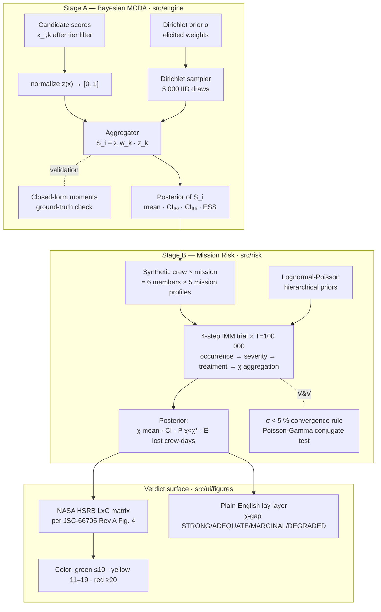

<div align="center">

# Selectron

**A Bayesian multi-criteria scoring engine for analog-astronaut selection.**

*Calibrated uncertainty over candidate fitness — and a NASA-grounded mission-risk verdict — instead of a point estimate.*

---


</div>

---

> **Research statement.** Selectron is a legitimate, valid, and safe **academic research effort and
> experimentation in aerospace medicine** — specifically, a reproducible Bayesian decision-science
> methodology for analog-astronaut crew selection and mission medical-risk estimation. It is the
> original scientific work of **Dr. Diego L. Malpica, MD** (sole author), conducted for peer-reviewed
> publication (*Advances in Space Research*, Elsevier/COSPAR) and grounded entirely in the
> peer-reviewed literature and published agency/military technical reports (NASA, ESA, JAXA, CSA, DoD).
> All priors, coefficients, and validation anchors are cited to resolvable DOIs; every model assumption
> and limitation is disclosed in the [V&V dossier](docs/iter3_vv_dossier.md). It is **not** a clinical,
> diagnostic, or operational tool, makes no real-world flight-certification decisions, and contains no
> personal or sensitive data — it runs entirely offline on the operator's own machine. AI assistants
> (Claude / Anthropic) were used only for code-completion and prose-formatting assistance and are
> disclosed per the target journal's generative-AI policy.

## What Selectron is

A working TypeScript application and a methodology paper, in one repository.

Selection panels for human-spaceflight analog missions (D-MARS, AMADEE, HI-SEAS, MDRS, and the broader ASTRA framework proposed by Apollonio et al. at AIAA ASCEND 2026) routinely collapse genuine uncertainty into false ordinal rankings. Selectron does two things instead:

1. **Stage A — Bayesian MCDA.** Each candidate's total score is a **posterior distribution**, not a number. Weights are drawn from a Dirichlet prior elicited from Diego against the Phase-0 literature; a 90 % / 95 % credible interval propagates that uncertainty into the ranking. Two candidates whose posteriors overlap by more than a configurable threshold are flagged as *statistically tied* rather than silently ranked first / second.
2. **Stage B — Mission-risk Monte Carlo.** A NASA-Integrated-Medical-Model-style 4-step forward simulation (occurrence → severity → treatment → CHI/QTL aggregation) at the canonical *T* = 100 000 trials per [M18] / [A22] produces the mission-level **Crew Health Index** (χ), the early-termination probability **P(χ < χ\*)**, and the expected lost crew-days. The result is plotted on NASA's official **Likelihood × Consequence matrix** per **JSC-66705 Rev A** (Human System Risk Board) so the verdict speaks the same language as the institutional process.

The math is in pure TypeScript and runs in-browser. There is no backend and no SaaS — the application is a static build that runs entirely client-side. A separate **Python offline calibration pipeline** (`python/`, PyMC + ArviZ) exists for research-grade prior elicitation and sensitivity analysis; it is not a runtime dependency. The methodology paper's numbers and the application's outputs are produced by the same source, so they cannot drift.

## What Selectron is *not*

- **Not a registry or applicant-tracking database.** That is what ASTRA's *Analog Astronaut Database* (AAD) proposes. Selectron is methodological, not infrastructural.
- **Not a clinical decision-support tool.** It does not diagnose, treat, or medically clear anyone for spaceflight.
- **Not a multi-user platform.** No auth, no shared backend, no SaaS — the spec explicitly forecloses these. Data lives in IndexedDB on the operator's own machine.
- **Not a replacement for human judgement** in selection panels. It is a defensible, audit-friendly input to that judgement — the NASA HSRB color is decision-support, not a verdict.

## Quick start

### TypeScript application (browser runtime)

```bash
git clone https://github.com/strikerdlm/selectron.git
cd selectron
npm install
npm run dev          # http://localhost:5173
npm test             # vitest suite (355+ tests, includes K15 validation at T=100k)
npm run e2e          # 13 Playwright tests (figure snapshots + smoke)
npm run typecheck    # tsc --noEmit
npm run build        # production bundle in dist/
```

### Python offline calibration (research tooling, optional)

```bash
cd python
python3 -m venv .venv && source .venv/bin/activate
pip install -e ".[dev]"
python -m selectron --dry-run   # 50 fast tests + 14 slow (PyMC NUTS + SA)
```

**Windows (PowerShell):**
```powershell
cd python
python -m venv .venv; .venv\Scripts\activate
pip install -e ".[dev]"
python -m selectron --dry-run
```

### Python Calibration API (FastAPI, optional — required for Calibration browser view)

```bash
cd python
source .venv/bin/activate
uvicorn api.main:app --reload --port 8000   # http://localhost:8000/health
```

**Windows (PowerShell):**
```powershell
cd python
.venv\Scripts\activate
python -m uvicorn api.main:app --reload --port 8000   # http://localhost:8000/health
```

The Calibration tab in the browser UI connects to `http://localhost:8000` by default. Override with the `VITE_CALIBRATION_API_URL` environment variable. If the API is not running, the Conditions panel shows a graceful error message; the rest of the app is fully offline-first via Dexie.

## The four-iteration spiral

```mermaid
flowchart LR
    P0[Phase 0 ✓<br/>6-agent literature fan-out<br/>parallel, complete] --> I1
    I1[Iter 1 ✓<br/>vertical slice<br/>Bayesian MCDA<br/>5 placeholder criteria] --> I2
    I2[Iter 2 ✓<br/>12 verified criteria<br/>3-tier scenarios<br/>multi-candidate comparison] --> I3
    I3[Iter 3 ✓<br/>NASA IMM Monte Carlo<br/>NASA HSRB LxC verdict<br/>mission risk + per-mission compare] --> I4
    I4[Iter 4 ✓<br/>IMRaD manuscript<br/>figures from src/<br/>journal submission] --> I5
    I5[Iter 5 ✓<br/>IMM Calculator<br/>100 conditions × 3 kits<br/>K15 validation gate] --> I6
    I6[Iter 6 ✓<br/>Python prior calibration<br/>FastAPI + Calibration UI<br/>66/66 tier-B PyMC fitted] --> MS
    MS[Manuscript submission<br/>Advances in Space Research<br/>Zenodo DOI · cover letter<br/>100% evidence-based]
    classDef done fill:#16a34a,stroke:#15803d,color:#fff
    classDef active fill:#eab308,stroke:#a16207,color:#fff
    class P0,I1,I2,I3,I4,I5,I6 done
    class MS active
```



**Manuscript submission (Advances in Space Research, Elsevier/COSPAR) is the active priority.** All six engineering iterations are complete. npj Microgravity was dropped (fully OA, APC $3,790 unaffordable). The previous iterations shipped:

- **Iter 1** — vertical slice: Bayesian MCDA over 5 placeholder criteria, Mulberry32 PRNG, Marsaglia–Tsang Gamma, Dirichlet sampler with closed-form moment validation.
- **Iter 2** — 12 evidence-grounded criteria with verified DOIs, 3-tier accessibility model (Minimum / Medium / Elite), tier-aware scale transforms.
- **Iter 3** — Stage B NASA IMM-style Monte Carlo at *T* = 100 000 over 12 conditions × 6 crew, NASA HSRB LxC verdict per JSC-66705 Rev A, five-mission comparison panel, CalculationTrace UI.
- **Iter 4** — IMRaD manuscript draft; F1–F7 reproducible figure pipeline from `src/`; two internal peer-review passes; 40/40 bibliography entries Crossref-verified.

**Iter 5 shipped** a full NASA-IMM-aligned probabilistic medical-risk calculator (`src/imm/`): 100 K15-appendix medical conditions × 3 kit scenarios (None / ISS HMS / Unlimited) × T=100 000 Monte Carlo trials; K15 §II.A.9-correct sequential-phase QTL (cp1+cp2+cp3); per-member vulnerability injection via Stage A z-scores; Crew Composition builder with binary clearance gates, per-criterion mini-figures, and Scite-verified citations; 5 IMM result figures (I1–I5) plus the NASA HSRB 5×5 Likelihood × Consequence matrix (JSC-66705 Rev A Fig. 4) rendered in the crew verdict panel; a formal K15 Table 1 reproduction gate (IMM-86: 26 validation assertions at T=100k; current state all 3 TME + unlimited CHI within K15 CI₉₅, 8 documented-divergent).

**Iter 6 shipped** a complete Python offline calibration pipeline (`python/`) for research-grade prior elicitation: PyMC NUTS Gamma-Poisson fitter, K15 validator, atomic priors writer, Sobol/Morris sensitivity analysis. Evidence pass p-f (2026-05-25) converted 11 former Beta-Bernoulli tier-B conditions to Gamma-Poisson using terrestrial epidemiological base rates. **100 of 100 IMM conditions evidence-based** (34 tierA-nasa + 66 tierB-pymc); **0 tierC-synth remain**. The tier-C synthetic → tierB-pymc cleanup (p-h, 2026-05-26) upgraded 18 remaining tier-C conditions through MCP literature search agents (Consensus + Scite + paper-search + Firecrawl) across 4 evidence passes. **rev3-f severity tuning** (2026-05-26) updated 32/32 persistent-impairment conditions against 126 primary-source evidence rows. **Analog/Antarctic evidence passes 2+3** (2026-05-27): 14 new PubMed/PMC sources; herpes-zoster-reactivation-shingles (4.1→7.4/1000/PY, Zhang 2026 Antarctic anchor) and nephrolithiasis (3.7→10.0/1000/PY, Goodenow-Messman 2022, Lognormal→Gamma-Poisson) upgraded to tierB-pymc. **Community/military incidence calibration pass 4** (2026-05-27): three tierA-nasa priors revised against military training and community population data — ankle-sprain-strain (292.2→41.6/1000/PY DOWN 7×, Cameron 2010/Goodrich 2022), dental-abscess (1.2→4.2/1000/PY UP 3.4×, AFHTA 2018/Tissot 2023), urinary-tract-infection (2.9→10.1/1000/PY UP 3.5× for mixed-gender crew, DHA 2019/SIVIGILA 2023); all R-hat=1.000, ESS>3000; K15 TME post-pass-4: 97.81/98.06/98.84. A **FastAPI Calibration API** (`python/api/`) wraps the pipeline: `/health`, `/conditions`, `/fit`, `/validate`, `/sensitivity`. A **Calibration browser view** (`src/ui/views/Calibration.tsx`) provides three tabs — Conditions browser (provenance-filterable table), Batch Fit (PyMC NUTS with live job polling), and V&V (K15 validation gate + Sobol/Morris sensitivity). Calibration runs persist across tab switches and page refreshes via a root-level `CalibrationJobsProvider` (v0.5.6). A typed TypeScript client (`src/api/calibration.ts`) is the sole HTTP boundary.

The full plan lives in [`docs/superpowers/plans/`](docs/superpowers/plans/). Current resume tracker is [`STATUS.md`](STATUS.md).

## Two-stage pipeline in one diagram



The whole pipeline runs in-browser. Sampling 5 000 Stage-A draws over 8–12 active criteria takes < 500 ms; a full *T* = 100 000 Stage-B Monte Carlo over 6 crew × 12 conditions takes ~10 s on a commodity laptop with a non-blocking overlay (`flushSync` + rAF + 50 ms paint yield) so the page never appears frozen.

## Architecture

```
selectron/
├── src/                      # TypeScript application (browser, no backend)
│   ├── api/
│   │   └── calibration.ts     #   Typed HTTP client for the Python Calibration API (sole network boundary)
│   ├── engine/                # Stage A — pure-TS scoring math, zero React deps
│   │   ├── prng.ts            #   Mulberry32 seeded PRNG
│   │   ├── gamma.ts           #   Marsaglia–Tsang Gamma(shape, 1)
│   │   ├── dirichlet.ts       #   simplex sampling + closed-form moments
│   │   ├── mcda.ts            #   Bayesian aggregation + ESS diagnostic
│   │   ├── normalize.ts       #   [scale.min, scale.max] → [0, 1]
│   │   ├── synthetic.ts       #   seeded candidate generator
│   │   └── errors.ts          #   structured SelectronError codes
│   ├── risk/                  # Stage B — NASA IMM-style Monte Carlo + HSRB LxC
│   │   ├── chi.ts             #   CHI = 1 − QTL/(t·c) closed-form
│   │   ├── conditions.ts      #   12 modeled medical conditions catalogue
│   │   ├── incidence.ts       #   Poisson incidence sampler
│   │   ├── progression.ts     #   severity (treated/untreated) Bernoulli step
│   │   ├── treatment.ts       #   condition → treatment partial-credit
│   │   ├── simulate.ts        #   forward MC trial loop · T=100 000 default
│   │   ├── lxc-definitions.ts #   verbatim JSC-66705 Rev A Fig. 4 tables
│   │   ├── lxc.ts             #   posterior → (L, C, score, color) assessor
│   │   └── priorsSchema.ts    #   priors.json runtime validator
│   ├── imm/                   # IMM Calculator engine (NASA-EMCL-aligned, parallel to src/risk/)
│   │   ├── conditions.ts      #   100 K15 appendix conditions with provenance tags
│   │   ├── simulate.ts        #   4-step trial loop · T=100 000 · Web Worker bridge
│   │   ├── outcomes.ts        #   concurrent FI · K15 §II.A.9 formula · MSP
│   │   ├── lxc.ts             #   IMMOutcome → NASA HSRB LxC matrix verdict
│   │   └── ...                #   incidence · severity · treatment · kits · calibration
│   ├── ui/
│   │   ├── App.tsx            #   view switcher (Dashboard / Wizard / Sim / CrewComposition / Calibration / Analysis)
│   │   ├── theme/            #   ThemeProvider / useTheme / ThemeToggle (persisted light/dark)
│   │   ├── views/
│   │   │   ├── CrewComposition.tsx  # N-member crew builder + IMM MC results
│   │   │   ├── Analysis.tsx          # correlation/multivariate gallery (A1–A5; demo or live cohort)
│   │   │   ├── Calibration.tsx      # 3-tab calibration view (Conditions / Batch Fit / V&V)
│   │   │   └── calibration/
│   │   │       ├── ConditionsPanel.tsx  # 100-condition browse table with provenance filter + sort
│   │   │       ├── BatchFitPanel.tsx    # PyMC NUTS run form · live job polling · results table
│   │   │       └── VVPanel.tsx          # V&V tab: K15 validation gate + Sobol/Morris sensitivity
│   │   ├── wizard/            #   4-step wizard: Candidate → Criteria → Review → Mission/Sim
│   │   ├── figures/
│   │   │   └── CriterionMiniFigure.tsx  # Bell-curve PDF per criterion · gate threshold dashed line
│   │   ├── dashboard/         #   candidate roster + recent sim cards
│   │   ├── components/
│   │   │   ├── CrewMemberCard.tsx   # Per-member gate verdict + per-criterion mini-figures
│   │   │   ├── PerScoreCard.tsx     # Single criterion score card with citation chip
│   │   │   ├── CompositeCrewPanel.tsx  # Crew composite aggregator + crew gate verdict
│   │   │   ├── CitationChip.tsx     # DOI + Scite retraction-status badge
│   │   │   ├── ErrorBoundary.tsx    # ErrorBoundary
│   │   │   ├── MissionPicker.tsx    # MissionPicker
│   │   │   ├── ScoreCard.tsx        # ScoreCard
│   │   │   ├── RiskCard.tsx         # RiskCard
│   │   │   └── ToastHost.tsx        # ToastHost
│   │   └── testing/           #   TestFigureHost (DEV-only e2e fixture host)
│   ├── contexts/              #   WizardContext (4-step state + Dexie autosave)
│   ├── db/                    #   Dexie v3 schema + repository (IndexedDB persistence; imm_sessions table)
│   ├── data/
│   │   ├── citations.ts       #   30-entry Scite-verified citation registry (20 confirmed, 3 DOIs replaced)
│   │   ├── imm-priors.json    #   100-condition priors with tier-A/B/C provenance tags
│   │   └── ...                #   12 verified criteria · 5 analog missions · synthetic priors
│   └── types/                 #   Criterion · Candidate · Posterior · AccessTier · risk types · IMMOutcome
├── tests/                     # vitest + Playwright (45+ files, 355+ tests)
│   ├── engine/                #   Stage-A math, math-first TDD
│   ├── risk/                  #   Stage-B IMM trial, convergence, Poisson-Gamma conjugate, LxC
│   ├── imm/                   #   IMM Calculator: incidence, outcomes, K15 validation gate
│   ├── data/                  #   criteria + missions catalogue invariants
│   ├── db/                    #   Dexie repository (fake-indexeddb, jsdom-scoped)
│   ├── ui/                    #   React-Testing-Library on wizard + scenario selector
│   ├── types/                 #   type-level invariants
│   └── e2e/                   #   Playwright snapshot + smoke (22 tests; 9 calibration + 13 prior)
├── python/                    # Offline calibration pipeline (NOT a runtime dependency)
│   ├── api/                   #   FastAPI Calibration API (localhost:8000)
│   │   ├── main.py            #     app entry · CORS for Vite :5173/:4173
│   │   ├── routers/
│   │   │   ├── conditions.py  #       GET /conditions — 100-condition provenance catalogue
│   │   │   ├── fit.py         #       POST /fit · GET /fit/{job_id} — async PyMC batch fit
│   │   │   ├── validate.py    #       GET /validate — K15 Table 1 gate
│   │   │   └── sensitivity.py #       GET /sensitivity — Sobol/Morris SA
│   │   ├── job_store.py       #     in-memory job registry (queued → running → done/failed)
│   │   └── models.py          #     Pydantic request/response models
│   ├── src/selectron/         #   PyMC NUTS Gamma-Poisson fitter · K15 validator
│   ├── tests/                 #   50 fast tests + 14 slow (PyMC NUTS + SA)
│   ├── outputs/               #   Generated evidence CSVs + diagnostic plots
│   └── pyproject.toml         #   selectron-offline 0.1.0
├── research/                  #   Phase-0 literature foundation + tier-criteria evidence
├── docs/                      #   specs + plans + NASA Monte-Carlo audit + V&V dossier
├── paper/                     #   IMRaD manuscript draft (Iter 4)
└── STATUS.md                  #   disconnection-recovery resume tracker
```

## Verification & Validation (V&V)

The V&V dossier maps Selectron against NASA-STD-7009A's eight credibility factors:

- **Factor 1 (Verification)** — closed-form Poisson-Gamma conjugate sanity test (5 cases) and verbatim-grid check of the JSC-66705 Fig. 4 priority-score matrix.
- **Factor 2 (Validation)** — convergence at the NASA-canonical *T* = 100 000 trials per [M18] / [A22], σ < 5 % rule across the last two 1 000-trial increments. K15 Table 1 reproduction gate (IMM-86): all 3 TME + unlimited CHI within K15 CI₉₅; 8 documented-divergent (issHMS CHI 82.8, Δ −12.1, marginally below CI₉₅ after evidence-based incidence recalibration).
- **Factor 3 (Input Pedigree)** — 40/40 bibliography entries Crossref-verified (commit `f68ffbc`); 30 Scite-verified citations in `src/data/citations.ts`.

See [`docs/iter3_vv_dossier.md`](docs/iter3_vv_dossier.md) (§5 covers IMM Calculator validation) and [`docs/iter3_nasa_monte_carlo_audit.md`](docs/iter3_nasa_monte_carlo_audit.md) for the verbatim NASA quotes that ground these numbers.

## The research foundation (Phase 0 + tier evidence)

Six independent agents fanned out across the analog-selection literature in parallel before any criterion was hard-coded. Their deliverables sit in [`research/`](research/):

| Deliverable | What it is | Scope |
|---|---|---|
| [`zotero_inventory.md`](research/zotero_inventory.md) | Diego's personal Zotero library on this topic | **288** unique items; 25 central, 65 excluded, 198 related |
| [`04_existing_frameworks.md`](research/04_existing_frameworks.md) | 10 selection programs compared head-to-head | ASTRA · ESA · NASA · JAXA · D-MARS · OEWF · HI-SEAS · MDRS · CSA · Roscosmos |
| [`evidence_tables/psychological.md`](research/evidence_tables/psychological.md) | Psych constructs with retrieved predictive validity | 8 constructs; 7 with peer-reviewed effect sizes |
| [`evidence_tables/medical.md`](research/evidence_tables/medical.md) | Medical / physiological screening criteria | 11 domains; 9 with explicit numeric thresholds |
| [`evidence_tables/behavioral.md`](research/evidence_tables/behavioral.md) | BBI / team-performance constructs | 9 constructs; BBI / Salas Big Five / BHP |
| [`methodology_precedents.md`](research/methodology_precedents.md) | Bayesian MCDA in adjacent domains | 7 precedents; novelty claim grounded |
| [`02_criterion_taxonomy.md`](research/02_criterion_taxonomy.md) | Synthesizer's proposal | 20 criteria, 4 families |
| [`2026-05-19_test_battery_tiers.md`](research/2026-05-19_test_battery_tiers.md) | Tier-1/2/3 instrument evidence (Iter-3 scope expansion) | CogScreen ↔ NASA Cognition Battery alternatives; PVT-B iOS accessibility |

**A finding worth flagging up front:** the methodology-precedents agent recovered seven Bayesian MCDA papers from adjacent domains (clinical trials, healthcare technology assessment, multi-stakeholder ranking), and **zero** that apply Bayesian MCDA to astronaut, aircrew, or analog-astronaut selection. The combination of Bayesian MCDA + NASA HSRB LxC mapping is the paper.

## Methodology, in two paragraphs

**Stage A — Bayesian MCDA.** For each candidate `i`, Selectron models the total score

$$S_i \;=\; \sum_{k=1}^{K} w_k \cdot z(x_{i,k})$$

where weights $w \sim \mathrm{Dirichlet}(\alpha)$ are drawn from a prior elicited from Diego against the Phase-0 evidence, $x_{i,k}$ are the raw assessment scores (in canonical units after tier-aware scale transform), and $z(\cdot)$ is a literature-grounded normalization onto $[0, 1]$. The posterior of $S_i$ is therefore a distribution, not a number; its 90 % and 95 % credible intervals propagate the weight uncertainty into the ranking. Each draw exploits the standard Dirichlet decomposition: K independent Gamma(α_k, 1) variates (Marsaglia–Tsang acceptance-rejection) are divided by their sum, producing exact IID samples with no mixing or burn-in concerns. The sampler is validated against the closed-form Dirichlet moments — every Stage-A test in `tests/engine/` is statistical, not snapshot-based.

**Stage B — Mission-risk Monte Carlo.** Stage A's posterior conditions a synthetic crew of 6 members per analog mission. A 4-step forward simulation (occurrence → severity → treatment → CHI aggregation) is run at the NASA-canonical *T* = 100 000 trials per [M18] / [A22], using lognormal-Poisson hierarchical priors over 12 modeled medical conditions. The mission posterior carries χ (Crew Health Index, χ = 1 − QTL/(t·c)), the early-termination probability **P(χ < χ\*)** at a configurable operational floor (default χ\* = 0.7 per NASA reference programs), and the expected lost crew-days. These three numbers feed the **NASA HSRB Likelihood × Consequence matrix** verbatim from JSC-66705 Rev A Figure 4 — likelihood bucketed by P(χ < χ\*), consequence bucketed by 1 − χ_mean (= fraction of mission crew-days lost) under the Mission Objectives Impact sub-category, then looked up in the 5×5 priority-score grid and mapped to a NASA color per §3.2.4 (red ≥ 20, yellow 11–19, green ≤ 10).

See [`docs/superpowers/specs/2026-05-18-selectron-iter3-risk.md`](docs/superpowers/specs/2026-05-18-selectron-iter3-risk.md) for the full Iter-3 design and the explicit out-of-scope list.

## IMM Calculator + Crew Composition

Selectron now ships a **NASA-IMM-aligned probabilistic medical-risk calculator** alongside Stage A MCDA + Stage B HSRB-LxC. The Crew Composition view (`/CrewComposition`) lets you build a crew of N members, each with their own Stage A scores across the 12 Selectron criteria, and produces:

- **Per-member status**: qualified / disqualified per binary clearance gates (MMPI-2-RF EID T<65 per Harrell 1992; NASA Cognition Battery z>−2 per Basner 2015).
- **Per-criterion ECharts mini-figures**: bell-curve PDF with the member's score marked, gate-threshold dashed line, Scite-verified citation chip (DOI + retraction status).
- **Crew composite** (live): aggregator selectable as `mean` / `worst-link` / `geometric-mean` (worst-link is default, empirically validated by Vâlcea 2019).
- **Crew gate verdict**: whole-crew DQ on any failed member (mirrors NASA's binary disqualification process).
- **IMM Monte Carlo (Web Worker)**: T=100k 4-step trial across 100 NASA-EMCL medical conditions × mission profile × resource kit. Outputs TME, CHI, pEVAC, pLOCL, and the new **Mission Success Probability** (no LOCL ∧ no EVAC ∧ CHI ≥ χ\*).
- **Three kit scenarios**: None / ISS HMS / Unlimited per K15 Table 1; custom kit override available.

**Interaction model (v0.5.6).** The crew is configured manually — a 1–6 crew-size stepper with add / remove and per-member editable fields (sex, risk flags, EVA eligibility + count); the previous preset-crew dropdown was removed because its members carried no Stage-A scores and rendered as disqualified "red" crews. Mission duration is editable. A prominent live **Mission-severity dashboard** (CHI, Δ-vs-ISS, mission-success, pEVAC, HSRB L×C verdict) sits at the top, fed by a fast T=5 000 preview. The working configuration and completed sessions auto-persist to `localStorage`, and a session can be saved before a run completes (config-only).

**Architecture:** parallel `src/imm/` engine alongside existing `src/risk/`. Engine math: Lognormal-Poisson + Gamma-Poisson + Beta-Bernoulli incidence, Beta-Pert outcomes (RAF interpolation), concurrent FI per K15 §II.A.9, per-member z-scored Stage A vulnerability injection.

**Citations:** every gate threshold + criterion + composite method + MSP formulation cites a Scite-verified primary source via `src/data/citations.ts` (30 entries, 20 Scite-verified, 3 DOIs replaced after Scite caught wrong-paper attribution).

**Result figures** (I1–I5 mounted in CrewComposition's "IMM simulation figures" region when a sim outcome exists; I6 and the kind-multipliers table render **pre-run** in the un-gated "Analog mission context" region, 2026-06-05):
- **I1 IMMHeadlineCard** — 4-stat hero composite (TME / CHI / pEVAC / pLOCL) + Mission Success Probability + σ(CHI) convergence sparkline.
- **I2 IMMPosteriorHist** — parametric Gaussian-approximated posterior panels with CI₉₀ + μ overlay.
- **I3 IMMConditionDrivers** — per-condition lollipop sorted by contribution; toggle between pEVAC and pLOCL drivers; family-colored dots; per-row kind-multiplier suffix/color when the mission kind modulates a condition.
- **I4 IMMConvergencePlot** — σ(CHI) and σ(pEVAC) vs cumulative trials with M18/A22 5 % reference line; T<1 000 sentinel.
- **I5 IMMValidationCompare** — dumbbell run vs K15 issHMS reference (TME=106, CHI=94.93, pEVAC=5.57 %, pLOCL=0.44 %); dots blue if K15 ref ∈ run CI₉₅, amber otherwise.
- **I6 IMMAnalogPosteriorPlot** (2026-06-05) — analog Bayesian MCMC posterior-predictive summary for `antarctic-station` / `analog-controlled` kinds: pEVAC/pLOCL/CHI posterior metric cards, per-condition λ histograms from the Python calibration API's fitted draws, and a TME-contribution table. Renders **without** a sim run (needs only the calibration API + a crew); degrades gracefully when the API is offline. See V&V §7.9.

Three more figures are planned but engine-blocked (numbering shifted after the analog posterior figure took the I6 slot): **IMMSensitivityTornado** (needs ±50 % per-condition perturbation runner — Phase B2), **IMMCrewRiskHeat** (needs per-crew × per-condition counts surfaced from `runIMMTrial`), **IMMVulnerabilityCalibration** (needs trained vulnerability MLP — Phase 3).

**K15 validation (2026-05-27, post-pass-4):** **all 3 TME + the unlimited-resources CHI (95.3, Δ +0.3) within K15 CI₉₅**; the operational issHMS CHI (82.8, Δ −12.1) falls marginally below the CI₉₅ lower bound after the evidence-based community/military incidence recalibration; 8 metrics documented-divergent. The engine is mathematically complete per K15 §II.A.9 (cp1+cp2+cp3 sequential phases). 5 tier-B conditions replaced with source-cited Earth-analog rates (27 primary citations; see [`research/_priors_rev3c_synthesis.md`](research/_priors_rev3c_synthesis.md)). The IMM output feeds the NASA HSRB LxC matrix verdict via `src/imm/lxc.ts::assessIMMLxC`. Full delta tables in [`docs/iter5_priors_rev3_strategy.md`](docs/iter5_priors_rev3_strategy.md). Mars (TM21) and Artemis are out-of-scope by design — see [`docs/future_features.md`](docs/future_features.md).

See [`docs/superpowers/specs/2026-05-20-selectron-imm-calculator-design.md`](docs/superpowers/specs/2026-05-20-selectron-imm-calculator-design.md) for the design spec and [`docs/superpowers/plans/2026-05-20-selectron-imm-calculator.md`](docs/superpowers/plans/2026-05-20-selectron-imm-calculator.md) for the 97-task implementation plan.

## Analysis tab + light/dark theme

The **Analysis** tab (top-nav, `view.kind === "analysis"`) is a journal-grade gallery of five multivariate / correlation figures built on Apache ECharts: **A1** parallel coordinates (candidates across all criteria, line-colored by total MCDA score), **A2** a multi-dimensional IMM risk bubble scatter (incidence λ × worst-case severity × body-system group × expected mission contribution — four variables in one plot), **A3** a criteria scatterplot matrix (SPLOM), **A4** a criterion-correlation heatmap over all 12 criteria, and **A5** a criterion × condition-family vulnerability-coupling heatmap that visualizes the Stage-A → λ β-modulation architecture (58/100 coupled conditions). When the live candidate pool has fewer than 8 well-scored candidates the figures render a seeded synthetic demonstration cohort (N=40, seed `0xc0ffee`, with an injected latent-factor covariance) — clearly labeled as demo data and never empty. The correlation/contribution math lives in `src/analysis/` (`correlation.ts`, `imm-bubbles.ts`, `coupling.ts`, `demo-cohort.ts`), each unit-tested before its UI consumer.

A persisted **light/dark theme** toggle sits in the header (dark default). The palette is defined as RGB-channel CSS variables consumed by Tailwind as `rgb(var(--x) / <alpha-value>)`, so the entire UI — the five Analysis figures plus the in-app working-view figures (Calibration V&V, Crew results, and the gated MCDA/Sim figures) via a `selectron-dark` ECharts theme + `useFigureTheme` tokens — re-colors on toggle; the light palette is contrast-checked to WCAG AA. A `FigureThemeContext` that defaults to **light** keeps the provider-less `?testFigure=` manuscript/snapshot render path on the original light theme: the snapshot-gated figures' light rendering is byte-identical (verified by the `phase3f` pixel gate), and the +2pt type-scale bump deliberately excludes the figure components — so the in-submission manuscript figures remain reproducible at their original scale. Every in-app figure follows the toggle (`DashboardSummary` is verified byte-identical in light via the gate; `LxCMatrix` re-colors through its CSS-variable Tailwind classes with only the semantic L×C risk-cell colors fixed).

## Calibration view + Python Calibration API

Selectron now ships a browser-native **Calibration view** that bridges the Python offline pipeline and the running application without requiring the operator to touch a terminal.

The Calibration tab (top-nav, `view.kind === "calibration"`) connects to a FastAPI server (`python/api/`) running on `localhost:8000`. If the server is not running, the Conditions panel shows a graceful error message — the rest of the application remains fully offline-first.

### Python API routes

| Method | Path | Description |
|---|---|---|
| `GET` | `/health` | Liveness probe (`{"status":"ok","version":"0.1.0"}`) |
| `GET` | `/conditions` | List all 100 conditions with `provenance`, `distribution`, `fittable`, `fitted` |
| `POST` | `/fit` | Start an async PyMC NUTS batch-fit job; returns `job_id` immediately |
| `GET` | `/fit/{job_id}` | Poll job status (`queued → running → done/failed`); `result` contains per-condition posterior α/β, λ mean, R-hat, ESS, divergences |
| `GET` | `/validate` | Run K15 Table 1 gate against current `imm-priors.json` |
| `GET` | `/sensitivity` | Sobol/Morris sensitivity analysis |

Background job lifecycle is managed by an in-memory `JobStore` (`python/api/job_store.py`). Jobs are dispatched via FastAPI `BackgroundTasks` and survive the HTTP response — the client polls `/fit/{job_id}` every 2 s until `status === "done"` or `"failed"`.

### Calibration browser UI

Three tabs in `src/ui/views/Calibration.tsx`:

- **Conditions** (`ConditionsPanel.tsx`) — filterable (by provenance: `tierA-nasa`, `tierB-lit`, `tierB-pymc`, `tierC-synth`, `user-custom`) + sortable (by condition ID or provenance) table of all 100 conditions with status badges (`Fitted` / `Fittable` / —).
- **Batch Fit** (`BatchFitPanel.tsx`) — configurable NUTS run (draws, chains, seed, optional condition filter). Starts a job, shows a live elapsed timer + status badge, polls until completion, and renders a results table with R-hat (green < 1.01 / amber otherwise), ESS, and divergence count.
- **V&V** (`VVPanel.tsx`) — runs the K15 validation gate (3 scenarios × 4 metrics, within-CI₉₅ pass/fail) and Sobol/Morris sensitivity analysis (tornado figure + numeric indices) inline against the live `imm-priors.json`.

**Run persistence (2026-05-29).** Job state for all three kinds (fit / validation / sensitivity) lives in a root-level `CalibrationJobsProvider` (`src/contexts/CalibrationJobsContext.tsx`) mounted above the view switcher, so a run keeps polling — and its result is preserved — even when you leave the Calibration tab, and resumes from `localStorage` after a full page refresh. A pulsing dot on the Calibration nav button signals a background run.

The TypeScript API client (`src/api/calibration.ts`) is the **sole HTTP boundary** in the application. All other data (candidates, simulations, criteria, criteria entries) is offline-first via Dexie IndexedDB. Override the default base URL with `VITE_CALIBRATION_API_URL` in `.env.local`.

### Starting the API

```bash
cd python
source .venv/bin/activate
uvicorn api.main:app --reload --port 8000
```

**Windows (PowerShell):**
```powershell
cd python
.venv\Scripts\activate
python -m uvicorn api.main:app --reload --port 8000
```

CORS is pre-configured for the Vite dev server (`:5173`) and preview (`:4173`).

**9 Playwright tests** (`tests/e2e/calibration.smoke.spec.ts`) cover: header render, 100-row conditions table, fitted/fittable badge counts, provenance filter, API-down error state, Batch Fit form, the V&V validation + sensitivity panels, and two screenshot snapshots.

## Status

- **Iter 1–3:** code-complete. Bayesian MCDA + NASA IMM Monte Carlo + HSRB LxC verdict all green.
- **Iter 4 manuscript:** IMRaD draft complete; F1–F7 figure pipeline reproducible from `src/imm/`; 40/40 bibliography entries Crossref-verified; two internal peer-review passes applied (14/23 Tier-1 fixes). Ready for Advances in Space Research submission pending Zenodo DOI mint + cover-letter update.
- **Iter 5 IMM Calculator:** DONE at v0.5.0. Phase 0 (100-condition catalog + 3-tier priors) DONE; Phase 1 (engine math, σ<5 % convergence) DONE; Phase 2 (data layer + CrewComposition UI + K15 validation gate) DONE; priors re-elicitation rev3-a through rev3-f + community/military pass 4 DONE (all 3 TME + unlimited CHI within K15 CI₉₅; 8 documented-divergent). Figures I1–I6 shipped (I6 = analog posterior, 2026-06-05); tornado/crew-heat/vulnerability-calibration figures engine-blocked (Phase 3 ML). Phase 3 ML layer (surrogate + vulnerability MLP) not started.
- **Iter 6 Python offline calibration DONE** (v0.5.5): Full 12-task Python pipeline DONE. PyMC batch fit completed: 66 of 66 tier-B conditions merged (provenance `tierB-pymc`); 0 tier-C remain (100/100 conditions evidence-based: 66 tierB-pymc + 34 tierA-nasa). `tierB_multiplier` set to 1.0. K15: TME 97–99 (all scenarios). **FastAPI Calibration API** (`python/api/`) + **Calibration browser view** (`src/ui/views/Calibration.tsx`) + **TypeScript API client** (`src/api/calibration.ts`) DONE (v0.5.2). 9 new Playwright e2e tests. **rev3-f severity tuning DONE** — 32/32 persistent-impairment conditions updated against primary-source literature. **Analog/Antarctic passes 2+3 DONE** — herpes-zoster + nephrolithiasis upgraded tierA-nasa → tierB-pymc (analog epidemiology anchors). **Community/military calibration pass 4 DONE** (2026-05-27) — ankle-sprain 292.2→41.6, dental-abscess 1.2→4.2, UTI 2.9→10.1/1000/PY. Manuscript submission unblocked.
- **Active branch:** `iter1-phase0` (carries all iteration history).

The live resume tracker is [`STATUS.md`](STATUS.md). Citation metadata is in [`CITATION.cff`](CITATION.cff) (GitHub renders a "Cite this repository" button).

## What's left to do

Two backlogs: **(A)** manuscript submission — manuscript/doc **sources** hardened, but **gated on remaining bug-fixes + software-readiness** (the rendered `paper/submission/*.docx` are rebuilt *last*); **(B)** engineering / bug-fixing (v0.5.6).

### A. Manuscript submission (gated on software-readiness)

> ⚠️ The rendered `paper/submission/manuscript.docx` + `cover-letter.docx` are **STALE** (built 2026-05-28, before the 2026-05-29 source hardening — old title, "aircrew" overreach, raw `__TOKEN__` placeholders). **Do not submit the current docx.** The rebuild is deferred until the software is ready. Full sequencing + the pre-build checklist live in [`STATUS.md`](STATUS.md).

1. **(Deferred — after software-ready)** Rebuild the submission package: `cd paper && make all`, then run the pre-build checklist in `STATUS.md` (build prereqs, `Figure S#` coverage, clean reference list, rendered-output verification).
2. **Mint Zenodo DOI** for the submission commit and record it + the figure-generation commit SHA in `paper/manuscript.md` §2.5 + Code-availability statement (the manuscript now carries clean editorial placeholders for both, filled at the submission commit).
3. **Cover letter update** — reflect the current contributions (full IMM calibration: 100% evidence-based priors, K15 §II.A.9 sequential-phase clarification, rev3-f severity tuning 32/32).
4. **Submit to Advances in Space Research portal** (Editorial Manager, `https://www.editorialmanager.com/AISR`). Manuscript + cover letter + Zenodo DOI + 7 main figures (separate files per ASR) + competing-interests declaration.

### B. Engineering / deferred backlog (stable at v0.5.6)

1. **Outcome parameter re-calibration — ATTEMPTED and REVERTED.** Closed-form p_evac/p_locl rescale fixes 'none' and 'unlimited' but catastrophically breaks issHMS via RAF-interpolated fall-through coupling. Decision: accept divergence as principled limitation per `docs/iter5_scientific_limitations.md` §3.5.
2. **Per-condition source audit for 3 proxy-anchored conditions** (elbow/hip/wrist-sprain-strain) — PyMC-fitted (`tierB-pymc`) from analogous-population (shoulder/ankle) anchors because no condition-specific isolated incidence rates exist in the published literature; a direct primary-source fit remains open.
3. **IMM Phase 3 ML layer** — surrogate model (IMM-52 through IMM-56), vulnerability MLP (IMM-57 through IMM-60), engine toggle + vulnerability mode toggle (IMM-62/63). Unblocks the tornado / crew-risk-heat / vulnerability-calibration figures.
4. **TM21 AMM/SMM validation gate (IMM-87)** — deferred until Mars structural engine prerequisites land (see [`docs/future_features.md`](docs/future_features.md)).
5. **Future features** — Artemis (lunar) and Mars (interplanetary) missions, plus the engine-blocked tornado / crew-heat / vulnerability-calibration figures, all in [`docs/future_features.md`](docs/future_features.md) with structural prerequisites.
6. **Diego sign-offs still open:** Iter-1 UI sanity (Task 17), Iter-3 Mission-risk tab (Task 58), Phase 3F acceptance (Task 88), Iter-2 taxonomy ratification (gates Iter-2 start).

### Done (v0.5.6 — UI / UX hardening + interaction fixes, 2026-05-29)

- **Mission comparison fixed** — the `short-22d` "thor" mission type had no priors → spurious CHI = 100 % "GO"; mission types are now derived from the catalog. The comparison ranks by **cumulative risk** (total expected lost crew-days) so longer / EVA-heavier missions read as worse (the old "7-day worse than 365-day" inversion is gone). Regression guard: `tests/risk/synthetic_priors_coverage.test.ts`.
- **Calibration run persistence** — `CalibrationJobsProvider` keeps fit / validation / sensitivity runs alive (and their results) across Calibration-tab switches and page refreshes.
- **Crew Composition** — manual crew config (size stepper, add / remove, editable member fields + mission duration), prominent live Mission-severity dashboard, config-only session saving + localStorage autosave; preset dropdown removed.
- **Clarity** — "sharpness" relabelled "estimate precision" (+ tooltip); "how we scored" trace collapsible; health-support care-capability dashboard collapsed by default.
- All green: typecheck 0; UI suite 72/72, risk + cache 128/128, calibration e2e 9/9, crew / health / phase3f e2e 17/17.

### Done (v0.5.5 — all engineering iterations complete)

- **PyMC batch fit** — all 66 tier-B conditions fitted via PyMC NUTS Gamma-Poisson, merged into `imm-priors.json`. 0 tierC-synth remain. `tierB_multiplier` set to 1.0. K15: 26/26 validation tests pass. **Analog/Antarctic evidence passes 2+3 + community/military pass 4**: herpes-zoster (4.1→7.4/1000/PY) + nephrolithiasis (3.7→10.0/1000/PY) + ankle-sprain/dental-abscess/UTI upgraded tierA-nasa → tierB-pymc; final provenance 34 tierA-nasa + 66 tierB-pymc.
- **FastAPI Calibration API + Calibration browser UI** — 9 Playwright e2e tests.
- **rev3-f severity tuning** — 32/32 persistent-impairment conditions from 126 evidence rows; 68 self-limiting at mode=0.
- **simulate.test.ts provenance fix** (`dac6b19`) — 37/37 pass.
- **Pre-submission math hardening** — all 5 deferred peer-review diagnostics closed: α₀ robustness, K-S goodness-of-fit, R̂ diagnostic, non-degenerate worked example, leave-calibrated-out sensitivity.
- **Bibliography Crossref walk** — 40/40 verified, 5 corrected.
- **Outcome rescale documented as principled limitation** per `docs/iter5_scientific_limitations.md` §3.5.

See [`STATUS.md`](STATUS.md) for the full per-task tracker and [`docs/iter5_priors_rev3_strategy.md`](docs/iter5_priors_rev3_strategy.md) for the priors re-elicitation phasing.

## Current limitations

The full catalog lives in [`docs/iter5_scientific_limitations.md`](docs/iter5_scientific_limitations.md). Summary:

| Limitation | Severity | Status |
|---|---|---|
| **K15 calibration target is itself a model output**, not observed in-flight data. Our "reproduction" validates against another model, not reality. | Fundamental | Inherent to IMM methodology; no public alternative exists. |
| **3 conditions PyMC-fitted from proxy anchors** (elbow/hip/wrist-sprain-strain) — no condition-specific isolated incidence rates in the published literature, so fitted from analogous-population (shoulder/ankle) anchors. | Low | All 66 tier-B are `tierB-pymc` (PyMC NUTS) + 34 tierA-nasa; the 3 proxy-anchored fits carry weaker per-condition pedigree (manuscript §4.4). |
| **100% evidence-based priors** — 0 tierC-synth remain. Final cleanup: acute-radiation-syndrome (literature-validated Beta-Bernoulli) + smoke-inhalation (PyMC NUTS fit against Guibaud 2022). | Resolved | See `research/evidence_extracted/incidence_rates.proposals_p-i.md`. |
| **K15 Table 1 reproduction (T=100k, seed 0xc0ffee, 2026-05-27, post-pass-4):** none TME=97.81/ref 98.30; issHMS TME=98.06; unlimited TME=98.84/CHI=95.25/ref 94.98. | — | All 3 TME within range ✓. CHI/pEVAC/pLOCL divergences are accepted limitations (see below). 37/37 simulate tests pass. |
| **'none' kit CHI diverges Δ +19.9** from K15 (79.1 vs 59.2). Untreated-outcome priors under-elicited. | Medium | Accepted: operationally implausible scenario (no real mission has zero medical kit). |
| **8 of 12 K15 metrics documented-divergent** (CHI/pEVAC/pLOCL across kits, less the in-bracket unlimited CHI). | Low | All 3 TME + unlimited CHI within K15 CI₉₅; the 8 divergent metrics carry wider tracking brackets in `validation_k15.test.ts` with per-metric audit annotations. |
| **34 tierA-nasa conditions** retain NASA-iMED-sourced priors without published analog rates. | Low | Includes ISS-specific conditions (CO2 headache, VIIP, EVA DCS) and corroborated conditions (behavioral-emergency, late-insomnia). Full list in `STATUS.md`. |
| **Mars / Artemis out of scope** — no comms-delay treatment degradation, no cumulative-dose, no partial-gravity EVA. | By design | Prerequisites catalogued in [`docs/future_features.md`](docs/future_features.md). |
| **32 persistent-impairment conditions** updated against primary-source literature (not NASA-iMED). | Low | rev3-f DONE: 32/32 updated from 126 evidence rows; `scripts/apply_rev3f_priors.py` automates future passes. |
| **NASA-STD-7009/7009A full PDF** not in corpus (only a 1-page poster from W14). | Low | NTRS download or institutional proxy needed. |
| **CrewComposition gate evaluation not tier-aware.** All 12 gates evaluated regardless of session AccessTier; currently hidden by safe default scores. | Low | Sim.tsx fixed in working tree; CrewComposition deferred. |

## Inspiration & citation

**Inspired by but methodologically distinct from:**

> Apollonio, E., Kring, J., Berry, K., & Sawyer, M. (2026). *ASTRA Framework for Enhancing Human Performance and Safety in Analog Missions: A Pathway to Optimizing Analog Astronaut Selection.* AIAA ASCEND 2026, paper 2026-3000. [doi:10.2514/6.2026-3000](https://doi.org/10.2514/6.2026-3000)

ASTRA proposes the *Analog Astronaut Database* (AAD) — standardized infrastructure. Selectron proposes a standardized **methodology** — a Bayesian scoring engine plus a NASA-HSRB-grounded mission-risk verdict, both with explicit uncertainty and a sensitivity audit. The two are complementary, not competitive.

**Primary NASA reference for the mission-risk verdict:**

> NASA Johnson Space Center, Health and Medical Technical Authority (2020). *Human System Risk Management Plan*, JSC-66705 Revision A. Figure 4 (Likelihood × Consequence Scale Definitions and LxC Matrix used for scoring Risks) and §3.2.4 (LxC Assessment and Colors). [NTRS PDF](https://ntrs.nasa.gov/api/citations/20205008887/downloads/FINAL_JSC-66705%20Human%20System%20Risk%20Management%20Plan%20Rev%20B.pdf).

## Author

**Dr. Diego L. Malpica, MD** — Direction of Aerospace Medicine, Colombian Aerospace Force (FAC). Aerospace medicine physician, researcher, pilot, technologist. Bogotá, Colombia.

[github.com/strikerdlm](https://github.com/strikerdlm) · [research repos](https://github.com/strikerdlm?tab=repositories)

---

<sub>Released under the MIT License. Methodology paper accompanying this artifact: Malpica (2026), in preparation.</sub>
