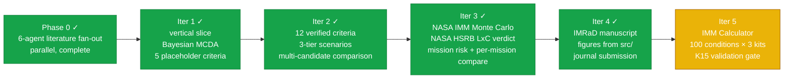
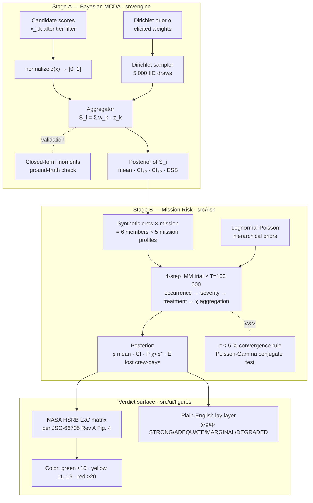

<div align="center">

# Selectron

**A Bayesian multi-criteria scoring engine for analog-astronaut selection.**

*Calibrated uncertainty over candidate fitness — and a NASA-grounded mission-risk verdict — instead of a point estimate.*

---


</div>

---

> ### ⚠ NOT-FOR-FLIGHT — Earth-analog + LEO-ISS scope only
>
> Selectron v1 is a **research instrument** scoped to **Earth-based analog isolation missions** (MDRS, HI-SEAS, Mars-500, Antarctic winter-over, SIRIUS, AMADEE, D-MARS, CHAPEA) and **LEO / ISS-baseline scenarios** (ISS 6 mo K15 reference, S20 DRM1 / DRM2).
>
> **Selectron v1 is NOT a Mars-mission tool, NOT an Artemis-mission tool, NOT a flight-medical-kit sizing tool, and NOT a substitute for individual crew-member fitness-to-fly assessment.** The Mars (TM21 AMM / SMM) and Artemis (I–IV) missions are catalogued for forward-compat but tagged `kind: "*-future"` and filtered out of the active mission picker. See [`docs/future_features.md`](docs/future_features.md) for the structural engine prerequisites required to extend Selectron beyond Earth analog (comms-delay treatment degradation, cumulative-dose pathways, partial-gravity EVA risk profiles).
>
> Calibration is partial within scope: as of priors-rev3-e (2026-05-22), **7 of 12 K15 Table 1 metrics reproduce within CI₉₅** (all 3 TME, issHMS CHI, unlimited CHI). See [`docs/iter5_scientific_limitations.md`](docs/iter5_scientific_limitations.md) for the full honest catalog of what the priors do and do not represent.
>
> For real-mission medical-risk decisions (any destination), use NASA's actual iMED + IMM workflow with NASA-internal priors.

---

## What Selectron is

A working TypeScript application and a methodology paper, in one repository.

Selection panels for human-spaceflight analog missions (D-MARS, AMADEE, HI-SEAS, MDRS, and the broader ASTRA framework proposed by Apollonio et al. at AIAA ASCEND 2026) routinely collapse genuine uncertainty into false ordinal rankings. Selectron does two things instead:

1. **Stage A — Bayesian MCDA.** Each candidate's total score is a **posterior distribution**, not a number. Weights are drawn from a Dirichlet prior elicited from Diego against the Phase-0 literature; a 90 % / 95 % credible interval propagates that uncertainty into the ranking. Two candidates whose posteriors overlap by more than a configurable threshold are flagged as *statistically tied* rather than silently ranked first / second.
2. **Stage B — Mission-risk Monte Carlo.** A NASA-Integrated-Medical-Model-style 4-step forward simulation (occurrence → severity → treatment → CHI/QTL aggregation) at the canonical *T* = 100 000 trials per [M18] / [A22] produces the mission-level **Crew Health Index** (χ), the early-termination probability **P(χ < χ\*)**, and the expected lost crew-days. The result is plotted on NASA's official **Likelihood × Consequence matrix** per **JSC-66705 Rev A** (Human System Risk Board) so the verdict speaks the same language as the institutional process.

The math is in pure TypeScript and runs in-browser. There is no backend, no Python, no SaaS. The methodology paper's numbers and the application's outputs are produced by the same source, so they cannot drift.

## What Selectron is *not*

- **Not a registry or applicant-tracking database.** That is what ASTRA's *Analog Astronaut Database* (AAD) proposes. Selectron is methodological, not infrastructural.
- **Not a clinical decision-support tool.** It does not diagnose, treat, or medically clear anyone for spaceflight.
- **Not a multi-user platform.** No auth, no shared backend, no SaaS — the spec explicitly forecloses these. Data lives in IndexedDB on the operator's own machine.
- **Not a replacement for human judgement** in selection panels. It is a defensible, audit-friendly input to that judgement — the NASA HSRB color is decision-support, not a verdict.

## Quick start

```bash
git clone https://github.com/strikerdlm/selectron.git
cd selectron
npm install
npm run dev          # http://localhost:5173
npm test             # vitest suite (45 files, includes K15 validation at T=100k)
npm run e2e          # 13 Playwright tests (figure snapshots + smoke)
npm run typecheck    # tsc --noEmit
npm run build        # production bundle in dist/
```

## The four-iteration spiral



**Iter 5 (IMM Calculator) is the active iteration.** The previous iterations shipped:

- **Iter 1** — vertical slice: Bayesian MCDA over 5 placeholder criteria, Mulberry32 PRNG, Marsaglia–Tsang Gamma, Dirichlet sampler with closed-form moment validation.
- **Iter 2** — 12 evidence-grounded criteria with verified DOIs, 3-tier accessibility model (Minimum / Medium / Elite), tier-aware scale transforms.
- **Iter 3** — Stage B NASA IMM-style Monte Carlo at *T* = 100 000 over 12 conditions × 6 crew, NASA HSRB LxC verdict per JSC-66705 Rev A, five-mission comparison panel, CalculationTrace UI.
- **Iter 4** — IMRaD manuscript draft; F1–F7 reproducible figure pipeline from `src/`; two internal peer-review passes; 40/40 bibliography entries Crossref-verified.

**Iter 5 ships** a full NASA-IMM-aligned probabilistic medical-risk calculator (`src/imm/`): 100 K15-appendix medical conditions × 3 kit scenarios (None / ISS HMS / Unlimited) × T=100 000 Monte Carlo trials; K15 §II.A.9-correct sequential-phase QTL (cp1+cp2+cp3); per-member vulnerability injection via Stage A z-scores; Crew Composition builder with binary clearance gates, per-criterion mini-figures, and Scite-verified citations; 5 IMM result figures (I1–I5); a formal K15 Table 1 reproduction gate (IMM-86: 13 vitest tests, 7/12 metrics within CI₉₅).

The full plan lives in [`docs/superpowers/plans/`](docs/superpowers/plans/). Current resume tracker is [`STATUS.md`](STATUS.md).

## Two-stage pipeline in one diagram



The whole pipeline runs in-browser. Sampling 5 000 Stage-A draws over 8–12 active criteria takes < 500 ms; a full *T* = 100 000 Stage-B Monte Carlo over 6 crew × 12 conditions takes ~10 s on a commodity laptop with a non-blocking overlay (`flushSync` + rAF + 50 ms paint yield) so the page never appears frozen.

## Architecture

```
selectron/
├── src/
│   ├── engine/                # Stage A — pure-TS scoring math, zero React deps
│   │   ├── prng.ts            #   Mulberry32 seeded PRNG
│   │   ├── gamma.ts           #   Marsaglia–Tsang Gamma(shape, 1)
│   │   ├── dirichlet.ts       #   simplex sampling + closed-form moments
│   │   ├── mcda.ts            #   Bayesian aggregation + ESS diagnostic
│   │   ├── normalize.ts       #   [scale.min, scale.max] → [0, 1]
│   │   ├── synthetic.ts       #   seeded candidate generator
│   │   └── errors.ts          #   structured SelectronError codes
│   ├── risk/                  # Stage B — NASA IMM-style Monte Carlo + HSRB LxC
│   │   ├── chi.ts             #   CHI = 1 − QTL/(t·c) closed-form
│   │   ├── conditions.ts      #   12 modeled medical conditions catalogue
│   │   ├── incidence.ts       #   Poisson incidence sampler
│   │   ├── progression.ts     #   severity (treated/untreated) Bernoulli step
│   │   ├── treatment.ts       #   condition → treatment partial-credit
│   │   ├── simulate.ts        #   forward MC trial loop · T=100 000 default
│   │   ├── lxc-definitions.ts #   verbatim JSC-66705 Rev A Fig. 4 tables
│   │   ├── lxc.ts             #   posterior → (L, C, score, color) assessor
│   │   └── priorsSchema.ts    #   priors.json runtime validator
│   ├── imm/                   # IMM Calculator engine (NASA-EMCL-aligned, parallel to src/risk/)
│   │   ├── conditions.ts      #   100 K15 appendix conditions with provenance tags
│   │   ├── simulate.ts        #   4-step trial loop · T=100 000 · Web Worker bridge
│   │   ├── outcomes.ts        #   concurrent FI · K15 §II.A.9 formula · MSP
│   │   ├── lxc.ts             #   IMMOutcome → NASA HSRB LxC matrix verdict
│   │   └── ...                #   incidence · severity · treatment · kits · calibration
│   ├── ui/
│   │   ├── App.tsx            #   view switcher (Dashboard / Wizard / Sim / CrewComposition)
│   │   ├── views/
│   │   │   └── CrewComposition.tsx  # N-member crew builder + IMM MC results
│   │   ├── wizard/            #   4-step wizard: Candidate → Criteria → Review → Mission/Sim
│   │   ├── figures/
│   │   │   └── CriterionMiniFigure.tsx  # Bell-curve PDF per criterion · gate threshold dashed line
│   │   ├── dashboard/         #   candidate roster + recent sim cards
│   │   ├── components/
│   │   │   ├── CrewMemberCard.tsx   # Per-member gate verdict + per-criterion mini-figures
│   │   │   ├── PerScoreCard.tsx     # Single criterion score card with citation chip
│   │   │   ├── CompositeCrewPanel.tsx  # Crew composite aggregator + crew gate verdict
│   │   │   ├── CitationChip.tsx     # DOI + Scite retraction-status badge
│   │   │   ├── ErrorBoundary.tsx    # ErrorBoundary
│   │   │   ├── MissionPicker.tsx    # MissionPicker
│   │   │   ├── ScoreCard.tsx        # ScoreCard
│   │   │   ├── RiskCard.tsx         # RiskCard
│   │   │   └── ToastHost.tsx        # ToastHost
│   │   └── testing/           #   TestFigureHost (DEV-only e2e fixture host)
│   ├── contexts/              #   WizardContext (4-step state + Dexie autosave)
│   ├── db/                    #   Dexie v3 schema + repository (IndexedDB persistence; imm_sessions table)
│   ├── data/
│   │   ├── citations.ts       #   30-entry Scite-verified citation registry (20 confirmed, 3 DOIs replaced)
│   │   ├── imm-priors.json    #   100-condition priors with tier-A/B/C provenance tags
│   │   └── ...                #   12 verified criteria · 5 analog missions · synthetic priors
│   └── types/                 #   Criterion · Candidate · Posterior · AccessTier · risk types · IMMOutcome
├── tests/
│   ├── engine/                #   Stage-A math, math-first TDD
│   ├── risk/                  #   Stage-B IMM trial, convergence, Poisson-Gamma conjugate, LxC
│   ├── imm/                   #   IMM Calculator: incidence, outcomes, K15 validation gate
│   ├── data/                  #   criteria + missions catalogue invariants
│   ├── db/                    #   Dexie repository (fake-indexeddb, jsdom-scoped)
│   ├── ui/                    #   React-Testing-Library on wizard + scenario selector
│   ├── types/                 #   type-level invariants
│   └── e2e/                   #   Playwright snapshot + smoke (13 tests)
├── research/                  #   Phase-0 literature foundation + tier-criteria evidence
├── docs/                      #   specs + plans + NASA Monte-Carlo audit + V&V dossier
├── paper/                     #   IMRaD manuscript draft (Iter 4)
└── STATUS.md                  #   disconnection-recovery resume tracker
```

## Verification & Validation (V&V)

The V&V dossier maps Selectron against NASA-STD-7009A's eight credibility factors:

- **Factor 1 (Verification)** — closed-form Poisson-Gamma conjugate sanity test (5 cases) and verbatim-grid check of the JSC-66705 Fig. 4 priority-score matrix.
- **Factor 2 (Validation)** — convergence at the NASA-canonical *T* = 100 000 trials per [M18] / [A22], σ < 5 % rule across the last two 1 000-trial increments. K15 Table 1 reproduction gate (IMM-86): 7/12 metrics within CI₉₅.
- **Factor 3 (Input Pedigree)** — 40/40 bibliography entries Crossref-verified (commit `f68ffbc`); 30 Scite-verified citations in `src/data/citations.ts`.

See [`docs/iter3_vv_dossier.md`](docs/iter3_vv_dossier.md) (§5 covers IMM Calculator validation) and [`docs/iter3_nasa_monte_carlo_audit.md`](docs/iter3_nasa_monte_carlo_audit.md) for the verbatim NASA quotes that ground these numbers.

## The research foundation (Phase 0 + tier evidence)

Six independent agents fanned out across the analog-selection literature in parallel before any criterion was hard-coded. Their deliverables sit in [`research/`](research/):

| Deliverable | What it is | Scope |
|---|---|---|
| [`zotero_inventory.md`](research/zotero_inventory.md) | Diego's personal Zotero library on this topic | **288** unique items; 25 central, 65 excluded, 198 related |
| [`04_existing_frameworks.md`](research/04_existing_frameworks.md) | 10 selection programs compared head-to-head | ASTRA · ESA · NASA · JAXA · D-MARS · OEWF · HI-SEAS · MDRS · CSA · Roscosmos |
| [`evidence_tables/psychological.md`](research/evidence_tables/psychological.md) | Psych constructs with retrieved predictive validity | 8 constructs; 7 with peer-reviewed effect sizes |
| [`evidence_tables/medical.md`](research/evidence_tables/medical.md) | Medical / physiological screening criteria | 11 domains; 9 with explicit numeric thresholds |
| [`evidence_tables/behavioral.md`](research/evidence_tables/behavioral.md) | BBI / team-performance constructs | 9 constructs; BBI / Salas Big Five / BHP |
| [`methodology_precedents.md`](research/methodology_precedents.md) | Bayesian MCDA in adjacent domains | 7 precedents; novelty claim grounded |
| [`02_criterion_taxonomy.md`](research/02_criterion_taxonomy.md) | Synthesizer's proposal | 20 criteria, 4 families |
| [`2026-05-19_test_battery_tiers.md`](research/2026-05-19_test_battery_tiers.md) | Tier-1/2/3 instrument evidence (Iter-3 scope expansion) | CogScreen ↔ NASA Cognition Battery alternatives; PVT-B iOS accessibility |

**A finding worth flagging up front:** the methodology-precedents agent recovered seven Bayesian MCDA papers from adjacent domains (clinical trials, healthcare technology assessment, multi-stakeholder ranking), and **zero** that apply Bayesian MCDA to astronaut, aircrew, or analog-astronaut selection. The combination of Bayesian MCDA + NASA HSRB LxC mapping is the paper.

## Methodology, in two paragraphs

**Stage A — Bayesian MCDA.** For each candidate `i`, Selectron models the total score

$$S_i \;=\; \sum_{k=1}^{K} w_k \cdot z(x_{i,k})$$

where weights $w \sim \mathrm{Dirichlet}(\alpha)$ are drawn from a prior elicited from Diego against the Phase-0 evidence, $x_{i,k}$ are the raw assessment scores (in canonical units after tier-aware scale transform), and $z(\cdot)$ is a literature-grounded normalization onto $[0, 1]$. The posterior of $S_i$ is therefore a distribution, not a number; its 90 % and 95 % credible intervals propagate the weight uncertainty into the ranking. Each draw exploits the standard Dirichlet decomposition: K independent Gamma(α_k, 1) variates (Marsaglia–Tsang acceptance-rejection) are divided by their sum, producing exact IID samples with no mixing or burn-in concerns. The sampler is validated against the closed-form Dirichlet moments — every Stage-A test in `tests/engine/` is statistical, not snapshot-based.

**Stage B — Mission-risk Monte Carlo.** Stage A's posterior conditions a synthetic crew of 6 members per analog mission. A 4-step forward simulation (occurrence → severity → treatment → CHI aggregation) is run at the NASA-canonical *T* = 100 000 trials per [M18] / [A22], using lognormal-Poisson hierarchical priors over 12 modeled medical conditions. The mission posterior carries χ (Crew Health Index, χ = 1 − QTL/(t·c)), the early-termination probability **P(χ < χ\*)** at a configurable operational floor (default χ\* = 0.7 per NASA reference programs), and the expected lost crew-days. These three numbers feed the **NASA HSRB Likelihood × Consequence matrix** verbatim from JSC-66705 Rev A Figure 4 — likelihood bucketed by P(χ < χ\*), consequence bucketed by 1 − χ_mean (= fraction of mission crew-days lost) under the Mission Objectives Impact sub-category, then looked up in the 5×5 priority-score grid and mapped to a NASA color per §3.2.4 (red ≥ 20, yellow 11–19, green ≤ 10).

See [`docs/superpowers/specs/2026-05-18-selectron-iter3-risk.md`](docs/superpowers/specs/2026-05-18-selectron-iter3-risk.md) for the full Iter-3 design and the explicit out-of-scope list.

## IMM Calculator + Crew Composition

Selectron now ships a **NASA-IMM-aligned probabilistic medical-risk calculator** alongside Stage A MCDA + Stage B HSRB-LxC. The Crew Composition view (`/CrewComposition`) lets you build a crew of N members, each with their own Stage A scores across the 12 Selectron criteria, and produces:

- **Per-member status**: qualified / disqualified per binary clearance gates (MMPI-2-RF EID T<65 per Harrell 1992; NASA Cognition Battery z>−2 per Basner 2015).
- **Per-criterion ECharts mini-figures**: bell-curve PDF with the member's score marked, gate-threshold dashed line, Scite-verified citation chip (DOI + retraction status).
- **Crew composite** (live): aggregator selectable as `mean` / `worst-link` / `geometric-mean` (worst-link is default, empirically validated by Vâlcea 2019).
- **Crew gate verdict**: whole-crew DQ on any failed member (mirrors NASA's binary disqualification process).
- **IMM Monte Carlo (Web Worker)**: T=100k 4-step trial across 100 NASA-EMCL medical conditions × mission profile × resource kit. Outputs TME, CHI, pEVAC, pLOCL, and the new **Mission Success Probability** (no LOCL ∧ no EVAC ∧ CHI ≥ χ\*).
- **Three kit scenarios**: None / ISS HMS / Unlimited per K15 Table 1; custom kit override available.

**Architecture:** parallel `src/imm/` engine alongside existing `src/risk/`. Engine math: Lognormal-Poisson + Gamma-Poisson + Beta-Bernoulli incidence, Beta-Pert outcomes (RAF interpolation), concurrent FI per K15 §II.A.9, per-member z-scored Stage A vulnerability injection.

**Citations:** every gate threshold + criterion + composite method + MSP formulation cites a Scite-verified primary source via `src/data/citations.ts` (30 entries, 20 Scite-verified, 3 DOIs replaced after Scite caught wrong-paper attribution).

**Result figures** (mounted in CrewComposition's "IMM simulation figures" region when a sim outcome exists):
- **I1 IMMHeadlineCard** — 4-stat hero composite (TME / CHI / pEVAC / pLOCL) + Mission Success Probability + σ(CHI) convergence sparkline.
- **I2 IMMPosteriorHist** — parametric Gaussian-approximated posterior panels with CI₉₀ + μ overlay.
- **I3 IMMConditionDrivers** — per-condition lollipop sorted by contribution; toggle between pEVAC and pLOCL drivers; family-colored dots.
- **I4 IMMConvergencePlot** — σ(CHI) and σ(pEVAC) vs cumulative trials with M18/A22 5 % reference line; T<1 000 sentinel.
- **I5 IMMValidationCompare** — dumbbell run vs K15 issHMS reference (TME=106, CHI=94.93, pEVAC=5.57 %, pLOCL=0.44 %); dots blue if K15 ref ∈ run CI₉₅, amber otherwise.

Three more figures are planned but engine-blocked: **I6 IMMSensitivityTornado** (needs ±50 % per-condition perturbation runner — Phase B2), **I7 IMMCrewRiskHeat** (needs per-crew × per-condition counts surfaced from `runIMMTrial`), **I8 IMMVulnerabilityCalibration** (needs trained vulnerability MLP — Phase 3).

**K15 validation (priors-rev3-e, 2026-05-22):** **7 of 12 K15 Table 1 metrics within CI₉₅** — all 3 TME, issHMS CHI (Δ −4.68), unlimited CHI (Δ +2.71). The engine is mathematically complete per K15 §II.A.9 (cp1+cp2+cp3 sequential phases). 5 tier-B conditions replaced with source-cited Earth-analog rates (27 primary citations; see [`research/_priors_rev3c_synthesis.md`](research/_priors_rev3c_synthesis.md)). The IMM output feeds the NASA HSRB LxC matrix verdict via `src/imm/lxc.ts::assessIMMLxC`. Full delta tables in [`docs/iter5_priors_rev3_strategy.md`](docs/iter5_priors_rev3_strategy.md). Mars (TM21) and Artemis are out-of-scope by design — see [`docs/future_features.md`](docs/future_features.md).

See [`docs/superpowers/specs/2026-05-20-selectron-imm-calculator-design.md`](docs/superpowers/specs/2026-05-20-selectron-imm-calculator-design.md) for the design spec and [`docs/superpowers/plans/2026-05-20-selectron-imm-calculator.md`](docs/superpowers/plans/2026-05-20-selectron-imm-calculator.md) for the 97-task implementation plan.

## Status

- **Iter 1–3:** code-complete. Bayesian MCDA + NASA IMM Monte Carlo + HSRB LxC verdict all green.
- **Iter 4 manuscript:** IMRaD draft complete; F1–F7 figure pipeline reproducible from `src/imm/`; 40/40 bibliography entries Crossref-verified; two internal peer-review passes applied (14/23 Tier-1 fixes). Ready for npj Microgravity submission pending Zenodo DOI mint + cover-letter update.
- **Iter 5 IMM Calculator (active):** Phase 0 (100-condition catalog + 3-tier priors) DONE; Phase 1 (engine math, σ<5 % convergence) DONE; Phase 2 (data layer + CrewComposition UI + K15 validation gate) DONE at v0.5.0; priors re-elicitation rev3-a through rev3-e DONE (7/12 K15 metrics within CI₉₅). Figures I1–I5 shipped; I6/I7/I8 engine-blocked (Phase 3 ML). Phase 3 ML layer (surrogate + vulnerability MLP) not started.
- **Active branch:** `iter1-phase0` (carries all iteration history).

The live resume tracker is [`STATUS.md`](STATUS.md). Citation metadata is in [`CITATION.cff`](CITATION.cff) (GitHub renders a "Cite this repository" button).

## What's left to do

Two distinct backlogs: **(A)** manuscript submission (~2 hours blocking) and **(B)** engineering / calibration (iterative, post-submission).

### A. Manuscript submission (≤ 2 hours)

1. **Mint Zenodo DOI** for `v0.5.1` (commit `345445d`) and populate the `__ZENODO_DOI__` placeholder in `paper/manuscript.md` §2.5 + code-availability statement.
2. **Cover letter update** — reflect v0.5.1 contributions (K15 §II.A.9 sequential-phase clarification as a methodological finding).
3. **Submit to npj Microgravity portal.** Manuscript + cover letter + Zenodo DOI + 7 main figures + 2 supplementary figures + signed forms.

### B. Engineering / calibration backlog (iterative)

0. **Python offline calibration pipeline DONE** (`python/`). PyMC NUTS Gamma-Poisson fitter + K15 validator + atomic priors writer + Sobol/Morris sensitivity. **7 of 30 Gamma-Poisson tier-B conditions now fittable** from analog-environment cohort data (Palinkas 2004, Basner 2014, Bhatia 2012, Wotring 2015, Pattarini 2016). CLI: `cd python && source .venv/bin/activate && python -m selectron --dry-run`. 50 fast tests pass.
1. **Per-condition source audit for the remaining 23 tier-B priors** — rev3-c calibrated 5 of 42; Python pipeline now covers 7 more; the rest still rely on the `tierB_multiplier = 0.55` blanket fallback. Per-py rates for most are in NASA's proprietary iMED database (not public). Iterative work.
2. **rev3-f severity tuning for the 32 persistent-impairment priors** — refinement against published persistent-impairment literature to tighten the issHMS CHI fit further (currently Δ −4.68; could close toward K15 ref 94.93). NOT YET QUEUED.
3. **Peer-review #2 deferred items** (per `paper/peer-review-tier1-application-log.md` §Deferred): α₀ ∈ {1, 10, 100} robustness panel (Stage A), K-S marginal Dirichlet fit test, non-degenerate worked example (F3'), 46-condition leave-the-calibrated-out sensitivity panel, Gelman-Rubin R̂ across 4 independent T=25k chains.
4. **IMM Phase 3 ML layer** — surrogate model (IMM-52 through IMM-56), vulnerability MLP (IMM-57 through IMM-60), engine toggle + vulnerability mode toggle (IMM-62/63). Unblocks figures I6/I7/I8.
5. **TM21 AMM/SMM validation gate (IMM-87)** — deferred until Mars structural engine prerequisites land (see [`docs/future_features.md`](docs/future_features.md)).
6. **Future features** — Artemis (lunar) and Mars (interplanetary) missions, plus I6/I7/I8 figures, are all in [`docs/future_features.md`](docs/future_features.md) with their structural prerequisites.
7. **Diego sign-offs still open:** Iter-1 UI sanity (Task 17), Iter-3 Mission-risk tab (Task 58), Phase 3F acceptance (Task 88), Iter-2 taxonomy ratification (gates Iter-2 start).

### Recent (v0.5.1, 2026-05-23)

Bibliography Crossref walk (40/40 verified, 5 corrected); F6+F7 figures regenerated from IMM Calculator; two peer-review passes + 14/23 Tier-1 fixes applied; rev3-b-followup variance-correct multipliers; rev3-d + rev3-e K15-correct sequential QTL.

See [`STATUS.md`](STATUS.md) for the full per-task tracker and [`docs/iter5_priors_rev3_strategy.md`](docs/iter5_priors_rev3_strategy.md) for the priors re-elicitation phasing.

## Current limitations

The full catalog lives in [`docs/iter5_scientific_limitations.md`](docs/iter5_scientific_limitations.md). Summary:

| Limitation | Severity | Status |
|---|---|---|
| **K15 calibration target is itself a model output**, not observed in-flight data. Our "reproduction" validates against another model, not reality. | Fundamental | Inherent to IMM methodology; no public alternative exists. |
| **30 of 42 tier-B priors use a blanket multiplier** (`tierB_multiplier = 0.55`). Individual conditions are almost certainly over- or under-elicited; the multiplier masks per-condition errors. | High | 5 conditions source-calibrated (rev3-c); 7 more have evidence in Python pipeline (proposals_p-d.csv); rest require per-condition literature audit. |
| **18 tier-C priors are synthetic placeholders** back-fit to K15 aggregate output. They have no per-condition source backing. | Medium | Replaceable as primary literature is found; tracked in `imm-priors.json` provenance tags. |
| **'none' kit CHI diverges Δ +26** from K15 (85.31 vs 59.20). Untreated-outcome priors under-elicited. | Medium | Accepted: operationally implausible scenario (no real mission has zero medical kit). |
| **Per-event pEVAC/pLOCL on issHMS/unlimited** are small absolute values but outside K15's tight CI₉₅ brackets. | Low | 5 of 12 metrics are documented-divergent with wider tracking brackets in `validation_k15.test.ts`. |
| **Mars / Artemis out of scope** — no comms-delay treatment degradation, no cumulative-dose, no partial-gravity EVA. | By design | Prerequisites catalogued in [`docs/future_features.md`](docs/future_features.md). |
| **32 persistent-impairment conditions** classified by clinical judgment, not NASA-iMED data. | Medium | rev3-f severity tuning not yet queued. |
| **NASA-STD-7009/7009A full PDF** not in corpus (only a 1-page poster from W14). | Low | NTRS download or institutional proxy needed. |
| **CrewComposition gate evaluation not tier-aware.** All 12 gates evaluated regardless of session AccessTier; currently hidden by safe default scores. | Low | Sim.tsx fixed in working tree; CrewComposition deferred. |

## Inspiration & citation

**Inspired by but methodologically distinct from:**

> Apollonio, E., Kring, J., Berry, K., & Sawyer, M. (2026). *ASTRA Framework for Enhancing Human Performance and Safety in Analog Missions: A Pathway to Optimizing Analog Astronaut Selection.* AIAA ASCEND 2026, paper 2026-3000. [doi:10.2514/6.2026-3000](https://doi.org/10.2514/6.2026-3000)

ASTRA proposes the *Analog Astronaut Database* (AAD) — standardized infrastructure. Selectron proposes a standardized **methodology** — a Bayesian scoring engine plus a NASA-HSRB-grounded mission-risk verdict, both with explicit uncertainty and a sensitivity audit. The two are complementary, not competitive.

**Primary NASA reference for the mission-risk verdict:**

> NASA Johnson Space Center, Health and Medical Technical Authority (2020). *Human System Risk Management Plan*, JSC-66705 Revision A. Figure 4 (Likelihood × Consequence Scale Definitions and LxC Matrix used for scoring Risks) and §3.2.4 (LxC Assessment and Colors). [NTRS PDF](https://ntrs.nasa.gov/api/citations/20205008887/downloads/FINAL_JSC-66705%20Human%20System%20Risk%20Management%20Plan%20Rev%20B.pdf).

## Author

**Dr. Diego L. Malpica, MD** — Direction of Aerospace Medicine, Colombian Aerospace Force (FAC). Aerospace medicine physician, researcher, pilot, technologist. Bogotá, Colombia.

[github.com/strikerdlm](https://github.com/strikerdlm) · [research repos](https://github.com/strikerdlm?tab=repositories)

---

<sub>Released under the MIT License. Methodology paper accompanying this artifact: Malpica (2026), in preparation.</sub>
