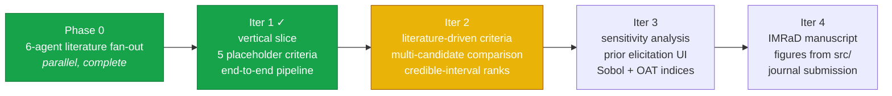
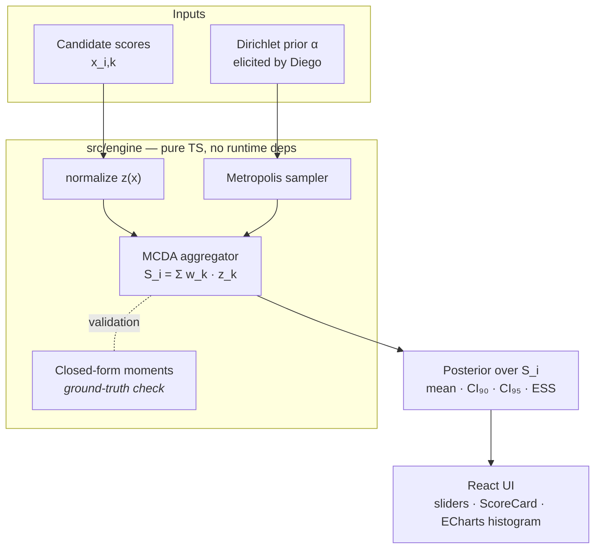

<div align="center">

# Selectron

**A Bayesian multi-criteria scoring engine for analog-astronaut selection.**

*Calibrated uncertainty over candidate fitness, not a point estimate.*

---


</div>

---

## What Selectron is

A working TypeScript application and a methodology paper, in one repository.

Selection panels for human-spaceflight analog missions (D-MARS, AMADEE, HI-SEAS, MDRS, and the broader ASTRA framework proposed by Apollonio et al. at AIAA ASCEND 2026) routinely collapse genuine uncertainty into false ordinal rankings of candidates. Selectron treats each candidate's total score as a **posterior distribution**, not a number — so a 90 % credible interval narrows when the evidence is clean and widens when it isn't, and two candidates whose posteriors overlap by more than a configurable threshold are flagged as *statistically tied* rather than silently ranked first / second.

The math is Bayesian Multi-Criteria Decision Analysis with Dirichlet weight priors and exact-form moment checks. The frontend is pure TypeScript on Vite + React + Tailwind, with the Bayesian sampler in-browser (no backend, no Python). Sampling 5 000 Metropolis-traced posterior draws over ~15 criteria takes < 500 ms in any modern browser.

The deliverable is a peer-reviewed methodology paper. The repository is the working artifact that backs every number in it.

## What Selectron is *not*

- **Not a registry or applicant-tracking database.** That is what ASTRA's *Analog Astronaut Database* (AAD) proposes. Selectron is methodological, not infrastructural.
- **Not a clinical decision-support tool.** It does not diagnose, treat, or medically clear anyone for spaceflight.
- **Not a multi-user platform.** No auth, no shared backend, no SaaS — the spec explicitly forecloses these.
- **Not a replacement for human judgement** in selection panels. It is a defensible, audit-friendly input to that judgement.

## Quick start

```bash
git clone https://github.com/strikerdlm/selectron.git
cd selectron
npm install
npm run dev          # http://localhost:5173
npm test             # 21 tests across 8 vitest suites
npm run typecheck    # tsc --noEmit
npm run build        # production bundle in dist/
```

## The four-iteration spiral



**Iter 1 is feature-complete.** The vertical slice ships a Metropolis-Hastings sampler validated against closed-form Dirichlet moments (mean error 1×10⁻⁵, variance error 2.7×10⁻³ on 50 000 samples), a React UI that re-samples the posterior on every slider change, and 21 passing tests. The full plan lives in [`docs/superpowers/plans/`](docs/superpowers/plans/).

## Bayesian MCDA in one diagram



The whole pipeline runs in-browser. There is no server. There is no Python. The methodology paper's numbers and the application's outputs are produced by the same TypeScript source, so they cannot drift.

## Architecture

```
selectron/
├── src/
│   ├── engine/                # pure-TS scoring math, zero React deps
│   │   ├── prng.ts            #   Mulberry32 seeded PRNG
│   │   ├── gamma.ts           #   Marsaglia–Tsang Gamma(shape, 1)
│   │   ├── dirichlet.ts       #   simplex sampling + closed-form moments
│   │   ├── mcda.ts            #   Bayesian aggregation + ESS diagnostic
│   │   ├── normalize.ts       #   [scale.min, scale.max] → [0, 1]
│   │   ├── synthetic.ts       #   seeded candidate generator
│   │   └── errors.ts          #   structured SelectronError codes
│   ├── ui/                    # React + Tailwind + ECharts
│   │   ├── App.tsx
│   │   └── components/
│   ├── data/                  # criterion definitions (placeholder in Iter 1)
│   └── types/                 # Criterion · Candidate · Posterior
├── tests/engine/              # 21 vitest suites — math-first TDD
├── research/                  # Phase-0 literature foundation (6 deliverables)
├── docs/                      # spec + plans + decisions
├── paper/                     # IMRaD manuscript draft (Iter 4)
└── STATUS.md                  # disconnection-recovery resume tracker
```

## The research foundation (Phase 0)

Six independent agents fanned out across the analog-selection literature in parallel before any criterion was hard-coded. Their deliverables sit in [`research/`](research/):

| Deliverable | What it is | Scope |
|---|---|---|
| [`zotero_inventory.md`](research/zotero_inventory.md) | Diego's personal Zotero library on this topic | **288** unique items; 25 central, 65 excluded, 198 related |
| [`04_existing_frameworks.md`](research/04_existing_frameworks.md) | 10 selection programs compared head-to-head | ASTRA · ESA · NASA · JAXA · D-MARS · OEWF · HI-SEAS · MDRS · CSA · Roscosmos |
| [`evidence_tables/psychological.md`](research/evidence_tables/psychological.md) | Psych constructs with retrieved predictive validity | 8 constructs; 7 with peer-reviewed effect sizes |
| [`evidence_tables/medical.md`](research/evidence_tables/medical.md) | Medical / physiological screening criteria | 11 domains; 9 with explicit numeric thresholds |
| [`evidence_tables/behavioral.md`](research/evidence_tables/behavioral.md) | BBI / team-performance constructs | 9 constructs; BBI / Salas Big Five / BHP |
| [`methodology_precedents.md`](research/methodology_precedents.md) | Bayesian MCDA in adjacent domains | 7 precedents; novelty claim grounded |
| [`02_criterion_taxonomy.md`](research/02_criterion_taxonomy.md) | Synthesizer's proposal — **20 criteria, 4 families** | Awaiting ratification → `docs/criteria.md` |

**A finding worth flagging up front:** the methodology-precedents agent recovered seven Bayesian MCDA papers from adjacent domains (clinical trials, healthcare technology assessment, multi-stakeholder ranking), and **zero** that apply Bayesian MCDA to astronaut, aircrew, or analog-astronaut selection. That gap is the paper.

## Methodology, in one paragraph

For each candidate `i`, Selectron models the total score

$$S_i \;=\; \sum_{k=1}^{K} w_k \cdot z(x_{i,k})$$

where weights $w \sim \mathrm{Dirichlet}(\alpha)$ are drawn from a prior elicited from Diego against the Phase-0 evidence, $x_{i,k}$ are the raw assessment scores, and $z(\cdot)$ is a literature-grounded normalization onto $[0,1]$. The posterior of $S_i$ is therefore a distribution, not a number; its 90 % and 95 % credible intervals propagate the weight uncertainty into the ranking. The Iter 1 sampler is hand-rolled Metropolis–Hastings on the simplex, validated against the closed-form Dirichlet moments — every test in `tests/engine/` is statistical, not snapshot-based. Iter 3 adds a sensitivity-analysis layer (Sobol + one-at-a-time) so panels can see which criterion's weight most affects the top-N ranking.

See [`docs/superpowers/specs/2026-05-18-selectron-design.md`](docs/superpowers/specs/2026-05-18-selectron-design.md) for the full design, including the explicit out-of-scope list.

## Status

- **Iter 1 vertical slice:** code-complete, all tests green, dev server live at `http://localhost:5173`.
- **Phase 0 literature fan-out:** complete; all 6 agent deliverables under `research/`.
- **Synthesis proposal:** [`research/02_criterion_taxonomy.md`](research/02_criterion_taxonomy.md) — 20 rows, 5 elicitation calls flagged for Diego.
- **Active branch:** `iter1-phase0` (40 commits, awaiting final release commit after manual UI sanity).
- **Next:** Diego ratifies the criterion taxonomy → `docs/criteria.md` → **Iter 2 starts**.

The live resume tracker is [`STATUS.md`](STATUS.md). It is updated as the single source of truth at the end of every task, so any new session (or any new agent) can pick up cleanly from a disconnection.

## Inspiration & citation

**Inspired by but methodologically distinct from:**

> Apollonio, E., Kring, J., Berry, K., & Sawyer, M. (2026). *ASTRA Framework for Enhancing Human Performance and Safety in Analog Missions: A Pathway to Optimizing Analog Astronaut Selection.* AIAA ASCEND 2026, paper 2026-3000. [doi:10.2514/6.2026-3000](https://doi.org/10.2514/6.2026-3000)

ASTRA proposes the *Analog Astronaut Database* (AAD) — standardized infrastructure. Selectron proposes a standardized **methodology** — a Bayesian scoring engine with explicit uncertainty and a sensitivity audit. The two are complementary, not competitive.

## Author

**Dr. Diego L. Malpica, MD** — Direction of Aerospace Medicine, Colombian Aerospace Force (FAC). Aerospace medicine physician, researcher, pilot, technologist. Bogotá, Colombia.

[github.com/strikerdlm](https://github.com/strikerdlm) · [research repos](https://github.com/strikerdlm?tab=repositories)

---

<sub>This repository is private and the methodology paper is in preparation. Please do not redistribute without permission.</sub>
