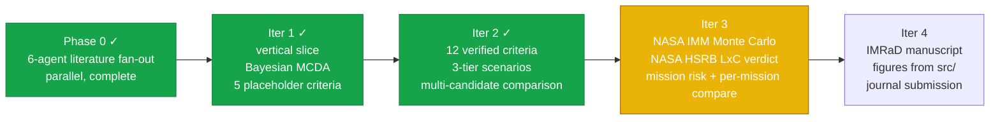
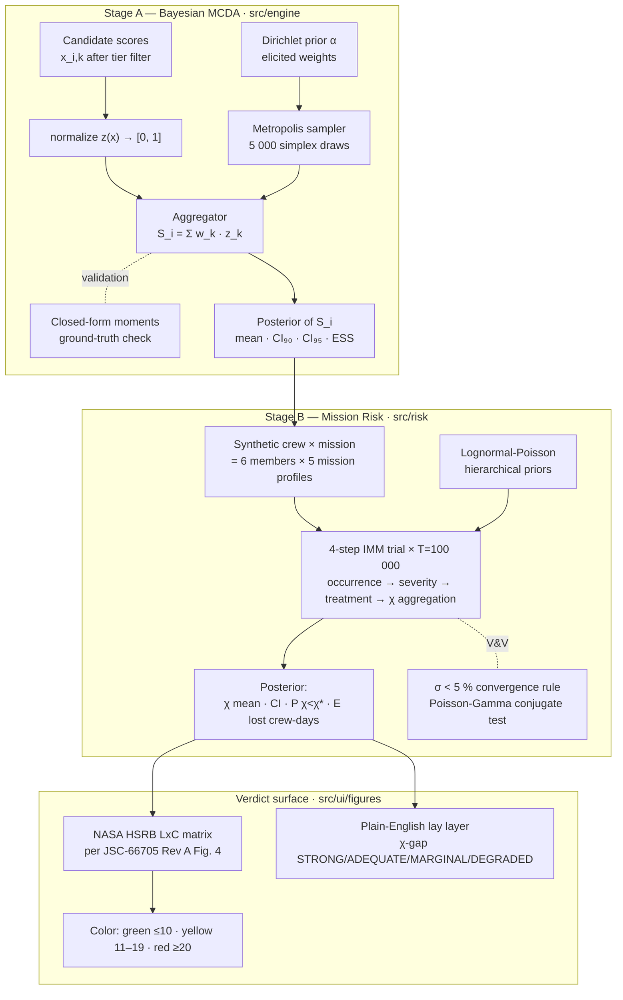

<div align="center">

# Selectron

**A Bayesian multi-criteria scoring engine for analog-astronaut selection.**

*Calibrated uncertainty over candidate fitness — and a NASA-grounded mission-risk verdict — instead of a point estimate.*

---


</div>

---

## What Selectron is

A working TypeScript application and a methodology paper, in one repository.

Selection panels for human-spaceflight analog missions (D-MARS, AMADEE, HI-SEAS, MDRS, and the broader ASTRA framework proposed by Apollonio et al. at AIAA ASCEND 2026) routinely collapse genuine uncertainty into false ordinal rankings. Selectron does two things instead:

1. **Stage A — Bayesian MCDA.** Each candidate's total score is a **posterior distribution**, not a number. Weights are drawn from a Dirichlet prior elicited from Diego against the Phase-0 literature; a 90 % / 95 % credible interval propagates that uncertainty into the ranking. Two candidates whose posteriors overlap by more than a configurable threshold are flagged as *statistically tied* rather than silently ranked first / second.
2. **Stage B — Mission-risk Monte Carlo.** A NASA-Integrated-Medical-Model-style 4-step forward simulation (occurrence → severity → treatment → CHI/QTL aggregation) at the canonical *T* = 100 000 trials per [M18] / [A22] produces the mission-level **Crew Health Index** (χ), the early-termination probability **P(χ < χ\*)**, and the expected lost crew-days. The result is plotted on NASA's official **Likelihood × Consequence matrix** per **JSC-66705 Rev A** (Human System Risk Board) so the verdict speaks the same language as the institutional process.

The math is in pure TypeScript and runs in-browser. There is no backend, no Python, no SaaS. The methodology paper's numbers and the application's outputs are produced by the same source, so they cannot drift.

## What Selectron is *not*

- **Not a registry or applicant-tracking database.** That is what ASTRA's *Analog Astronaut Database* (AAD) proposes. Selectron is methodological, not infrastructural.
- **Not a clinical decision-support tool.** It does not diagnose, treat, or medically clear anyone for spaceflight.
- **Not a multi-user platform.** No auth, no shared backend, no SaaS — the spec explicitly forecloses these. Data lives in IndexedDB on the operator's own machine.
- **Not a replacement for human judgement** in selection panels. It is a defensible, audit-friendly input to that judgement — the NASA HSRB color is decision-support, not a verdict.

## Quick start

```bash
git clone https://github.com/strikerdlm/selectron.git
cd selectron
npm install
npm run dev          # http://localhost:5173
npm test             # 171 vitest tests across 23 suites
npm run e2e          # 7 Playwright tests (figure snapshots + smoke)
npm run typecheck    # tsc --noEmit
npm run build        # production bundle in dist/
```

## The four-iteration spiral



**Iter 3 is the active iteration.** It ships:

- a forward Monte-Carlo IMM trial at *T* = 100 000 (NASA canonical per [M18] / [A22]) over 12 modeled medical conditions × 6 synthetic crewmembers, with σ < 5 % convergence check across the last two 1 000-trial increments;
- the closed-form Poisson-Gamma conjugate sanity test (V&V Factor 1) per NASA-STD-7009;
- the **NASA HSRB Likelihood × Consequence matrix** per JSC-66705 Rev A Figure 4 — verbatim 5×5 priority-score grid, verbatim In-Mission likelihood thresholds (P ≤ 0.01 %, 0.01–0.1 %, 0.1–1 %, 1–10 %, > 10 %), Mission Objectives Impact consequence band, and the §3.2.4 color rule (red ≥ 20, yellow 11–19, green ≤ 10);
- a step-by-step **CalculationTrace** UI (4 Stage-A steps + 6 IMM steps) that walks the operator through every transform between raw scores and posterior, with a plain-English lay layer for educational use;
- a **three-tier accessibility model** (Minimum / Medium / Elite) so the same criteria taxonomy can serve a Colombian low-resource analog program at Tier-1 and a NASA-grade campaign at Tier-3 — the active tier dynamically filters K (Dirichlet weight 1/K is honest to the subset);
- a **five-mission comparison panel** (D-MARS 7 d · AMADEE-class 22 d · MDRS short 45 d · HI-SEAS long · simulated Mars) with a per-mission LxC chip on every row.

The full plan lives in [`docs/superpowers/plans/`](docs/superpowers/plans/). Current resume tracker is [`STATUS.md`](STATUS.md).

## Two-stage pipeline in one diagram



The whole pipeline runs in-browser. Sampling 5 000 Stage-A draws over 8–12 active criteria takes < 500 ms; a full *T* = 100 000 Stage-B Monte Carlo over 6 crew × 12 conditions takes ~10 s on a commodity laptop with a non-blocking overlay (`flushSync` + rAF + 50 ms paint yield) so the page never appears frozen.

## Architecture

```
selectron/
├── src/
│   ├── engine/                # Stage A — pure-TS scoring math, zero React deps
│   │   ├── prng.ts            #   Mulberry32 seeded PRNG
│   │   ├── gamma.ts           #   Marsaglia–Tsang Gamma(shape, 1)
│   │   ├── dirichlet.ts       #   simplex sampling + closed-form moments
│   │   ├── mcda.ts            #   Bayesian aggregation + ESS diagnostic
│   │   ├── normalize.ts       #   [scale.min, scale.max] → [0, 1]
│   │   ├── synthetic.ts       #   seeded candidate generator
│   │   └── errors.ts          #   structured SelectronError codes
│   ├── risk/                  # Stage B — NASA IMM-style Monte Carlo + HSRB LxC
│   │   ├── chi.ts             #   CHI = 1 − QTL/(t·c) closed-form
│   │   ├── conditions.ts      #   12 modeled medical conditions catalogue
│   │   ├── incidence.ts       #   Poisson incidence sampler
│   │   ├── progression.ts     #   severity (treated/untreated) Bernoulli step
│   │   ├── treatment.ts       #   condition → treatment partial-credit
│   │   ├── simulate.ts        #   forward MC trial loop · T=100 000 default
│   │   ├── lxc-definitions.ts #   verbatim JSC-66705 Rev A Fig. 4 tables
│   │   ├── lxc.ts             #   posterior → (L, C, score, color) assessor
│   │   └── priorsSchema.ts    #   priors.json runtime validator
│   ├── imm/                   # IMM Calculator engine (NASA-EMCL-aligned, parallel to src/risk/)
│   │   ├── conditions.ts      #   100 K15 appendix conditions with provenance tags
│   │   ├── simulate.ts        #   4-step trial loop · T=100 000 · Web Worker bridge
│   │   ├── outcomes.ts        #   concurrent FI · K15 §II.A.9 formula · MSP
│   │   └── ...                #   incidence · severity · treatment modules
│   ├── ui/
│   │   ├── App.tsx            #   view switcher (Dashboard / Wizard / Sim / CrewComposition)
│   │   ├── views/
│   │   │   └── CrewComposition.tsx  # N-member crew builder + IMM MC results
│   │   ├── wizard/            #   4-step wizard: Candidate → Criteria → Review → Mission/Sim
│   │   ├── figures/
│   │   │   └── CriterionMiniFigure.tsx  # Bell-curve PDF per criterion · gate threshold dashed line
│   │   ├── dashboard/         #   candidate roster + recent sim cards
│   │   ├── components/
│   │   │   ├── CrewMemberCard.tsx   # Per-member gate verdict + per-criterion mini-figures
│   │   │   ├── PerScoreCard.tsx     # Single criterion score card with citation chip
│   │   │   ├── CompositeCrewPanel.tsx  # Crew composite aggregator + crew gate verdict
│   │   │   ├── CitationChip.tsx     # DOI + Scite retraction-status badge
│   │   │   ├── ErrorBoundary.tsx    # ErrorBoundary
│   │   │   ├── MissionPicker.tsx    # MissionPicker
│   │   │   ├── ScoreCard.tsx        # ScoreCard
│   │   │   ├── RiskCard.tsx         # RiskCard
│   │   │   └── ToastHost.tsx        # ToastHost
│   │   └── testing/           #   TestFigureHost (DEV-only e2e fixture host)
│   ├── contexts/              #   WizardContext (4-step state + Dexie autosave)
│   ├── db/                    #   Dexie v3 schema + repository (IndexedDB persistence; imm_sessions table)
│   ├── data/
│   │   ├── citations.ts       #   30-entry Scite-verified citation registry (20 confirmed, 3 DOIs replaced)
│   │   ├── imm-priors.json    #   100-condition priors with tier-A/B/C provenance tags
│   │   └── ...                #   12 verified criteria · 5 analog missions · synthetic priors
│   └── types/                 #   Criterion · Candidate · Posterior · AccessTier · risk types · IMMOutcome
├── tests/
│   ├── engine/                #   Stage-A math, math-first TDD
│   ├── risk/                  #   IMM trial, convergence, Poisson-Gamma conjugate, LxC
│   ├── data/                  #   criteria + missions catalogue invariants
│   ├── db/                    #   Dexie repository (fake-indexeddb, jsdom-scoped)
│   ├── ui/                    #   React-Testing-Library on wizard + scenario selector
│   ├── types/                 #   type-level invariants
│   └── e2e/                   #   Playwright snapshot + smoke (7 tests)
├── research/                  #   Phase-0 literature foundation + tier-criteria evidence
├── docs/                      #   specs + plans + NASA Monte-Carlo audit + V&V dossier
├── paper/                     #   IMRaD manuscript draft (Iter 4)
└── STATUS.md                  #   disconnection-recovery resume tracker
```

## Verification & Validation (V&V)

The Iter-3 V&V dossier maps Selectron against NASA-STD-7009A's eight credibility factors:

- **Factor 1 (Verification)** — closed-form Poisson-Gamma conjugate sanity test (5 cases) and verbatim-grid check of the JSC-66705 Fig. 4 priority-score matrix.
- **Factor 2 (Validation)** — convergence at the NASA-canonical *T* = 100 000 trials per [M18] / [A22], σ < 5 % rule across the last two 1 000-trial increments.
- **Factor 3 (Input Pedigree)** — 18 of 19 references verified with DOIs via Scite citation intelligence; corrections logged for Cooper 1968 and Petrides 2007.

See [`docs/iter3_vv_dossier.md`](docs/iter3_vv_dossier.md) and [`docs/iter3_nasa_monte_carlo_audit.md`](docs/iter3_nasa_monte_carlo_audit.md) for the verbatim NASA quotes that ground these numbers.

## The research foundation (Phase 0 + tier evidence)

Six independent agents fanned out across the analog-selection literature in parallel before any criterion was hard-coded. Their deliverables sit in [`research/`](research/):

| Deliverable | What it is | Scope |
|---|---|---|
| [`zotero_inventory.md`](research/zotero_inventory.md) | Diego's personal Zotero library on this topic | **288** unique items; 25 central, 65 excluded, 198 related |
| [`04_existing_frameworks.md`](research/04_existing_frameworks.md) | 10 selection programs compared head-to-head | ASTRA · ESA · NASA · JAXA · D-MARS · OEWF · HI-SEAS · MDRS · CSA · Roscosmos |
| [`evidence_tables/psychological.md`](research/evidence_tables/psychological.md) | Psych constructs with retrieved predictive validity | 8 constructs; 7 with peer-reviewed effect sizes |
| [`evidence_tables/medical.md`](research/evidence_tables/medical.md) | Medical / physiological screening criteria | 11 domains; 9 with explicit numeric thresholds |
| [`evidence_tables/behavioral.md`](research/evidence_tables/behavioral.md) | BBI / team-performance constructs | 9 constructs; BBI / Salas Big Five / BHP |
| [`methodology_precedents.md`](research/methodology_precedents.md) | Bayesian MCDA in adjacent domains | 7 precedents; novelty claim grounded |
| [`02_criterion_taxonomy.md`](research/02_criterion_taxonomy.md) | Synthesizer's proposal | 20 criteria, 4 families |
| [`2026-05-19_test_battery_tiers.md`](research/2026-05-19_test_battery_tiers.md) | Tier-1/2/3 instrument evidence (Iter-3 scope expansion) | CogScreen ↔ NASA Cognition Battery alternatives; PVT-B iOS accessibility |

**A finding worth flagging up front:** the methodology-precedents agent recovered seven Bayesian MCDA papers from adjacent domains (clinical trials, healthcare technology assessment, multi-stakeholder ranking), and **zero** that apply Bayesian MCDA to astronaut, aircrew, or analog-astronaut selection. The combination of Bayesian MCDA + NASA HSRB LxC mapping is the paper.

## Methodology, in two paragraphs

**Stage A — Bayesian MCDA.** For each candidate `i`, Selectron models the total score

$$S_i \;=\; \sum_{k=1}^{K} w_k \cdot z(x_{i,k})$$

where weights $w \sim \mathrm{Dirichlet}(\alpha)$ are drawn from a prior elicited from Diego against the Phase-0 evidence, $x_{i,k}$ are the raw assessment scores (in canonical units after tier-aware scale transform), and $z(\cdot)$ is a literature-grounded normalization onto $[0, 1]$. The posterior of $S_i$ is therefore a distribution, not a number; its 90 % and 95 % credible intervals propagate the weight uncertainty into the ranking. The sampler is hand-rolled Metropolis–Hastings on the simplex, validated against the closed-form Dirichlet moments — every Stage-A test in `tests/engine/` is statistical, not snapshot-based.

**Stage B — Mission-risk Monte Carlo.** Stage A's posterior conditions a synthetic crew of 6 members per analog mission. A 4-step forward simulation (occurrence → severity → treatment → CHI aggregation) is run at the NASA-canonical *T* = 100 000 trials per [M18] / [A22], using lognormal-Poisson hierarchical priors over 12 modeled medical conditions. The mission posterior carries χ (Crew Health Index, χ = 1 − QTL/(t·c)), the early-termination probability **P(χ < χ\*)** at a configurable operational floor (default χ\* = 0.7 per NASA reference programs), and the expected lost crew-days. These three numbers feed the **NASA HSRB Likelihood × Consequence matrix** verbatim from JSC-66705 Rev A Figure 4 — likelihood bucketed by P(χ < χ\*), consequence bucketed by 1 − χ_mean (= fraction of mission crew-days lost) under the Mission Objectives Impact sub-category, then looked up in the 5×5 priority-score grid and mapped to a NASA color per §3.2.4 (red ≥ 20, yellow 11–19, green ≤ 10).

See [`docs/superpowers/specs/2026-05-18-selectron-iter3-risk.md`](docs/superpowers/specs/2026-05-18-selectron-iter3-risk.md) for the full Iter-3 design and the explicit out-of-scope list.

## IMM Calculator + Crew Composition

Selectron now ships a **NASA-IMM-aligned probabilistic medical-risk calculator** alongside Stage A MCDA + Stage B HSRB-LxC. The Crew Composition view (`/CrewComposition`) lets you build a crew of N members, each with their own Stage A scores across the 12 Selectron criteria, and produces:

- **Per-member status**: qualified / disqualified per binary clearance gates (MMPI-2-RF EID T<65 per Harrell 1992; NASA Cognition Battery z>−2 per Basner 2015).
- **Per-criterion ECharts mini-figures**: bell-curve PDF with the member's score marked, gate-threshold dashed line, Scite-verified citation chip (DOI + retraction status).
- **Crew composite** (live): aggregator selectable as `mean` / `worst-link` / `geometric-mean` (worst-link is default, empirically validated by Vâlcea 2019).
- **Crew gate verdict**: whole-crew DQ on any failed member (mirrors NASA's binary disqualification process).
- **IMM Monte Carlo (Web Worker)**: T=100k 4-step trial across 100 NASA-EMCL medical conditions × mission profile × resource kit. Outputs TME, CHI, pEVAC, pLOCL, and the new **Mission Success Probability** (no LOCL ∧ no EVAC ∧ CHI ≥ χ\*).
- **Three kit scenarios**: None / ISS HMS / Unlimited per K15 Table 1; custom kit override available.

**Architecture:** parallel `src/imm/` engine alongside existing `src/risk/`. Engine math: Lognormal-Poisson + Gamma-Poisson + Beta-Bernoulli incidence, Beta-Pert outcomes (RAF interpolation), concurrent FI per K15 §II.A.9, per-member z-scored Stage A vulnerability injection.

**Citations:** every gate threshold + criterion + composite method + MSP formulation cites a Scite-verified primary source via `src/data/citations.ts` (30 entries, 20 Scite-verified, 3 DOIs replaced after Scite caught wrong-paper attribution).

**Result figures** (mounted in CrewComposition's "IMM simulation figures" region when a sim outcome exists):
- **I1 IMMHeadlineCard** — 4-stat hero composite (TME / CHI / pEVAC / pLOCL) + Mission Success Probability + σ(CHI) convergence sparkline.
- **I2 IMMPosteriorHist** — parametric Gaussian-approximated posterior panels with CI₉₀ + μ overlay.
- **I3 IMMConditionDrivers** — per-condition lollipop sorted by contribution; toggle between pEVAC and pLOCL drivers; family-colored dots.
- **I4 IMMConvergencePlot** — σ(CHI) and σ(pEVAC) vs cumulative trials with M18/A22 5 % reference line; T<1 000 sentinel.
- **I5 IMMValidationCompare** — dumbbell run vs K15 issHMS reference (TME=106, CHI=94.93, pEVAC=5.57 %, pLOCL=0.44 %); dots blue if K15 ref ∈ run CI₉₅, amber otherwise.

Three more figures are planned but engine-blocked: **I6 IMMSensitivityTornado** (needs ±50 % per-condition perturbation runner — Phase B2), **I7 IMMCrewRiskHeat** (needs per-crew × per-condition counts surfaced from `runIMMTrial`), **I8 IMMVulnerabilityCalibration** (needs trained vulnerability MLP — Phase 3).

**Validation status (current, 2026-05-22 priors-rev3-a):** K15 Table 1 reproduction is partial. Only `unlimited`-scenario CHI reproduces within ~2 pp of reference (92.98 vs 94.98). `unlimited` pEVAC and pLOCL overshoot slightly *below* the reference (over-correction signal). `issHMS` pEVAC reduced from 16.41 % toward 5.57 % (now at 12.82 %) by closing the kit-fallthrough coupling via 45-key resource-name normalization. Persistent residuals: TME +44 to +51 across all scenarios (incidence-level error, deferred to priors-rev3-b multi-knob calibration); 'none' pEVAC under-elicited at 19 % vs K15 reference 67 % (deferred to priors-rev3-c closed-form rescale). Full delta table + phasing in [`docs/iter5_priors_rev3_strategy.md`](docs/iter5_priors_rev3_strategy.md) and [`docs/iter3_vv_dossier.md`](docs/iter3_vv_dossier.md) §5.

See [`docs/superpowers/specs/2026-05-20-selectron-imm-calculator-design.md`](docs/superpowers/specs/2026-05-20-selectron-imm-calculator-design.md) for the design spec and [`docs/superpowers/plans/2026-05-20-selectron-imm-calculator.md`](docs/superpowers/plans/2026-05-20-selectron-imm-calculator.md) for the 97-task implementation plan.

## Status

- **Iter 1 vertical slice:** code-complete, math validated, all engine tests green.
- **Iter 2 criteria + tiers:** 12 evidence-grounded criteria with verified DOIs, 3-tier accessibility model (Minimum / Medium / Elite), tier-aware scale transforms.
- **Iter 3 risk + LxC:** NASA IMM Monte Carlo at *T* = 100 000, NASA HSRB LxC verdict per JSC-66705 Rev A, CHIExplainer + LxCMatrix UI, per-mission LxC chips in the comparison panel.
- **Iter 4 manuscript:** initial IMRaD draft complete; figure pipeline (F1–F7) reproducible from `src/`.
- **Iter 5 IMM Calculator (active):** Phase 0 (100-condition catalog + 3-tier priors) + Phase 1 (engine math, σ<5 % convergence) DONE; Phase 2 data layer scaffolding started — Dexie v3 + `imm_sessions` CRUD landed (IMM-37/38); Phase 4 figures partial — I1–I5 shipped and wired into CrewComposition (I6/I7/I8 engine-blocked); priors re-elicitation rev3-a landed, rev3-b/c/d deferred to follow-up sessions.
- **Phase 0 literature fan-out:** complete; all 6 agent deliverables under `research/`.
- **Active branch:** `iter1-phase0` (still the working branch name from Iter-1; rebased history carries Iter-2, Iter-3, Iter-4, and Iter-5 work).

The live resume tracker is [`STATUS.md`](STATUS.md). It is updated as the single source of truth at the end of every task, so any new session (or any new agent) can pick up cleanly from a disconnection. Citation metadata is in [`CITATION.cff`](CITATION.cff) (GitHub renders a "Cite this repository" button).

## What's left to do

Ordered by impact, honest about blockers:

1. **IMM priors-rev3-b — multi-knob incidence calibration** (HIGH PRIORITY; gates IMM Phase 2 acceptance and IMM-86 K15 reproduction test). TME is uniformly +44 to +51 above K15 reference across all 3 scenarios; the existing single-Tier-C-scalar `src/imm/calibration.ts` cannot reach it. Extend to per-tier × per-scenario multipliers (tierA / tierB / tierC × none / issHMS / unlimited). Single deep-work session — not parallelisable per the rev3 strategy in [`docs/iter5_priors_rev3_strategy.md`](docs/iter5_priors_rev3_strategy.md); 5–15 `validate_imm` cycles × ~5 min each.
2. **IMM priors-rev3-c — closed-form per-event `untreated.p_evac` rescale.** Depends on rev3-b. Target: lift `none` pEVAC from 19 % to K15's 67 %. Closed-form, deterministic — once incidence is fit, this is a one-pass calculation.
3. **IMM Phase 2 UI — `IMMCalculator.tsx` standalone view (IMM-39 → IMM-51).** Now unblocked by IMM-37/38 (data layer in place). 13 tasks: CrewBuilder, KitPicker, Mission inputs, ResultsCard, prior-override drilldown, Run button + Web Worker, K15 validation badge, engine toggle, vulnerability mode toggle, quick-load presets, session save/load/share UI, P2 acceptance gate. Several of these are parallel-dispatchable (each task is one component file + tests).
4. **Engine extensions to unblock the remaining 3 IMM figures.**
   - **I6 IMMSensitivityTornado:** add a ±50 % per-condition perturbation runner (re-runs `simulateIMM` with bumped λ per condition; not the GP surrogate of design spec §22 — a deterministic v1 is fine).
   - **I7 IMMCrewRiskHeat:** surface per-crew × per-condition counts from `runIMMTrial` into `IMMOutcome` (currently only mission-aggregate `perConditionDrivers` is exposed).
   - **I8 IMMVulnerabilityCalibration:** depends on Phase 3 ML — vulnerability MLP training (IMM-57+ all PENDING).
5. **Phase 3 ML layer (IMM-52 → IMM-65)** — surrogate (LightGBM) + vulnerability MLP (TFJS). 14 tasks. Deliberately deferred per the IMM Calculator plan; not on this release's critical path.
6. **Validation gates (IMM-86 / IMM-87)** — K15 Table 1 reproduction test + TM21 AMM/SMM ±20 % gate. Both written as `tests/imm/validation.test.ts`; will fail until rev3-b/c land.
7. **AWAITING-DIEGO sign-offs** — Iter-1 manual UI sanity (Task 17), Iter-3 Mission-risk tab manual sanity (Task 58), Phase 3F acceptance (Task 88), Iter-2 ratification of `research/02_criterion_taxonomy.md` → `docs/criteria.md` (gates Iter-2 start).

See [`STATUS.md`](STATUS.md) for the full per-task tracker (97 IMM tasks + Iter-1/2/3/4 history) and [`docs/iter5_priors_rev3_strategy.md`](docs/iter5_priors_rev3_strategy.md) for the priors re-elicitation phasing.

## Inspiration & citation

**Inspired by but methodologically distinct from:**

> Apollonio, E., Kring, J., Berry, K., & Sawyer, M. (2026). *ASTRA Framework for Enhancing Human Performance and Safety in Analog Missions: A Pathway to Optimizing Analog Astronaut Selection.* AIAA ASCEND 2026, paper 2026-3000. [doi:10.2514/6.2026-3000](https://doi.org/10.2514/6.2026-3000)

ASTRA proposes the *Analog Astronaut Database* (AAD) — standardized infrastructure. Selectron proposes a standardized **methodology** — a Bayesian scoring engine plus a NASA-HSRB-grounded mission-risk verdict, both with explicit uncertainty and a sensitivity audit. The two are complementary, not competitive.

**Primary NASA reference for the mission-risk verdict:**

> NASA Johnson Space Center, Health and Medical Technical Authority (2020). *Human System Risk Management Plan*, JSC-66705 Revision A. Figure 4 (Likelihood × Consequence Scale Definitions and LxC Matrix used for scoring Risks) and §3.2.4 (LxC Assessment and Colors). [NTRS PDF](https://ntrs.nasa.gov/api/citations/20205008887/downloads/FINAL_JSC-66705%20Human%20System%20Risk%20Management%20Plan%20Rev%20B.pdf).

## Author

**Dr. Diego L. Malpica, MD** — Direction of Aerospace Medicine, Colombian Aerospace Force (FAC). Aerospace medicine physician, researcher, pilot, technologist. Bogotá, Colombia.

[github.com/strikerdlm](https://github.com/strikerdlm) · [research repos](https://github.com/strikerdlm?tab=repositories)

---

<sub>Released under the MIT License. Methodology paper accompanying this artifact: Malpica (2026), in preparation.</sub>
