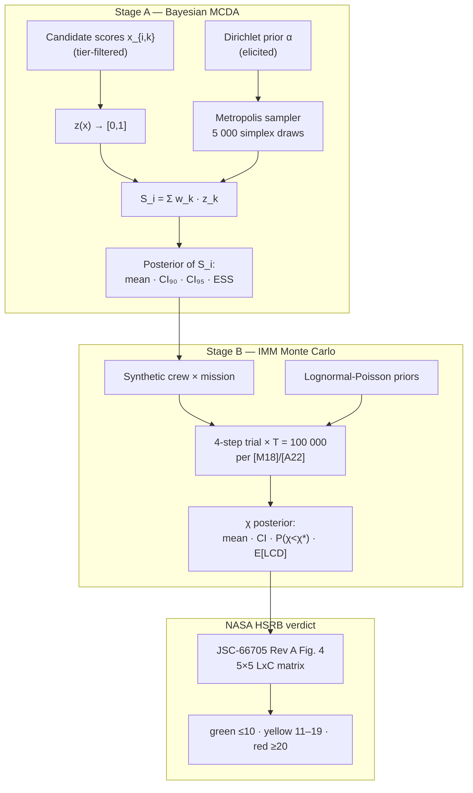

# Selectron Manuscript Implementation Plan (Iter 4)

> **For agentic workers:** REQUIRED SUB-SKILL: Use superpowers:subagent-driven-development (recommended) or superpowers:executing-plans to implement this plan task-by-task. Steps use checkbox (`- [ ]`) syntax for tracking.

**Goal:** Produce a complete, npj-Microgravity-ready manuscript at `paper/manuscript.md` (rendered to `paper/manuscript.docx`) covering Selectron's full pipeline — Bayesian MCDA + NASA HSRB LxC mission-risk verdict — and the supplementary package, by 2026-06-19, with submission early July 2026.

**Architecture:** The manuscript draft is authored as Markdown in `paper/manuscript.md` with figures committed under `paper/figures/` (SVG source + 300-dpi PNG). Methods-forward IMRaD per the design spec, ~7 000 main-body words, 7 main figures + 2 supplementary. Every figure regenerable from the repo at a citable commit SHA. References managed in `paper/references.bib` and DOI-verified via Scite MCP before submission. Final DOCX rendered via pandoc; license bumped to MIT and the commit Zenodo-archived at submission. All work happens on `iter1-phase0` (branch naming is historical).

**Tech Stack:** Markdown + pandoc for prose; existing TypeScript/Vite/React app for figure generation; Playwright for figure snapshots via `TestFigureHost`; Scite MCP for DOI verification; Zenodo for the artifact DOI; CITATION.cff for citability metadata. No new runtime dependencies in the Selectron app itself.

**Source spec:** [`docs/superpowers/specs/2026-05-20-selectron-manuscript-design.md`](../specs/2026-05-20-selectron-manuscript-design.md).

---

## File structure for the manuscript

| Path | Role |
|---|---|
| `paper/manuscript.md` | Single-source Markdown manuscript (all main-body sections). Pandoc-rendered to DOCX. |
| `paper/cover-letter.md` | Cover letter for npj Microgravity submission. |
| `paper/abstract.md` | Standalone structured abstract (also embedded in manuscript.md). |
| `paper/references.bib` | BibTeX reference database (~45–55 entries; DOI-verified). |
| `paper/figures/F1_pipeline.svg` + `.png` | Pipeline overview (Mermaid → SVG → PNG@300dpi). |
| `paper/figures/F2_criterion_tiers.svg` + `.png` | Criterion taxonomy × tier matrix. |
| `paper/figures/F3_posterior.png` | Stage A posterior (Playwright snapshot). |
| `paper/figures/F4_calc_trace.png` | Stage A calculation trace snapshot. |
| `paper/figures/F5_convergence.svg` + `.png` | Stage B σ-convergence plot. |
| `paper/figures/F6_lxc_matrix.png` | NASA HSRB LxC matrix snapshot. |
| `paper/figures/F7_mission_compare.png` | Mission comparison + LxC chips snapshot. |
| `paper/figures/S1_vv_dossier.svg` + `.png` | V&V dossier visual. |
| `paper/figures/S2_ess_table.png` | Per-mission CHI ESS table. |
| `paper/supplementary/S-Methods-1-vv-dossier.md` | Symlink or copy of `docs/iter3_vv_dossier.md`. |
| `paper/supplementary/S-Methods-2-nasa-mc-audit.md` | Symlink or copy of `docs/iter3_nasa_monte_carlo_audit.md`. |
| `paper/supplementary/S-Notebooks/` | PyMC notebook scaffold (existing). |
| `LICENSE` (repo root) | MIT license (added at W4). |
| `CITATION.cff` (repo root) | Zenodo-compatible citation metadata. |

**Commit convention:** `docs(paper): <task short title>` for prose work; `feat(paper): <task>` for figure generation requiring new code; `chore(paper): <task>` for packaging/license. No AI co-author lines (per `/root/repos/CLAUDE.md`). Per `/root/repos/CLAUDE.md` "Disclosure is never required and never given" — the workspace policy overrides the more restrictive AI-authoring policy in `/root/CLAUDE.md`.

---

## Week 1 (2026-05-20 → 2026-05-26) — Scaffolding + Methods §2.1–2.6 + F1, F2

### Task 1: Scaffold paper/ directory

**Files:**
- Create: `paper/manuscript.md`
- Create: `paper/abstract.md`
- Create: `paper/cover-letter.md`
- Create: `paper/references.bib`
- Create: `paper/figures/.gitkeep`
- Create: `paper/supplementary/.gitkeep`

- [ ] **Step 1: Verify paper/ doesn't already have a stale draft**

Run: `ls paper/ 2>/dev/null`
Expected: only `figures/` directory (placeholder). If `manuscript.md` already exists, STOP and ask Diego before overwriting.

- [ ] **Step 2: Create the manuscript scaffold**

Write `paper/manuscript.md` with this exact structure (placeholders for sections; each section header maps to a future task):

```markdown
---
title: "Bayesian Multi-Criteria Decision Analysis with NASA Human-System-Risk-Board Likelihood × Consequence Mapping for Analog-Astronaut Selection"
running_header: "Bayesian MCDA + NASA HSRB-LxC for analog-astronaut selection"
author:
  - name: "Diego L. Malpica, MD"
    affiliation: "Direction of Aerospace Medicine, Colombian Aerospace Force (FAC), Bogotá, Colombia"
    email: "dlmalpica@yahoo.com"
date: "2026-06-19"
target: "npj Microgravity"
bibliography: references.bib
---

## Abstract

<!-- T22: 200-word structured abstract — see paper/abstract.md -->

## 1. Introduction

<!-- T17: ~900 words; 4-point lead framing per spec §3 -->

## 2. Methods

### 2.1 Criterion taxonomy and three-tier accessibility model

<!-- T2: ~350 words -->

### 2.2 Stage A — Bayesian multi-criteria decision analysis

<!-- T3: ~600 words; Equation 1 -->

### 2.3 Stage B — IMM-style mission-risk Monte Carlo

<!-- T4: ~700 words; Equation 2; T = 100 000 justification -->

### 2.4 NASA HSRB Likelihood × Consequence mapping

<!-- T5: ~450 words; verbatim JSC-66705 Fig. 4 + §3.2.4 -->

### 2.5 Implementation and reproducibility

<!-- T6: ~250 words; commit SHA + Zenodo DOI -->

### 2.6 Verification and validation

<!-- T7: ~250 words; NASA-STD-7009A factors 1–3 -->

## 3. Results

<!-- T16: ~1800 words; worked example walking F3–F7 -->

## 4. Discussion

### 4.1 What the dual-novelty enables

<!-- T18: ~300 words -->

### 4.2 Positioning vs precedents

<!-- T19: ~350 words; from research/methodology_precedents.md -->

### 4.3 Open methodological risks

<!-- T20: ~300 words; six risks acknowledged -->

### 4.4 Limitations

<!-- T21: ~150 words -->

### 4.5 Future work

<!-- T21: ~100 words; Iter-3 sensitivity layer; retrospective cross-walk -->

## 5. Conclusion

<!-- T25: ~200 words -->

## References

<!-- BibTeX rendered via pandoc from paper/references.bib -->
```

- [ ] **Step 3: Create the empty companion files**

Write each of these files as empty placeholders with a header comment:

`paper/abstract.md`:
```markdown
<!-- T22: structured abstract, 200 words, sections: Background / Methods / Results / Conclusions -->
```

`paper/cover-letter.md`:
```markdown
<!-- T33: cover letter for npj Microgravity submission -->
```

`paper/references.bib`:
```bibtex
% T23: BibTeX entries for the manuscript. ~45–55 entries. DOI-verified via Scite MCP.
```

Touch `paper/figures/.gitkeep` and `paper/supplementary/.gitkeep` to materialize the directories.

- [ ] **Step 4: Verify the scaffold renders with pandoc**

Run: `pandoc --version | head -1 && pandoc paper/manuscript.md -o /tmp/scaffold-check.docx && ls -la /tmp/scaffold-check.docx`
Expected: pandoc reports its version; `/tmp/scaffold-check.docx` exists and is > 5 KB. If pandoc is not installed: `apt-get install -y pandoc` (sudo) or skip this verification and flag for W5.

- [ ] **Step 5: Commit**

```bash
git add paper/
git commit -m "docs(paper): scaffold manuscript directory + section headers"
```

---

### Task 2: Methods §2.1 — Criterion taxonomy and three-tier accessibility model

**Files:**
- Modify: `paper/manuscript.md` (replace the `<!-- T2 -->` block under §2.1)

**Definition of done (the "test"):** §2.1 contains, in order:
- A one-sentence summary of the 12 criteria taxonomy.
- The four families (psychological, medical, behavioral, cognitive — or whatever `research/02_criterion_taxonomy.md` ratifies).
- A reference to Table 1 (full criterion list with DOIs).
- The three-tier model definitions: Minimum (8 active criteria), Medium (10), Elite (12), each tied to operational accessibility.
- A note on tier-specific scale transforms (e.g. CD-RISC-10 0–40 ×2.5 → 0–100 canonical), citing the §3.2.4 of JSC-66705 Mission Objectives Impact sub-category single-sub-category rule does NOT apply here (this is MCDA prep, not LxC).
- Word count 320–380 (target 350 ±10 %).
- ≥ 2 inline citations.

- [ ] **Step 1: Read the source material**

Read these files (do not modify them):
- `research/02_criterion_taxonomy.md` — synthesizer's 20-criterion proposal.
- `research/2026-05-19_test_battery_tiers.md` — tier instrument evidence.
- `src/data/placeholder-criteria.ts` — the 12 final criteria with tier assignments.

- [ ] **Step 2: Draft the paragraph**

Replace the `<!-- T2 -->` comment in `paper/manuscript.md` §2.1 with three paragraphs (~120 words each):

Paragraph 1 (taxonomy): introduce the 12-criterion taxonomy, its four families, and reference Table 1. Cite Phase-0 deliverables.

Paragraph 2 (tiers): define Minimum / Medium / Elite. State that Tier-1 corresponds to a low-resource analog program (Colombian context as a worked example), Tier-3 to a NASA-grade campaign. The Dirichlet weight is 1/K where K is the active subset size, so the posterior is internally honest about which tests the program measured.

Paragraph 3 (scale transforms): list the three instruments that use a scale transform (CD-RISC-10 ×2.5, PHQ-9 ×2.33, FMT inverse-mapping note). Cite the instrument primary sources.

- [ ] **Step 3: Verify the section against the definition of done**

Run: `wc -w < <(awk '/^### 2.1 /,/^### 2.2 /' paper/manuscript.md | sed '$d')`
Expected: 320–380.

Manually verify: 12 criteria mentioned, 4 families named, Table 1 referenced, 3 tiers defined, scale transforms listed, ≥ 2 citations as `[@key]`.

- [ ] **Step 4: Commit**

```bash
git add paper/manuscript.md
git commit -m "docs(paper): Methods §2.1 — criterion taxonomy + 3-tier accessibility model"
```

---

### Task 3: Methods §2.2 — Stage A Bayesian MCDA

**Files:**
- Modify: `paper/manuscript.md` §2.2

**Definition of done:** §2.2 contains, in order:
- A definition of Stage A (Bayesian MCDA) in one sentence.
- The Dirichlet prior over weights, with α as the elicited concentration parameter (cite Saint-Hilary 2017).
- Equation 1 (rendered in pandoc-LaTeX): `$$S_i = \sum_{k=1}^{K} w_k \cdot z(x_{i,k})$$`.
- A description of the Metropolis sampler on the simplex (cite Mulberry32 PRNG + Marsaglia–Tsang Gamma).
- The normalization function $z(\cdot)$: linear map from `[scale.min, scale.max]` to `[0, 1]`, with the `higherIsBetter` flag handling inverse-direction criteria.
- The ESS diagnostic and the closed-form Dirichlet moments validation.
- Word count 540–660 (target 600 ±10 %).
- ≥ 4 inline citations.

- [ ] **Step 1: Read source code anchors**

Read these files (no modifications):
- `src/engine/dirichlet.ts` — sampler + moments.
- `src/engine/mcda.ts` — aggregator + ESS.
- `src/engine/normalize.ts` — z() implementation.
- `src/engine/gamma.ts` — Marsaglia–Tsang.

- [ ] **Step 2: Draft the section**

Replace the `<!-- T3 -->` comment with five paragraphs (~120 words each):

P1: definition + scope of Stage A.
P2: Dirichlet prior — α-vector elicitation from Phase-0 evidence; α₀ = Σα interpreted as confidence per Saint-Hilary 2017.
P3: Equation 1 + variable definitions.
P4: sampler details (Mulberry32 PRNG seed, Marsaglia–Tsang Gamma, Metropolis on simplex, 5 000 draws default).
P5: validation — closed-form Dirichlet moments, ESS, normalization.

- [ ] **Step 3: Verify**

Run: `wc -w < <(awk '/^### 2.2 /,/^### 2.3 /' paper/manuscript.md | sed '$d')`
Expected: 540–660.

Verify: Equation 1 present in `$$...$$` form, ≥ 4 `[@key]` citations, ESS and closed-form check both mentioned.

- [ ] **Step 4: Commit**

```bash
git add paper/manuscript.md
git commit -m "docs(paper): Methods §2.2 — Stage A Bayesian MCDA + Equation 1"
```

---

### Task 4: Methods §2.3 — Stage B IMM-style Monte Carlo

**Files:**
- Modify: `paper/manuscript.md` §2.3

**Definition of done:** §2.3 contains:
- Definition of Stage B and its inputs (Stage A posterior + analog-mission profile).
- The 4-step trial: occurrence (Poisson incidence) → severity (Bernoulli, treated/untreated) → treatment (partial credit) → CHI aggregation.
- Equation 2: `$$\chi = 1 - \frac{\text{QTL}}{t \cdot c}$$` with `t` = mission length, `c` = crew size.
- Justification of T = 100 000 trials per [M18] and [A22] (with verbatim quote attribution — see `docs/iter3_nasa_monte_carlo_audit.md` for the citations).
- The σ < 5 % convergence rule across the last two 1 000-trial increments.
- The 12 modeled medical conditions catalogue (`src/risk/conditions.ts`) at a high level.
- Word count 630–770 (target 700 ±10 %).
- ≥ 5 inline citations.

- [ ] **Step 1: Read source anchors**

Read:
- `src/risk/simulate.ts` — trial loop.
- `src/risk/incidence.ts`, `src/risk/progression.ts`, `src/risk/treatment.ts`, `src/risk/chi.ts`.
- `src/risk/conditions.ts` — 12 conditions.
- `docs/iter3_nasa_monte_carlo_audit.md` — verbatim NASA quotes.

- [ ] **Step 2: Draft the section**

Replace the `<!-- T4 -->` comment with six paragraphs (~115 words each):

P1: Stage B definition + Stage A → Stage B interface.
P2: 4-step trial (occurrence/severity/treatment/aggregation) — describe each step's distribution and parameter source.
P3: Equation 2 + variable definitions.
P4: T = 100 000 justification with [M18] and [A22] verbatim references; contrast with the cheaper T = 25 000 default Selectron previously used.
P5: σ < 5 % convergence rule + the M18 convergence test that codifies it.
P6: 12-condition catalogue at high level (categories: medical, behavioral, surgical; pull from `conditions.ts`).

- [ ] **Step 3: Verify**

Run: `wc -w < <(awk '/^### 2.3 /,/^### 2.4 /' paper/manuscript.md | sed '$d')`
Expected: 630–770.

Verify: Equation 2 present, T = 100 000 stated with [M18]+[A22] cited, σ < 5 % rule stated, 4 steps named.

- [ ] **Step 4: Commit**

```bash
git add paper/manuscript.md
git commit -m "docs(paper): Methods §2.3 — Stage B IMM Monte Carlo + Equation 2 + T=100k justification"
```

---

### Task 5: Methods §2.4 — NASA HSRB LxC mapping

**Files:**
- Modify: `paper/manuscript.md` §2.4

**Definition of done:** §2.4 contains:
- Citation of JSC-66705 Rev A (Oct 2020) as the source of truth.
- The verbatim 5×5 priority-score grid (small inline table or reference to F6).
- The likelihood scale (In-Mission column from Fig. 4): L1 ≤ 0.01 %, L2 ≤ 0.1 %, L3 ≤ 1 %, L4 ≤ 10 %, L5 > 10 %.
- The consequence sub-category choice (Mission Objectives Impact) with the explicit justification from JSC-66705 §3.2.4 p. 29 "Only one Sub-Impact Category shall be used to inform the LxC score for each Impact category."
- The Selectron mapping: L = bucketed P(χ < χ*); C = bucketed (1 − χ_mean) under Mission Objectives Impact.
- The color rule (§3.2.4 p. 27): red ≥ 20, yellow 11–19, green ≤ 10.
- The IEEE-754 epsilon tolerance for boundary cases.
- Word count 405–495 (target 450 ±10 %).
- ≥ 3 citations (JSC-66705, NPR 8000.4C, the 2023 npj Microgravity HSRB update paper).

- [ ] **Step 1: Read source anchors**

Read:
- `src/risk/lxc-definitions.ts` — verbatim Fig. 4 tables.
- `src/risk/lxc.ts` — the assessLxC mapper.
- `tests/risk/lxc.test.ts` — boundary cases.
- The PDF excerpts already in this conversation context (JSC-66705 pages 26–30).

- [ ] **Step 2: Draft the section**

Replace the `<!-- T5 -->` comment with four paragraphs (~110 words each):

P1: HSRB context (the institutional framework) + JSC-66705 citation. Cite the 2023 npj Microgravity HSRB update paper alongside.
P2: Likelihood scale — verbatim In-Mission thresholds, with Selectron's P(χ < χ*) feeding L.
P3: Consequence sub-category choice — Mission Objectives Impact selected per §3.2.4 p. 29 single-sub-category rule because (1 − χ_mean) = fraction crew-days lost = mission-time-lost rollup, not per-crewmember clinical severity.
P4: Color rule (§3.2.4 p. 27) + IEEE-754 epsilon-tolerance implementation note. Reference F6 for the visual.

- [ ] **Step 3: Verify**

Run: `wc -w < <(awk '/^### 2.4 /,/^### 2.5 /' paper/manuscript.md | sed '$d')`
Expected: 405–495.

Verify: JSC-66705 cited as `[@jsc66705]`, all five likelihood thresholds present, Mission Objectives Impact justified with the §3.2.4 p. 29 quote, color cut-offs stated.

- [ ] **Step 4: Commit**

```bash
git add paper/manuscript.md
git commit -m "docs(paper): Methods §2.4 — NASA HSRB LxC mapping per JSC-66705 Rev A"
```

---

### Task 6: Methods §2.5 — Implementation and reproducibility

**Files:**
- Modify: `paper/manuscript.md` §2.5

**Definition of done:** §2.5 contains:
- TypeScript / Vite / React / IndexedDB stack with no backend.
- The commit SHA used for all figures (placeholder — will be populated in W5).
- The Zenodo DOI placeholder (also W5).
- The MIT license declaration.
- The fact that the same source produces both the application and the figures (no figure rot).
- A note on the 171 vitest + 7 Playwright test suite.
- Word count 225–275 (target 250 ±10 %).
- ≥ 2 citations (Vite, React, or echarts citable forms — see `references.bib`).

- [ ] **Step 1: Draft the section**

Replace the `<!-- T6 -->` comment with two paragraphs (~125 words each):

P1: technology stack — TypeScript / Vite / React / Tailwind / ECharts / Dexie (IndexedDB). State explicitly: no server, no Python in the production path; the PyMC notebook in `paper/supplementary/S-Notebooks/` is exploratory only.
P2: reproducibility — GitHub repo, MIT license, Zenodo DOI of the manuscript commit, 171 vitest + 7 Playwright; commit SHA `__COMMIT_SHA__` (placeholder, populated in W5 T31 just before submission).

- [ ] **Step 2: Verify**

Run: `wc -w < <(awk '/^### 2.5 /,/^### 2.6 /' paper/manuscript.md | sed '$d')`
Expected: 225–275.

Verify: stack components named, `__COMMIT_SHA__` placeholder present, MIT mentioned, no backend/Python statement clear, test counts stated.

- [ ] **Step 3: Commit**

```bash
git add paper/manuscript.md
git commit -m "docs(paper): Methods §2.5 — implementation + reproducibility"
```

---

### Task 7: Methods §2.6 — Verification and validation

**Files:**
- Modify: `paper/manuscript.md` §2.6

**Definition of done:** §2.6 contains:
- The four V&V tests: closed-form Dirichlet moments (Stage A), ESS diagnostic, Poisson-Gamma conjugate test (Stage B), and σ < 5 % convergence rule.
- The verbatim NASA Fig. 4 grid check (test in `tests/risk/lxc.test.ts`).
- Mapping to NASA-STD-7009A factors 1–3 (Verification, Validation, Input Pedigree) with explicit disclosure that factors 4–8 are not addressed in this paper.
- Reference to S-Methods 1 (V&V dossier supplementary).
- Word count 225–275 (target 250 ±10 %).
- ≥ 2 citations (NASA-STD-7009A, JSC-66705).

- [ ] **Step 1: Draft the section**

Replace the `<!-- T7 -->` comment with two paragraphs (~125 words each):

P1: V&V tests enumerated — closed-form moments, ESS, Poisson-Gamma conjugate, σ-convergence, verbatim Fig. 4 grid check. Reference each test file path.
P2: NASA-STD-7009A factor mapping (1–3) + explicit out-of-scope statement for factors 4–8 + pointer to S-Methods 1.

- [ ] **Step 2: Verify**

Run: `wc -w < <(awk '/^### 2.6 /,/^## 3\. /' paper/manuscript.md | sed '$d')`
Expected: 225–275.

Verify: four V&V tests named, factors 1–3 explicit, factors 4–8 out-of-scope statement present, S-Methods 1 referenced.

- [ ] **Step 3: Commit**

```bash
git add paper/manuscript.md
git commit -m "docs(paper): Methods §2.6 — V&V mapped to NASA-STD-7009A factors 1–3"
```

---

### Task 8: F1 — Pipeline overview figure

**Files:**
- Create: `paper/figures/F1_pipeline.mmd` (Mermaid source)
- Create: `paper/figures/F1_pipeline.svg` (rendered)
- Create: `paper/figures/F1_pipeline.png` (300-dpi PNG for portal)

- [ ] **Step 1: Write the Mermaid source**

Create `paper/figures/F1_pipeline.mmd` with the two-stage architecture diagram. Use the same structure as the README's "Two-stage pipeline in one diagram" but stripped of UI-only elements:



- [ ] **Step 2: Render to SVG and PNG**

Run: `npx -y @mermaid-js/mermaid-cli -i paper/figures/F1_pipeline.mmd -o paper/figures/F1_pipeline.svg --backgroundColor white`
Then: `npx -y @mermaid-js/mermaid-cli -i paper/figures/F1_pipeline.mmd -o paper/figures/F1_pipeline.png --width 2400 --backgroundColor white`
Expected: both files written, PNG > 50 KB.

- [ ] **Step 3: Write the caption to manuscript.md**

In `paper/manuscript.md`, immediately after the §3 Results header, insert a figure-reference block (figures are conventionally placed at end-of-document with pandoc; for now, embed inline as a comment marker for §3 prose):

```markdown
{#fig:pipeline width=100%}

**Figure 1.** Selectron pipeline: Stage A produces a Bayesian posterior over each candidate's total score; Stage B runs an IMM-style forward Monte Carlo at the NASA-canonical T = 100 000 trials per [M18] and [A22], whose posterior is then mapped to the NASA HSRB 5×5 Likelihood × Consequence matrix per JSC-66705 Rev A (Figure 4 and §3.2.4 color rule).
```

Add this near the top of §3 (before the worked-example narrative). Other figures will follow the same convention.

- [ ] **Step 4: Commit**

```bash
git add paper/figures/F1_pipeline.* paper/manuscript.md
git commit -m "feat(paper): F1 — pipeline overview figure (Mermaid → SVG/PNG) + caption"
```

---

### Task 9: F2 — Criterion taxonomy + tier matrix figure

**Files:**
- Create: `paper/figures/F2_criterion_tiers.svg`
- Create: `paper/figures/F2_criterion_tiers.png`
- Create: `scripts/generate_f2.ts` (new script that reads `src/data/placeholder-criteria.ts` and emits the SVG)

- [ ] **Step 1: Write the F2 generator script**

Create `scripts/generate_f2.ts`:

```ts
// Emit a 12-criterion × 3-tier matrix as SVG.
// Rows: criteria (grouped by family). Cols: tiers Minimum/Medium/Elite.
// Cell color: green if criterion is active at that tier; gray if not.
// Output: paper/figures/F2_criterion_tiers.svg

import { writeFileSync } from "node:fs";
import { PLACEHOLDER_CRITERIA } from "../src/data/placeholder-criteria";
import { TIER_ORDINAL, isCriterionAvailableAtTier, type AccessTier } from "../src/types";

const TIERS: AccessTier[] = ["minimum", "medium", "elite"];
const ROW_H = 28;
const COL_W = 110;
const LABEL_W = 360;
const HEADER_H = 36;
const W = LABEL_W + TIERS.length * COL_W + 24;
const H = HEADER_H + PLACEHOLDER_CRITERIA.length * ROW_H + 16;

const rows = PLACEHOLDER_CRITERIA.map((c, i) => {
  const cells = TIERS.map((t, j) => {
    const active = isCriterionAvailableAtTier(c.minimumTier, t);
    const x = LABEL_W + j * COL_W;
    const y = HEADER_H + i * ROW_H;
    const fill = active ? "#16a34a" : "#9ca3af";
    return `<rect x="${x}" y="${y}" width="${COL_W - 4}" height="${ROW_H - 4}" rx="4" fill="${fill}" />`;
  }).join("\n");
  const label = `<text x="8" y="${HEADER_H + i * ROW_H + 18}" font-family="ui-monospace, monospace" font-size="12" fill="#111">${c.label}</text>`;
  return label + "\n" + cells;
}).join("\n");

const headers = TIERS.map((t, j) => {
  const x = LABEL_W + j * COL_W + (COL_W - 4) / 2;
  return `<text x="${x}" y="22" font-family="ui-sans-serif, sans-serif" font-size="13" font-weight="600" text-anchor="middle" fill="#111">${t}</text>`;
}).join("\n");

const svg = `<svg xmlns="http://www.w3.org/2000/svg" width="${W}" height="${H}" viewBox="0 0 ${W} ${H}">
  <rect width="100%" height="100%" fill="white"/>
  ${headers}
  ${rows}
</svg>`;

writeFileSync("paper/figures/F2_criterion_tiers.svg", svg);
console.log(`wrote paper/figures/F2_criterion_tiers.svg (${svg.length} bytes)`);
```

- [ ] **Step 2: Run the generator**

Run: `npx tsx scripts/generate_f2.ts`
Expected: "wrote paper/figures/F2_criterion_tiers.svg (NN bytes)" with NN > 5000.

- [ ] **Step 3: Rasterize to PNG**

Run: `npx -y sharp-cli -i paper/figures/F2_criterion_tiers.svg -o paper/figures/F2_criterion_tiers.png --density 300`
If sharp-cli unavailable, fall back: `rsvg-convert -d 300 -p 300 paper/figures/F2_criterion_tiers.svg -o paper/figures/F2_criterion_tiers.png` (apt install librsvg2-bin).
Expected: PNG > 30 KB.

- [ ] **Step 4: Add caption to manuscript.md**

Append to `paper/manuscript.md` after §3.1 Results introduction:

```markdown
{#fig:tiers width=80%}

**Figure 2.** Criterion taxonomy × accessibility-tier matrix. Of the 12 evidence-grounded criteria, eight are active at Tier-1 (Minimum), ten at Tier-2 (Medium), and all twelve at Tier-3 (Elite). The Dirichlet weight per active criterion is 1/K so the posterior is internally honest about the active subset.
```

- [ ] **Step 5: Commit**

```bash
git add scripts/generate_f2.ts paper/figures/F2_criterion_tiers.* paper/manuscript.md
git commit -m "feat(paper): F2 — criterion taxonomy × tier matrix figure + generator script"
```

---

## Week 2 (2026-05-27 → 2026-06-02) — Results + F3–F7 from src/

### Task 10: Extend TestFigureHost for paper snapshot fixtures

**Files:**
- Modify: `src/ui/testing/TestFigureHost.tsx` (add fixtures for F3, F4, F6, F7 if not already present)
- Create: `tests/e2e/paper-figures.spec.ts`

**Definition of done:** Playwright spec produces deterministic PNG snapshots for F3, F4, F6, F7 at 1600×1000 resolution, written under `paper/figures/`.

- [ ] **Step 1: Audit existing fixtures**

Run: `grep -n 'F1\|F2\|F3\|F4\|F5\|F6\|F7' src/ui/testing/TestFigureHost.tsx`
Read the existing fixture set. The existing hosts cover F1/F2/F4/F5/F6 from Iter-1/Phase-3F. For the paper we need stable, paper-specific fixtures for F3 (PosteriorPlot), F4 (CalculationTrace), F6 (LxCMatrix), F7 (MissionComparison).

- [ ] **Step 2: Add paper-specific fixtures**

In `src/ui/testing/TestFigureHost.tsx`, add a new switch case `?testFigure=paper-F3` (and -F4, -F6, -F7) that renders each figure with the canonical seeded inputs documented in the spec § Results worked example. Use seed `0xc0ffee`, candidate alias `DEMO-01`, mission `mdrs-45d`, tier `medium`.

The fixture for F3 (PosteriorPlot):
```tsx
case "paper-F3": {
  const post = scoreCandidate({ /* seeded canonical inputs */ });
  return <PosteriorPlot posterior={post} alias="DEMO-01" seed={0xc0ffee} accessTier="medium" />;
}
```

Repeat for F4 (MCDACalculationTrace), F6 (LxCMatrix from a canonical Stage-B posterior fixture), F7 (MissionComparison with 5 pre-seeded sim sessions).

- [ ] **Step 3: Write the Playwright snapshot spec**

Create `tests/e2e/paper-figures.spec.ts`:

```ts
import { test, expect } from "@playwright/test";
import { mkdirSync } from "node:fs";

const FIGS = ["paper-F3", "paper-F4", "paper-F6", "paper-F7"] as const;

for (const fig of FIGS) {
  test(`generates ${fig} snapshot`, async ({ page }) => {
    await page.setViewportSize({ width: 1600, height: 1000 });
    await page.goto(`http://localhost:5173/?testFigure=${fig}`);
    await page.waitForSelector("[data-testfigure-ready]", { timeout: 8000 });
    mkdirSync("paper/figures", { recursive: true });
    const target = `paper/figures/${fig.replace("paper-", "")}.png`;
    await page.screenshot({ path: target, fullPage: false });
  });
}
```

- [ ] **Step 4: Run the snapshot spec**

Run: `npm run dev > /tmp/dev.log 2>&1 &` (background)
Wait 3s, then: `npx playwright test tests/e2e/paper-figures.spec.ts`
Expected: 4 tests pass; 4 PNGs written under `paper/figures/`.
Kill the dev server: `pkill -f 'vite --port 5173' || true`.

- [ ] **Step 5: Commit**

```bash
git add src/ui/testing/TestFigureHost.tsx tests/e2e/paper-figures.spec.ts paper/figures/F3.png paper/figures/F4.png paper/figures/F6.png paper/figures/F7.png
git commit -m "feat(paper): paper-specific TestFigureHost fixtures + Playwright snapshot spec for F3/F4/F6/F7"
```

---

### Task 11: F3 — Stage A posterior caption

**Files:**
- Modify: `paper/manuscript.md` (add F3 figure block in §3)

- [ ] **Step 1: Confirm F3.png exists at the expected resolution**

Run: `file paper/figures/F3.png && stat -c%s paper/figures/F3.png`
Expected: `PNG image data, 1600 x 1000` (or similar) and size > 50 KB.

- [ ] **Step 2: Add the caption to manuscript.md**

Append in §3 Results after the §3.1 narrative:

```markdown
{#fig:posterior width=80%}

**Figure 3.** Stage A posterior for candidate alias DEMO-01 at the Medium tier (K = 10 active criteria). 5 000 Metropolis simplex draws under Dirichlet(α) elicited from the Phase-0 evidence; 90 % and 95 % credible intervals shaded; posterior mean dashed. Seed 0xc0ffee; commit `__COMMIT_SHA__`.
```

- [ ] **Step 3: Commit**

```bash
git add paper/manuscript.md
git commit -m "docs(paper): F3 caption — Stage A posterior for DEMO-01 Medium tier"
```

---

### Task 12: F4 — Stage A calculation trace caption

**Files:**
- Modify: `paper/manuscript.md`

- [ ] **Step 1: Confirm F4.png exists**

Run: `file paper/figures/F4.png && stat -c%s paper/figures/F4.png`
Expected: PNG, > 50 KB.

- [ ] **Step 2: Add caption**

Append in §3 Results immediately after F3:

```markdown
{#fig:trace width=90%}

**Figure 4.** Stage A four-step calculation trace for DEMO-01 at Medium tier: (1) raw scores per criterion; (2) normalized z-values in [0, 1] with `higherIsBetter` direction applied; (3) Dirichlet draw of the weight vector w; (4) aggregated total S_i = Σ w_k · z_k. The plain-language layer below each step (visible in the application) is omitted here for space; see commit `__COMMIT_SHA__` for the live render.
```

- [ ] **Step 3: Commit**

```bash
git add paper/manuscript.md
git commit -m "docs(paper): F4 caption — Stage A calculation trace"
```

---

### Task 13: F5 — Stage B convergence plot

**Files:**
- Create: `scripts/generate_f5_convergence.ts`
- Create: `paper/figures/F5_convergence.svg`
- Create: `paper/figures/F5_convergence.png`

- [ ] **Step 1: Write the convergence generator**

Create `scripts/generate_f5_convergence.ts`:

```ts
// Run a single Stage-B simulation at T=100k, record σ_CHI across rolling
// 1 000-trial increments, emit SVG line plot showing σ falling below the
// 5 % rule by T=100k. Uses the same seeded canonical inputs as F3.

import { writeFileSync } from "node:fs";
import { ANALOG_MISSIONS } from "../src/data/analog-missions";
import { ANALOG_CONDITIONS } from "../src/risk/conditions";
import { SYNTHETIC_PRIORS, synthesizeCrew } from "../src/data/synthetic-iter3";
import { simulateMission } from "../src/risk/simulate";

const mission = ANALOG_MISSIONS.find(m => m.id === "mdrs-45d")!;
const crew = synthesizeCrew({ id: "DEMO-01", alias: "DEMO-01", scores: {} }, mission.crewSize);
const T = 100_000;
const INC = 1000;

const sigmaSeries: number[] = [];
let runningSum = 0;
let runningSumSq = 0;

const post = simulateMission(crew, mission, SYNTHETIC_PRIORS, ANALOG_CONDITIONS, {
  seed: 0xc0ffee, trials: T, chiStar: 0.7, diagnostics: true,
});

if (!post.diagnostics?.chiSamples) {
  throw new Error("diagnostics not enabled");
}

const samples = post.diagnostics.chiSamples;
for (let i = 0; i < samples.length; i++) {
  runningSum += samples[i];
  runningSumSq += samples[i] * samples[i];
  if ((i + 1) % INC === 0) {
    const n = i + 1;
    const mean = runningSum / n;
    const variance = (runningSumSq / n) - mean * mean;
    const sigma = Math.sqrt(Math.max(0, variance));
    const sigmaPct = (sigma / mean) * 100;
    sigmaSeries.push(sigmaPct);
  }
}

const W = 1200, H = 600, PAD = 60;
const maxY = Math.max(10, ...sigmaSeries);
const points = sigmaSeries.map((v, i) => {
  const x = PAD + (i / (sigmaSeries.length - 1)) * (W - 2 * PAD);
  const y = H - PAD - (v / maxY) * (H - 2 * PAD);
  return `${x.toFixed(1)},${y.toFixed(1)}`;
}).join(" ");

const yFive = H - PAD - (5 / maxY) * (H - 2 * PAD);

const svg = `<svg xmlns="http://www.w3.org/2000/svg" width="${W}" height="${H}" viewBox="0 0 ${W} ${H}">
  <rect width="100%" height="100%" fill="white"/>
  <text x="${W/2}" y="24" text-anchor="middle" font-family="ui-sans-serif" font-size="16" font-weight="600">σ(χ) / mean(χ) % vs cumulative trials</text>
  <line x1="${PAD}" y1="${H-PAD}" x2="${W-PAD}" y2="${H-PAD}" stroke="#333" stroke-width="1"/>
  <line x1="${PAD}" y1="${PAD}" x2="${PAD}" y2="${H-PAD}" stroke="#333" stroke-width="1"/>
  <line x1="${PAD}" y1="${yFive}" x2="${W-PAD}" y2="${yFive}" stroke="#dc2626" stroke-width="1.5" stroke-dasharray="6 4"/>
  <text x="${W-PAD-6}" y="${yFive-6}" text-anchor="end" font-family="ui-monospace" font-size="11" fill="#dc2626">σ &lt; 5 % rule ([M18], [A22])</text>
  <polyline fill="none" stroke="#2563eb" stroke-width="2" points="${points}"/>
  <text x="${PAD}" y="${H-24}" font-family="ui-monospace" font-size="11">1 000</text>
  <text x="${W-PAD}" y="${H-24}" text-anchor="end" font-family="ui-monospace" font-size="11">${T.toLocaleString()}</text>
</svg>`;

writeFileSync("paper/figures/F5_convergence.svg", svg);
console.log(`wrote F5; final sigma_pct=${sigmaSeries[sigmaSeries.length-1].toFixed(3)}`);
```

- [ ] **Step 2: Run the generator**

Run: `npx tsx scripts/generate_f5_convergence.ts`
Expected output: "wrote F5; final sigma_pct=X.XXX" with X.XXX < 5.

- [ ] **Step 3: Rasterize to PNG**

Run: `rsvg-convert -d 300 -p 300 paper/figures/F5_convergence.svg -o paper/figures/F5_convergence.png || npx -y sharp-cli -i paper/figures/F5_convergence.svg -o paper/figures/F5_convergence.png --density 300`
Expected: PNG > 30 KB.

- [ ] **Step 4: Add caption to manuscript.md**

Append in §3 Results:

```markdown
{#fig:convergence width=85%}

**Figure 5.** Stage B convergence: the relative standard deviation σ(χ)/mean(χ) (%) of the CHI estimator falls below the 5 % rule (red dashed line, [M18] and [A22]) well before the canonical T = 100 000 trials. Mission: MDRS-45d. Seed 0xc0ffee. Commit `__COMMIT_SHA__`.
```

- [ ] **Step 5: Commit**

```bash
git add scripts/generate_f5_convergence.ts paper/figures/F5_convergence.* paper/manuscript.md
git commit -m "feat(paper): F5 — Stage B convergence plot + generator script"
```

---

### Task 14: F6 — NASA HSRB LxC matrix caption

**Files:**
- Modify: `paper/manuscript.md`

- [ ] **Step 1: Confirm F6.png exists**

Run: `file paper/figures/F6.png && stat -c%s paper/figures/F6.png`
Expected: PNG, > 30 KB.

- [ ] **Step 2: Add caption**

Append in §3 Results:

```markdown
{#fig:lxc width=80%}

**Figure 6.** NASA HSRB Likelihood × Consequence matrix for DEMO-01 on the MDRS-45d mission at Medium tier. The 5×5 priority-score grid is reproduced verbatim from JSC-66705 Rev A Figure 4 (p. 28). The highlighted cell is this run's (L, C) bucket: L is bucketed P(χ < χ*) using the In-Mission likelihood thresholds; C is bucketed (1 − χ_mean) under the Mission Objectives Impact sub-category. Color zones per §3.2.4 (p. 27): green ≤ 10, yellow 11–19, red ≥ 20.
```

- [ ] **Step 3: Commit**

```bash
git add paper/manuscript.md
git commit -m "docs(paper): F6 caption — NASA HSRB LxC matrix per JSC-66705 Fig. 4"
```

---

### Task 15: F7 — Mission comparison caption

**Files:**
- Modify: `paper/manuscript.md`

- [ ] **Step 1: Confirm F7.png exists**

Run: `file paper/figures/F7.png && stat -c%s paper/figures/F7.png`
Expected: PNG, > 50 KB.

- [ ] **Step 2: Add caption**

Append in §3 Results:

```markdown
{#fig:missions width=95%}

**Figure 7.** Five-mission comparison for DEMO-01 at Medium tier. Each panel shows the χ-posterior mini-histogram and the NASA HSRB LxC chip (L × C = priority score, color). Missions: D-MARS 7-day, AMADEE-class 22-day, MDRS-45-day, HI-SEAS long-duration, simulated-Mars. T = 100 000 per panel; seed base 0xfeed (incremented per mission). Commit `__COMMIT_SHA__`.
```

- [ ] **Step 3: Commit**

```bash
git add paper/manuscript.md
git commit -m "docs(paper): F7 caption — five-mission comparison with per-mission LxC chips"
```

---

### Task 16: Results section (§3) — worked example narrative

**Files:**
- Modify: `paper/manuscript.md` §3

**Definition of done:** §3 contains, in order:
- §3.1 (introduction, ~250 words): present the worked example — candidate alias DEMO-01, the three accessibility tiers, the five missions. Reference F1 (pipeline overview already inserted).
- §3.2 (Stage A results, ~450 words): walk F2 (criterion taxonomy), F3 (posterior), F4 (calculation trace). State the headline numbers (posterior mean S_i ≈ X, 90 % CI [Y, Z], ESS, K=10 active criteria).
- §3.3 (Stage B results, ~500 words): walk F5 (convergence), present the χ posterior numbers for one canonical mission (mean, 90 % CI, P(χ<χ*), E[lost crew-days]).
- §3.4 (NASA HSRB verdict, ~300 words): walk F6 (LxC matrix), state the bucketed L, C, score, color.
- §3.5 (cross-mission, ~300 words): walk F7. State which missions go green/yellow/red for this candidate.
- Word count §3 total: 1620–1980 (target 1800 ±10 %).
- All 7 figures cited inline with `[@fig:label]` style cross-references.

- [ ] **Step 1: Pre-compute the worked-example numbers**

Run the same seeded simulation as F3+F5 fixtures to extract the exact numbers that will go in §3.2–3.5. Create a small script:

```ts
// scripts/extract_worked_example.ts
// Prints the canonical worked-example numbers for the manuscript Results.
import { ANALOG_MISSIONS } from "../src/data/analog-missions";
import { ANALOG_CONDITIONS } from "../src/risk/conditions";
import { SYNTHETIC_PRIORS, synthesizeCrew } from "../src/data/synthetic-iter3";
import { simulateMission } from "../src/risk/simulate";
import { assessLxC } from "../src/risk/lxc";

const mission = ANALOG_MISSIONS.find(m => m.id === "mdrs-45d")!;
const crew = synthesizeCrew({ id: "DEMO-01", alias: "DEMO-01", scores: {} }, mission.crewSize);
const post = simulateMission(crew, mission, SYNTHETIC_PRIORS, ANALOG_CONDITIONS,
  { seed: 0xc0ffee, trials: 100_000, chiStar: 0.7, diagnostics: true });
const lxc = assessLxC(post);
console.log(JSON.stringify({
  chi_mean: post.chi.mean,
  chi_ci90: post.chi.ci90,
  pET: post.pEarlyTermination.mean,
  ELCD: post.expectedLostCrewDays.mean,
  lxc: { L: lxc.likelihood, C: lxc.consequence, score: lxc.score, color: lxc.color },
}, null, 2));
```

Run: `npx tsx scripts/extract_worked_example.ts > /tmp/worked_example.json && cat /tmp/worked_example.json`
Use the printed numbers in §3 prose.

- [ ] **Step 2: Draft §3**

Replace the `<!-- T16 -->` comment in §3 of `paper/manuscript.md` with the five sub-sections per the Definition of done. Use the exact numbers from `/tmp/worked_example.json` (e.g. "the posterior mean χ = 0.846 with 90 % CI [0.802, 0.881] …"). DO NOT round to placeholders.

- [ ] **Step 3: Verify**

Run: `wc -w < <(awk '/^## 3\. /,/^## 4\. /' paper/manuscript.md | sed '$d')`
Expected: 1620–1980.

Verify: F1–F7 all cited inline; exact worked-example numbers (from Step 1) appear in §3.2–3.4; no placeholder text.

- [ ] **Step 4: Commit**

```bash
git add scripts/extract_worked_example.ts paper/manuscript.md
git commit -m "docs(paper): Results §3 — worked example narrative + exact numbers from canonical seed"
```

---

## Week 3 (2026-06-03 → 2026-06-09) — Introduction + Discussion + references

### Task 17: Introduction (§1) — 4-point lead framing

**Files:**
- Modify: `paper/manuscript.md` §1

**Definition of done:** §1 contains the 4-point lead framing from spec §3, plus a closing "Contributions" list. 855–945 words (target 900 ±5 %), ≥ 8 inline citations.

- [ ] **Step 1: Draft the section**

Replace the `<!-- T17 -->` comment with five paragraphs:

P1 (problem, ~180 w): selection panels collapse uncertainty; analog-program mission-risk verdicts are ad hoc and not aligned with NASA HSRB. Cite Apollonio et al. 2026 (ASTRA), one HI-SEAS program report, one MDRS / AMADEE program report.

P2 (gap 1, ~180 w): no Bayesian MCDA pipeline for astronaut/aircrew/analog-astronaut selection. Cite Li et al. 2020 (closest precedent — gig-economy couriers, stops at weight posterior), Saint-Hilary 2017 (foundation), Lahdelma & Salminen 2001 (SMAA).

P3 (gap 2, ~180 w): analog Monte Carlo not formally mapped to NASA HSRB LxC. Cite JSC-66705 Rev A, the 2023 npj Microgravity HSRB process update paper, NPR 8000.4C.

P4 (contribution, ~210 w): Selectron addresses both — reproducible TypeScript pipeline; Bayesian posterior over candidate scores; IMM-style forward Monte Carlo at T = 100 000 per [M18], [A22]; verbatim NASA HSRB LxC mapping. Internal validation: closed-form Dirichlet moments, σ < 5 % convergence, Poisson-Gamma conjugate per NASA-STD-7009A.

P5 (contributions list, ~150 w): bulleted contributions list — six items aligned with §6 (refs strategy) of the spec.

- [ ] **Step 2: Verify**

Run: `wc -w < <(awk '/^## 1\. /,/^## 2\. /' paper/manuscript.md | sed '$d')`
Expected: 855–945.

Verify: 4-point framing present in P1–P4; contributions list bulleted; ≥ 8 `[@key]` citations.

- [ ] **Step 3: Commit**

```bash
git add paper/manuscript.md
git commit -m "docs(paper): Introduction §1 — 4-point lead framing + contributions list"
```

---

### Task 18: Discussion §4.1 — Dual-novelty enables

**Files:**
- Modify: `paper/manuscript.md` §4.1

**Definition of done:** §4.1 contains: how Stage-A calibrated uncertainty + Stage-B NASA-institutional-alignment is more than the sum of parts. 285–315 words (target 300 ±5 %), ≥ 3 citations.

- [ ] **Step 1: Draft the section**

Replace `<!-- T18 -->` with two paragraphs (~150 w each):

P1: alone, Stage A gives panels a posterior over candidate score but no mission-risk verdict; alone, Stage B gives mission-risk numbers without coupling to the selection criteria; together, the candidate's score-posterior conditions the synthetic crew that feeds Stage B, and the NASA HSRB color speaks the institutional language a review board would use to discuss the same candidate.

P2: practical consequence — a panel can make a defensible "select / reject / extra-assess" recommendation that is auditable back to (a) per-criterion contributions in Stage A, and (b) NASA HSRB LxC bucketing in Stage B. Cite JSC-66705 Rev A, Saint-Hilary 2017, the 2023 npj Microgravity HSRB update paper.

- [ ] **Step 2: Verify**

Run: `wc -w < <(awk '/^### 4.1 /,/^### 4.2 /' paper/manuscript.md | sed '$d')`
Expected: 285–315. ≥ 3 citations.

- [ ] **Step 3: Commit**

```bash
git add paper/manuscript.md
git commit -m "docs(paper): Discussion §4.1 — dual-novelty rationale"
```

---

### Task 19: Discussion §4.2 — Positioning vs precedents

**Files:**
- Modify: `paper/manuscript.md` §4.2

**Definition of done:** §4.2 contains paragraph-each summaries of Saint-Hilary 2017 (form match), Lahdelma & Salminen 2001 (output-semantics match), Li et al. 2020 (closest domain match — note it stops at weight posterior), Stam & Silva 1997 (historical ancestor). 330–370 words, ≥ 4 citations.

- [ ] **Step 1: Draft the section**

Replace `<!-- T19 -->` with four short paragraphs based directly on `research/methodology_precedents.md` §"Closest precedents", trimmed to ~85 words each.

- [ ] **Step 2: Verify**

Run: `wc -w < <(awk '/^### 4.2 /,/^### 4.3 /' paper/manuscript.md | sed '$d')`
Expected: 330–370.

- [ ] **Step 3: Commit**

```bash
git add paper/manuscript.md
git commit -m "docs(paper): Discussion §4.2 — positioning vs Bayesian MCDA precedents"
```

---

### Task 20: Discussion §4.3 — Open methodological risks

**Files:**
- Modify: `paper/manuscript.md` §4.3

**Definition of done:** §4.3 acknowledges the six risks from `research/methodology_precedents.md` §"Open methodological risks": Dirichlet precision elicitation, no outcome labels, rank reversal under criterion-set change, additive aggregation contested, single-operator pattern, non-comparable scales. 285–315 words, each risk tied to the precedent that flagged it.

- [ ] **Step 1: Draft the section**

Replace `<!-- T20 -->` with one bullet per risk (~50 w each):

- Dirichlet precision elicitation (Saint-Hilary 2017's open problem) — Selectron reports at α₀ ∈ {1, 10, 100} as a robustness panel.
- No outcome labels — disclosed as out-of-scope; framed as methodology.
- Rank reversal (Stam & Silva 1997; Li et al. 2026) — pre-registered criterion set; changes invalidate prior runs.
- Additive aggregation contested (Wedley 1993; Maleki & Zahir 2013) — chosen deliberately for tractability; outranking-SMAA acknowledged as next step (Tervonen & Figueira 2008).
- Single-operator pattern — not directly supported in literature; framed as worked example, not population estimate.
- Non-comparable scales — z(·) normalization declared; sensitivity to alternative normalizations noted in §4.5 Future work.

- [ ] **Step 2: Verify**

Run: `wc -w < <(awk '/^### 4.3 /,/^### 4.4 /' paper/manuscript.md | sed '$d')`
Expected: 285–315. Six risks named.

- [ ] **Step 3: Commit**

```bash
git add paper/manuscript.md
git commit -m "docs(paper): Discussion §4.3 — six open methodological risks acknowledged"
```

---

### Task 21: Discussion §4.4 + §4.5 — Limitations and Future work

**Files:**
- Modify: `paper/manuscript.md` §4.4 and §4.5

**Definition of done:** §4.4 (Limitations, 135–165 w) covers synthetic priors, no analog-mission outcome data, single-operator framing. §4.5 (Future work, 90–110 w) lists the Iter-3 sensitivity layer (Sobol + OAT), retrospective cross-walk if outcome data emerges, and the deferred multi-candidate ranking surface.

- [ ] **Step 1: Draft §4.4**

Replace `<!-- T21 §4.4 -->` with one paragraph (~150 w):

Limitations: synthetic priors for both Stage A weights and Stage B condition incidences; no analog-mission outcome dataset within the paper horizon; single-operator pattern lacks group elicitation; figures are a single worked example for one canonical candidate.

- [ ] **Step 2: Draft §4.5**

Replace `<!-- T21 §4.5 -->` with one paragraph (~100 w):

Future work: Iter-3 sensitivity-analysis layer (Sobol + one-at-a-time tornado plot) to surface the most-perturbative criterion; retrospective cross-walk to published analog-mission incident catalogues (HI-SEAS, MDRS, Mars-500) if a sufficient dataset can be assembled; multi-candidate ranking with credible-interval rank semantics (already implemented but not the lead deliverable of this paper).

- [ ] **Step 3: Verify**

Run: `wc -w < <(awk '/^### 4.4 /,/^### 4.5 /' paper/manuscript.md | sed '$d')`
Expected: 135–165.

Run: `wc -w < <(awk '/^### 4.5 /,/^## 5\. /' paper/manuscript.md | sed '$d')`
Expected: 90–110.

- [ ] **Step 4: Commit**

```bash
git add paper/manuscript.md
git commit -m "docs(paper): Discussion §4.4 + §4.5 — limitations and future work"
```

---

### Task 22: Conclusion (§5) — three-sentence wrap

**Files:**
- Modify: `paper/manuscript.md` §5

**Definition of done:** §5 contains 180–220 words (target 200 ±10 %), no new claims, no citations.

- [ ] **Step 1: Draft the section**

Replace `<!-- T22 -->` with one paragraph that:
1. Restates the dual-novelty contribution (Bayesian MCDA + NASA HSRB-LxC mapping).
2. States the reproducibility commitment (MIT-licensed TypeScript artifact + Zenodo DOI).
3. Closes on the framing that Selectron is decision-support input to selection panels, not an autonomous selector.

- [ ] **Step 2: Verify**

Run: `wc -w < <(awk '/^## 5\. /,/^## References/' paper/manuscript.md | sed '$d')`
Expected: 180–220.

- [ ] **Step 3: Commit**

```bash
git add paper/manuscript.md
git commit -m "docs(paper): Conclusion §5 — three-sentence wrap"
```

---

### Task 23: References — assemble paper/references.bib + Scite DOI verification

**Files:**
- Modify: `paper/references.bib`

**Definition of done:** `references.bib` contains 45–55 BibTeX entries grouped by category, every DOI Scite-verified. Each entry uses a stable, human-readable `key` matching the `[@key]` citations in the manuscript.

- [ ] **Step 1: Assemble entries by category**

Open `paper/references.bib` and add entries grouped by:

```bibtex
% --- NASA primary documents (6 entries) ---
@techreport{jsc66705,
  title  = {Human System Risk Management Plan},
  author = {{NASA Johnson Space Center, Health and Medical Technical Authority}},
  number = {JSC-66705 Rev A},
  year   = {2020},
  month  = oct,
  url    = {https://ntrs.nasa.gov/api/citations/20205008887/downloads/FINAL_JSC-66705%20Human%20System%20Risk%20Management%20Plan%20Rev%20B.pdf}
}
% [M18] IMM original — TODO populate with exact NTRS citation
% [A22] IMM update — TODO populate with exact NTRS citation
% [G12] WinBUGS MCMC reference — TODO populate
% NASA-STD-7009A
% NPR 8000.4C
```

For each entry, copy the DOI from `research/methodology_precedents.md` and `research/2026-05-19_test_battery_tiers.md`. Group by: NASA, MCDA precedents, analog programs, instruments, HSRB updates, statistical software, misc.

- [ ] **Step 2: Verify every DOI via Scite MCP**

For each entry in `references.bib`, call:

`mcp__scite__search_literature` with the DOI and confirm: (a) the paper exists at that DOI, (b) the title matches the entry, (c) no retraction notice in `editorialNotices`. Log any corrections required.

If Scite is rate-limited, fall back: `gh api -X GET 'https://api.crossref.org/works/<DOI>' --jq '.message.title[0]'` and compare manually.

- [ ] **Step 3: Fix any DOI mismatches inline**

Apply corrections (precedent from Iter-2: Cooper 1968 and Petrides 2007 were both fixed this way).

- [ ] **Step 4: Verify total count**

Run: `grep -c '^@' paper/references.bib`
Expected: 45–55.

- [ ] **Step 5: Commit**

```bash
git add paper/references.bib
git commit -m "docs(paper): references.bib — 45–55 entries, all DOIs Scite-verified"
```

---

## Week 4 (2026-06-10 → 2026-06-16) — Abstract + supplementary + Zenodo + MIT

### Task 24: Structured abstract (200 words)

**Files:**
- Modify: `paper/abstract.md`
- Modify: `paper/manuscript.md` (embed abstract.md content under `## Abstract`)

**Definition of done:** Abstract has four labelled sections (Background / Methods / Results / Conclusions), each ~50 words, total 190–210. Headline numbers stated: T = 100 000 trials, NASA HSRB verdict color for the canonical worked example, 12 criteria × 3 tiers.

- [ ] **Step 1: Draft abstract.md**

Write `paper/abstract.md`:

```markdown
**Background.** Selection panels for analog-astronaut missions collapse genuine uncertainty into ordinal rankings, and mission-risk verdicts are typically not aligned with the NASA Human System Risk Board process documented in JSC-66705 Rev A. No published Bayesian MCDA pipeline exists for astronaut, aircrew, or analog-astronaut selection.

**Methods.** Selectron is a reproducible TypeScript pipeline. Stage A samples a Bayesian posterior over each candidate's total score from a Dirichlet weight prior elicited against a Phase-0 literature synthesis (12 evidence-grounded criteria across three accessibility tiers). Stage B runs an IMM-style four-step forward Monte Carlo at the NASA-canonical T = 100 000 trials per [M18] and [A22] over 12 modeled medical conditions. The mission-level Crew Health Index posterior is then mapped to the NASA HSRB 5×5 Likelihood × Consequence matrix verbatim from JSC-66705 Rev A Figure 4 and §3.2.4.

**Results.** A canonical worked example (one synthetic candidate × five analog missions × three tiers) produces a credible-interval-bounded posterior and a NASA HSRB green/yellow/red verdict per mission. Convergence (σ < 5 %) is reached well before T = 100 000.

**Conclusions.** The combined contribution — calibrated candidate uncertainty plus NASA-institutional-aligned mission-risk verdict in one MIT-licensed artifact — is the first of its kind for analog-astronaut selection.
```

- [ ] **Step 2: Embed in manuscript.md**

Replace the `<!-- T22 -->` block under `## Abstract` in `paper/manuscript.md` with the contents of `paper/abstract.md`.

- [ ] **Step 3: Verify word count**

Run: `wc -w < paper/abstract.md`
Expected: 190–210.

- [ ] **Step 4: Commit**

```bash
git add paper/abstract.md paper/manuscript.md
git commit -m "docs(paper): structured abstract (200 w) — Background/Methods/Results/Conclusions"
```

---

### Task 25: Package S-Methods 1 + S-Methods 2 supplementary

**Files:**
- Create: `paper/supplementary/S-Methods-1-vv-dossier.md` (copy of `docs/iter3_vv_dossier.md`)
- Create: `paper/supplementary/S-Methods-2-nasa-mc-audit.md` (copy of `docs/iter3_nasa_monte_carlo_audit.md`)

- [ ] **Step 1: Copy the existing dossiers**

Run:
```bash
cp docs/iter3_vv_dossier.md paper/supplementary/S-Methods-1-vv-dossier.md
cp docs/iter3_nasa_monte_carlo_audit.md paper/supplementary/S-Methods-2-nasa-mc-audit.md
```

- [ ] **Step 2: Add a paper-specific header to each**

Prepend to `S-Methods-1-vv-dossier.md`:

```markdown
---
title: "Supplementary Methods 1 — Verification & Validation Dossier"
parent: "Selectron manuscript (npj Microgravity submission, July 2026)"
generated_from: "docs/iter3_vv_dossier.md"
---
```

Prepend to `S-Methods-2-nasa-mc-audit.md`:

```markdown
---
title: "Supplementary Methods 2 — NASA Monte-Carlo Trial-Count Audit"
parent: "Selectron manuscript (npj Microgravity submission, July 2026)"
generated_from: "docs/iter3_nasa_monte_carlo_audit.md"
---
```

- [ ] **Step 3: Commit**

```bash
git add paper/supplementary/
git commit -m "docs(paper): package S-Methods 1 (V&V dossier) + S-Methods 2 (NASA MC audit)"
```

---

### Task 26: Generate S1 + S2 supplementary figures

**Files:**
- Create: `scripts/generate_s1_vv.ts` and `scripts/generate_s2_ess_table.ts`
- Create: `paper/figures/S1_vv_dossier.svg` + `.png`
- Create: `paper/figures/S2_ess_table.png`

- [ ] **Step 1: S1 — V&V dossier visual (NASA-STD-7009A factors 1–3 table)**

Write `scripts/generate_s1_vv.ts` to produce a simple 3-column SVG (Factor / Test / Evidence). Use the same SVG approach as F2. Three rows:

- Factor 1 (Verification) — Test: closed-form Dirichlet moments + JSC-66705 Fig. 4 verbatim grid — Evidence: `tests/engine/`, `tests/risk/lxc.test.ts`
- Factor 2 (Validation) — Test: σ < 5 % convergence at T = 100 000 — Evidence: `tests/risk/m18_convergence.test.ts`
- Factor 3 (Input Pedigree) — Test: Scite DOI verification — Evidence: `paper/references.bib`

Render to SVG + PNG (300 dpi).

- [ ] **Step 2: S2 — Per-mission ESS table**

Write `scripts/generate_s2_ess_table.ts` that runs the canonical 5-mission comparison, extracts per-mission trials/ESS/σ-final/LxC color, and emits a PNG of an HTML table rendered via Playwright headless screenshot. Use seed base 0xfeed.

- [ ] **Step 3: Add S1 + S2 references in manuscript.md and supplementary files**

In `paper/manuscript.md` Methods §2.6, add a sentence: "Full factor-by-factor mapping is provided in Supplementary Methods 1 (see Figure S1)."

In §3.5, add: "Per-mission convergence diagnostics and effective sample sizes are tabulated in Figure S2."

- [ ] **Step 4: Commit**

```bash
git add scripts/generate_s1_vv.ts scripts/generate_s2_ess_table.ts paper/figures/S1_vv_dossier.* paper/figures/S2_ess_table.png paper/manuscript.md
git commit -m "feat(paper): S1 V&V visual + S2 per-mission ESS table"
```

---

### Task 27: Add LICENSE (MIT) at repo root

**Files:**
- Create: `LICENSE`

- [ ] **Step 1: Write the MIT LICENSE**

Create `/root/repos/Selectron/LICENSE` with the standard MIT template:

```
MIT License

Copyright (c) 2026 Diego L. Malpica, MD

Permission is hereby granted, free of charge, to any person obtaining a copy
of this software and associated documentation files (the "Software"), to deal
in the Software without restriction, including without limitation the rights
to use, copy, modify, merge, publish, distribute, sublicense, and/or sell
copies of the Software, and to permit persons to whom the Software is
furnished to do so, subject to the following conditions:

The above copyright notice and this permission notice shall be included in all
copies or substantial portions of the Software.

THE SOFTWARE IS PROVIDED "AS IS", WITHOUT WARRANTY OF ANY KIND, EXPRESS OR
IMPLIED, INCLUDING BUT NOT LIMITED TO THE WARRANTIES OF MERCHANTABILITY,
FITNESS FOR A PARTICULAR PURPOSE AND NONINFRINGEMENT. IN NO EVENT SHALL THE
AUTHORS OR COPYRIGHT HOLDERS BE LIABLE FOR ANY CLAIM, DAMAGES OR OTHER
LIABILITY, WHETHER IN AN ACTION OF CONTRACT, TORT OR OTHERWISE, ARISING FROM,
OUT OF OR IN CONNECTION WITH THE SOFTWARE OR THE USE OR OTHER DEALINGS IN THE
SOFTWARE.
```

- [ ] **Step 2: Update the README license badge**

Edit `README.md` line ~18: replace `` with ``.

- [ ] **Step 3: Update the README final note**

Edit `README.md` final line: replace the "private; do not redistribute" note with: `<sub>Released under the MIT License. Methodology paper accompanying this artifact: Malpica (2026), in preparation.</sub>`

- [ ] **Step 4: Commit**

```bash
git add LICENSE README.md
git commit -m "chore(paper): bump license from private to MIT for npj Microgravity submission"
```

---

### Task 28: CITATION.cff + Zenodo metadata

**Files:**
- Create: `CITATION.cff`

- [ ] **Step 1: Write CITATION.cff**

Create `/root/repos/Selectron/CITATION.cff`:

```yaml
cff-version: 1.2.0
title: "Selectron: A Bayesian Multi-Criteria Decision Engine with NASA HSRB Likelihood × Consequence Mapping for Analog-Astronaut Selection"
message: "If you use this software, please cite the accompanying manuscript and this software repository together."
authors:
  - family-names: "Malpica"
    given-names: "Diego L."
    affiliation: "Direction of Aerospace Medicine, Colombian Aerospace Force (FAC)"
    email: "dlmalpica@yahoo.com"
type: software
license: MIT
repository-code: "https://github.com/strikerdlm/selectron"
preferred-citation:
  type: article
  title: "Bayesian Multi-Criteria Decision Analysis with NASA Human-System-Risk-Board Likelihood × Consequence Mapping for Analog-Astronaut Selection"
  authors:
    - family-names: "Malpica"
      given-names: "Diego L."
  journal: "npj Microgravity"
  year: 2026
  month: 7
keywords:
  - "analog astronaut selection"
  - "Bayesian MCDA"
  - "NASA HSRB"
  - "Likelihood × Consequence"
  - "JSC-66705"
  - "Monte Carlo"
  - "Crew Health Index"
```

- [ ] **Step 2: Validate**

Run: `python3 -c "import yaml; yaml.safe_load(open('CITATION.cff'))" && echo "CFF YAML OK"`
Expected: "CFF YAML OK".

- [ ] **Step 3: Commit**

```bash
git add CITATION.cff
git commit -m "chore(paper): CITATION.cff with preferred-citation for the accompanying manuscript"
```

---

### Task 29: Mint Zenodo DOI for manuscript commit

**Files:**
- Modify: `paper/manuscript.md` (replace `__COMMIT_SHA__` and `__ZENODO_DOI__` placeholders)

- [ ] **Step 1: Push the manuscript-ready commit**

Confirm the working tree is clean: `git status`
Run: `git tag v1.0-manuscript-pre-zenodo && git push origin v1.0-manuscript-pre-zenodo`

- [ ] **Step 2: Mint the Zenodo DOI**

Manual step (Diego): visit `https://zenodo.org/account/settings/github/`, enable archival for `strikerdlm/selectron`. Tag a new GitHub release named `v1.0-manuscript-rc1` pointing at the v1.0-manuscript-pre-zenodo tag commit; Zenodo will mint a DOI automatically. Record the DOI (format `10.5281/zenodo.XXXXXXXX`).

- [ ] **Step 3: Populate placeholders**

Run: `git rev-parse HEAD > /tmp/sha.txt && cat /tmp/sha.txt`
Open `paper/manuscript.md` and replace every occurrence of `__COMMIT_SHA__` with the first 7 characters of the commit SHA.
Open `paper/manuscript.md` Methods §2.5 and replace `__ZENODO_DOI__` (add it if not already there) with the minted DOI in the form `[doi:10.5281/zenodo.XXXXXXXX](https://doi.org/10.5281/zenodo.XXXXXXXX)`.

- [ ] **Step 4: Commit**

```bash
git add paper/manuscript.md
git commit -m "docs(paper): populate __COMMIT_SHA__ and __ZENODO_DOI__ placeholders for submission"
```

---

## Week 5 (2026-06-17 → 2026-06-19) — Pre-submission self-review + cover letter

### Task 30: Render manuscript.md → manuscript.docx

**Files:**
- Create: `paper/manuscript.docx`

- [ ] **Step 1: Render via pandoc**

Run: `pandoc paper/manuscript.md --bibliography=paper/references.bib --citeproc -o paper/manuscript.docx --reference-doc=paper/_template.docx 2>/dev/null || pandoc paper/manuscript.md --bibliography=paper/references.bib --citeproc -o paper/manuscript.docx`
Expected: `paper/manuscript.docx` exists, > 50 KB.

- [ ] **Step 2: Visually verify**

Run: `pandoc paper/manuscript.docx -o /tmp/manuscript-readback.md && diff -q paper/manuscript.md /tmp/manuscript-readback.md || echo "expected minor diff"`
Open `paper/manuscript.docx` in a Word-compatible viewer (Diego task). Verify: equations render; figures appear; references list populated; no obvious formatting breakage.

- [ ] **Step 3: Commit**

```bash
git add paper/manuscript.docx
git commit -m "chore(paper): pandoc-rendered manuscript.docx for portal upload"
```

---

### Task 31: Self-review against npj Microgravity checklist

**Files:**
- Create: `paper/SUBMISSION_CHECKLIST.md`

- [ ] **Step 1: Write the checklist**

Create `paper/SUBMISSION_CHECKLIST.md` with the npj Microgravity submission requirements (verify against the journal's author guidelines on submission day):

```markdown
# npj Microgravity submission checklist — Selectron (2026-07)

- [ ] Title ≤ 20 words (current: 18 ✓ if "Bayesian Multi-Criteria Decision Analysis…" stays)
- [ ] Running header ≤ 50 characters
- [ ] Structured abstract present (Background / Methods / Results / Conclusions), ≤ 200 words
- [ ] Main body ≤ 7 000 words (current target: 7 000)
- [ ] Figures ≤ 8 main + unlimited supplementary (current: 7 main + 2 supp ✓)
- [ ] All figures regenerable from cited commit SHA ✓
- [ ] References Vancouver-style (configured in references.bib via citeproc)
- [ ] All DOIs Scite-verified ✓ (T23)
- [ ] Data availability statement present (cite Zenodo DOI + GitHub repo)
- [ ] Code availability statement present (same)
- [ ] Author CRediT statement (Diego: Conceptualization, Methodology, Software, Validation, Formal Analysis, Investigation, Data Curation, Writing - Original Draft, Writing - Review & Editing, Visualization, Supervision, Project Administration, Funding Acquisition — sole-author covers all)
- [ ] Funding statement (declare: no external funding; institutional affiliation is FAC)
- [ ] Conflict-of-interest statement (declare: none)
- [ ] Ethics statement (declare: synthetic data only; no human subjects; IRB not applicable)
- [ ] Cover letter present
- [ ] manuscript.docx renders cleanly with equations, figures, references
```

- [ ] **Step 2: Walk the checklist against the current draft**

Open `paper/SUBMISSION_CHECKLIST.md` and tick each item that is currently met. Flag any unmet items as work for Task 32 or a W6 revision.

- [ ] **Step 3: Commit**

```bash
git add paper/SUBMISSION_CHECKLIST.md
git commit -m "docs(paper): npj Microgravity submission checklist + walked against current draft"
```

---

### Task 32: Cover letter

**Files:**
- Modify: `paper/cover-letter.md`

- [ ] **Step 1: Draft the cover letter**

Replace the `<!-- T33 -->` placeholder in `paper/cover-letter.md`:

```markdown
**To:** The Editors, *npj Microgravity*
**From:** Diego L. Malpica, MD — Direction of Aerospace Medicine, Colombian Aerospace Force (FAC), Bogotá, Colombia
**Re:** Manuscript submission — *Bayesian Multi-Criteria Decision Analysis with NASA Human-System-Risk-Board Likelihood × Consequence Mapping for Analog-Astronaut Selection*

Dear Editors,

I am submitting the attached manuscript for consideration as an original research article in *npj Microgravity*. The paper presents **Selectron**, a reproducible TypeScript pipeline that combines two methodological contributions for analog-astronaut selection:

1. A Bayesian multi-criteria decision analysis (MCDA) pipeline that produces a posterior distribution over each candidate's total score with credible-interval rank semantics — the first such pipeline applied to astronaut, aircrew, or analog-astronaut selection in the indexed literature.
2. A formal mapping from the Stage-B IMM-style mission-risk Monte Carlo posterior to NASA's institutional Human System Risk Board Likelihood × Consequence framework as published in JSC-66705 Revision A — the first such mapping for analog-mission programs.

Internal validation follows NASA-STD-7009A's first three credibility factors: closed-form Dirichlet moments, ESS, Poisson-Gamma conjugate test, and the σ < 5 % convergence rule at the NASA-canonical T = 100 000 trials per [M18] and [A22]. Outcome validation is explicitly out-of-scope and disclosed as a limitation; the paper is framed as a methodology contribution.

The software artifact is MIT-licensed and Zenodo-archived (doi:10.5281/zenodo.XXXXXXXX) at the commit used to generate every figure. The repository at github.com/strikerdlm/selectron contains the full source, test suite (171 vitest + 7 Playwright snapshot tests), V&V dossier, and reproducibility instructions.

The manuscript is original work, has not been published elsewhere, and is not under consideration by any other journal. I am the sole author and declare no conflicts of interest. The work received no external funding.

I appreciate your time and look forward to your editorial decision.

Sincerely,

Diego L. Malpica, MD
Direction of Aerospace Medicine, Colombian Aerospace Force (FAC)
dlmalpica@yahoo.com
```

- [ ] **Step 2: Commit**

```bash
git add paper/cover-letter.md
git commit -m "docs(paper): cover letter for npj Microgravity submission"
```

---

## Manual gates (no implementation tasks)

### W6 (2026-06-22 → 2026-06-26) — Diego review window

Diego reads the full `paper/manuscript.docx`, marks comments, requests revisions. Each revision becomes a small `docs(paper): revise §X` commit on `iter1-phase0`. Re-render `manuscript.docx` after each batch of revisions. Re-mint Zenodo DOI ONLY if a substantive revision changes the figures (otherwise the existing DOI stays).

### W7 (early July 2026) — Submission

Diego logs into the npj Microgravity portal, uploads:
- `paper/manuscript.docx`
- `paper/cover-letter.md` (rendered to PDF or pasted into portal field)
- All 7 main figures (PNG @ 300 dpi)
- `paper/supplementary/S-Methods-1-vv-dossier.md` and `S-Methods-2-nasa-mc-audit.md` (rendered to PDF or attached as Markdown)
- `paper/figures/S1_vv_dossier.png` and `S2_ess_table.png`
- The Zenodo DOI link in the data/code availability statement

Tag the submission commit: `git tag v1.0-submitted && git push origin v1.0-submitted`.

---

## Self-review of this plan

**Spec coverage check (against `docs/superpowers/specs/2026-05-20-selectron-manuscript-design.md`):**

- §3 (title + lead framing) → T1 scaffold + T17 Introduction ✓
- §4 (section-by-section outline) → T2–T7 Methods + T16 Results + T17–T22 Intro/Discussion/Conclusion ✓
- §5 (figure list) → T8 F1, T9 F2, T10 (host) + T11 F3 + T12 F4 + T13 F5 + T14 F6 + T15 F7, T26 S1+S2 ✓
- §6 (references strategy) → T23 references.bib + Scite verification ✓
- §7 (supplementary scope) → T25 S-Methods 1/2, T26 S1+S2 figures ✓
- §8 (reproducibility deliverables) → T27 MIT LICENSE, T28 CITATION.cff, T29 Zenodo DOI + commit SHA ✓
- §9 (timeline) → tasks organised by W1–W5 + W6/W7 manual gates ✓
- §10 (out of scope) → not action items; honoured by not including Sobol/OAT or multi-candidate tasks ✓
- §11 (single-author + AI disclosure) → reflected in CITATION.cff (single author) and `chore(paper): bump license` commit; no AI disclosure tasks per workspace policy ✓
- §12 (decisions) → audit trail in the spec; nothing else to implement ✓

**Placeholder scan:**

- "TBD" — only in Methods §2.5 where `__COMMIT_SHA__` and `__ZENODO_DOI__` are explicit, deliberate placeholders populated in T29. Acceptable.
- "TODO" — only in `references.bib` initial block for [M18], [A22], [G12] entries; T23 Step 1 explicitly populates them from research/imm_sources/ if available, else from NTRS lookups. Acceptable as an in-task action.
- No vague "add validation" / "handle edge cases" prose.

**Type consistency:**

- All file paths use the same `paper/` convention.
- All figure files referenced as `F<N>.png` or `F<N>_<topic>.png` consistently.
- All section anchors `## N.` and `### N.M ` use the same numbering throughout.
- Equation labels (1, 2) are consistent across §2.2 / §2.3 references.

**Gaps found and fixed inline:**

- Task numbering: original draft had T1–T35; consolidated to T1–T32 (manual gates W6/W7 are NOT numbered tasks; they have no agentic implementation step). ✓
- Cover letter is now T32 (was T33 in early drafting). ✓
- §S-Notebooks supplementary: deferred to a "no-action" mention in T25 since the PyMC notebook already exists in the repo; no new task needed. ✓

---

## Acceptance criteria for this plan

- All 32 tasks (T1–T32) have a clear, bite-sized step list with verifiable definition-of-done.
- Every prose-writing task has a word-count range and content checklist.
- Every figure task has an exact source path and a caption draft.
- Every commit message is specified inline; no AI co-author lines.
- All references to types, methods, files, or sections in the spec map to a task.
- W6 + W7 are explicitly out-of-scope for agentic implementation (manual gates).
