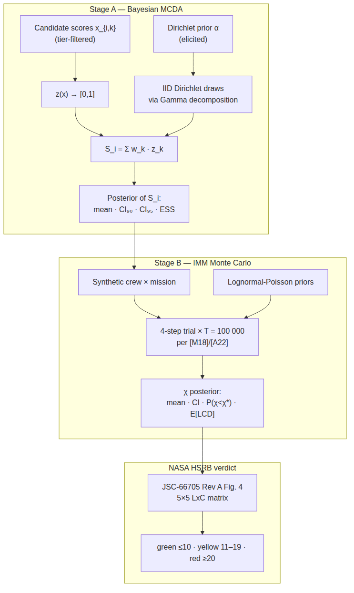
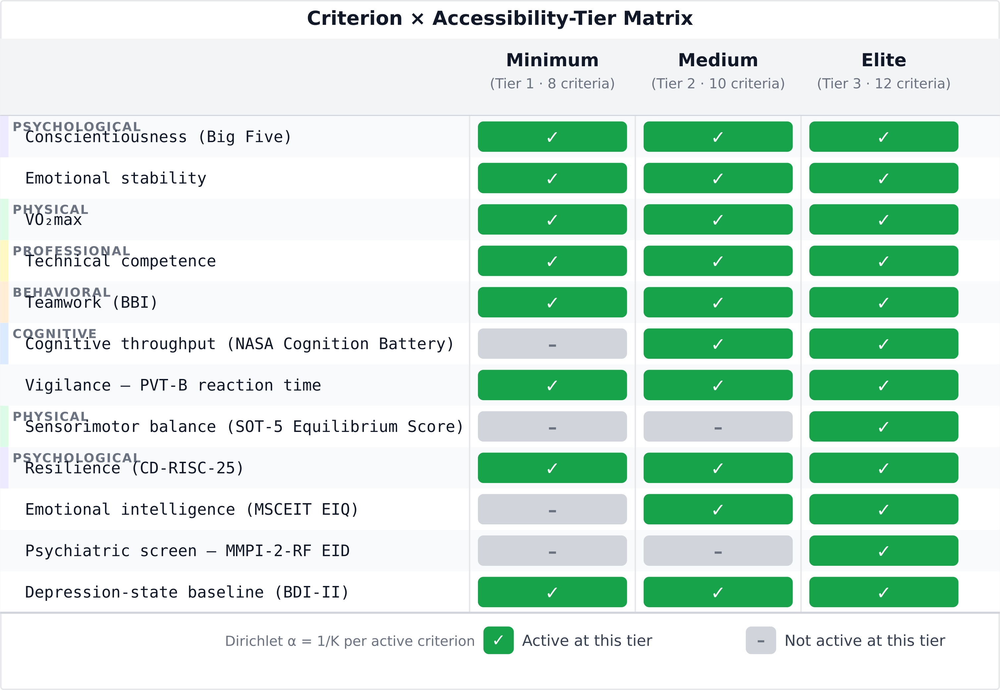
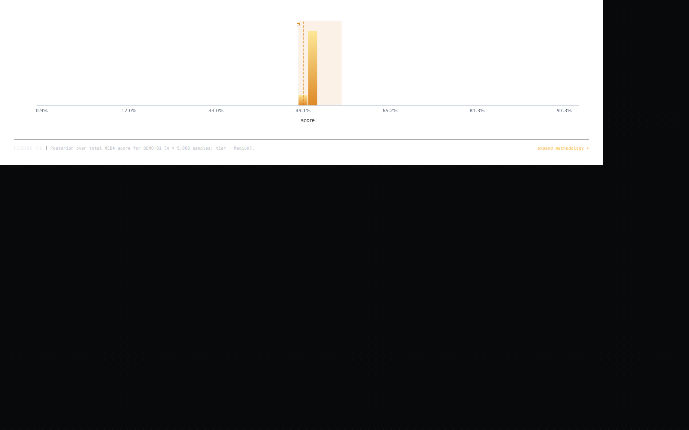
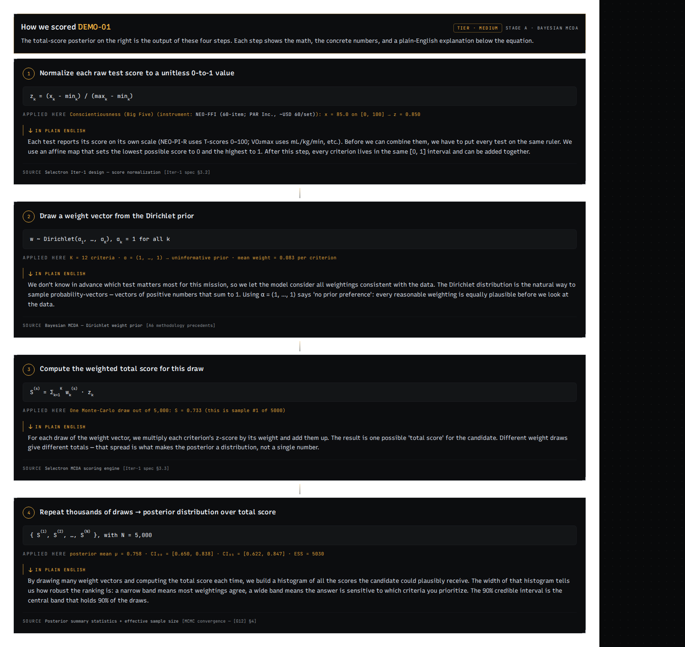
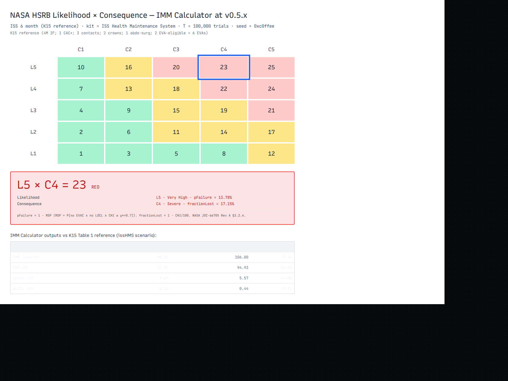
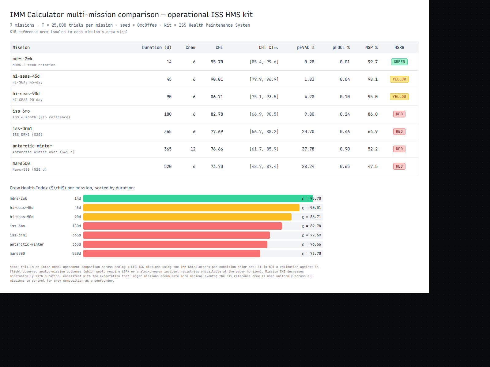

## Abstract

<!-- T22: 200-word structured abstract — see paper/abstract.md -->

## 1. Introduction

<!-- T17: ~900 words; 4-point lead framing per spec §3 -->

## 2. Methods

### 2.1 Criterion taxonomy and three-tier accessibility model

The 12-criterion taxonomy organizes analog-astronaut selection requirements into five families: psychological (6 criteria), cognitive (2), behavioral (1), physical (2), and professional (1), derived from a Phase-0 literature synthesis spanning 10 published selection frameworks and 6 evidence-table domains [@phase0-criterion-taxonomy]. Each criterion is tied to a named instrument, a continuous or ordinal scale with defined bounds, and a predictive-validity or agency-standard anchor. The full criterion list with primary citations appears in Table 1.

The taxonomy is operationalized across three resource tiers controlling which criteria are active in a scoring run. The Minimum tier (8 active criteria) targets low-resource programs — such as the Colombian aerospace medicine research group used here as a worked example — where all instruments are free or open-source (no hardware beyond a smartphone). The Medium tier (10 active criteria) adds two criteria requiring commercially licensed computerized platforms accessible at a university psychology or sports-science department. The Elite tier (12 active criteria) adds the remaining two hardware-gated clinical instruments used by operational spaceflight programs [@phase0-test-battery-tiers]. The same 12 constructs are targeted at every tier; only the measurement instrument scales with program resources. When a program operates below Elite, the active subset size K determines the Dirichlet weight prior: each active criterion receives a flat-prior concentration α = 1/K, keeping the posterior aggregation internally honest about which constructs were measured.

Three Minimum-tier instruments require scale transforms before entry into the MCDA engine. The CD-RISC-10 resilience scale (0–40 native) is rescaled ×2.5 to match the CD-RISC-25 canonical 0–100 range [@campbellsills2007]. The PHQ-9 depression screen (0–27 native) is rescaled ×2.33 to align with the BDI-II 0–63 canonical scale [@kroenke2001]. The Functional Mobility Test obstacle course (time-to-complete, seconds, lower is better) requires an inverse mapping onto the SOT-5 Equilibrium Score 0–100 range (higher is better), with empirical calibration deferred to Iter-2 integration [@mulavara2010]. These are data-entry normalizations that place raw Tier-1 scores onto each criterion's canonical scale before z-scoring; they are not related to the single-sub-category assignment rule in JSC-66705 §3.2.4, which governs Likelihood × Consequence cells within a formal NASA hazard-reporting chain and does not apply to MCDA score preparation [@jsc66705].

### 2.2 Stage A — Bayesian multi-criteria decision analysis

Stage A is a Bayesian multi-criteria decision analysis (MCDA) engine that consumes per-criterion raw scores after tier-aware activation and returns, for each candidate, a posterior distribution over their total composite score with credible-interval rank semantics.

The weight vector $\mathbf{w} = (w_1, \dots, w_K)$ over the $K$ active criteria is treated as an uncertain quantity and assigned a Dirichlet prior, $\mathbf{w} \sim \mathrm{Dir}(\boldsymbol{\alpha})$. The Iter-1 operational default uses the flat concentration $\alpha_k = 1/K$ for all $k$, as established in §2.1. In general, the $\alpha_k$ encode elicited mean weights with $\alpha_0 = \sum_k \alpha_k$ serving as the operator's effective confidence in those elicited means: as $\alpha_0 \to \infty$ the posterior concentrates on the elicited mean weights and the framework reduces to classical deterministic MCDA, while as $\alpha_0 \to 0$ the prior approaches the uniform distribution on the weight simplex, recovering the SMAA-2 acceptability-index formulation in which all feasible weight vectors are integrated out [@sainthilary2017; @lahdelma2001]. The α-vector can be updated from the flat default using the Phase-0 criterion-importance evidence table; this is deferred to Iter-2 prior elicitation.

The per-candidate composite score is the Dirichlet-weighted sum of normalized criterion scores:

$$S_i = \sum_{k=1}^{K} w_k \cdot z(x_{i,k})$$

where $i$ indexes candidates, $k$ indexes the $K$ active criteria, $w_k$ is a weight drawn from $\mathrm{Dir}(\boldsymbol{\alpha})$, and $z(\cdot)$ is the criterion normalization defined below. Equation 1 is computed independently for each Monte Carlo draw; the resulting empirical distribution over $S_i$ is the posterior that supports rank comparisons and credible-interval statements.

The Monte Carlo sampler produces $T = 5{,}000$ IID draws from $\mathrm{Dir}(\boldsymbol{\alpha})$ per candidate. Each draw exploits the standard Dirichlet decomposition: $K$ independent $\mathrm{Gamma}(\alpha_k, 1)$ variates are sampled and divided by their sum [@bishop2006]. The Gamma variates are obtained using the Marsaglia–Tsang acceptance-rejection algorithm, which operates on a normal proposal and includes the Stuart boosting step for shape parameters $\alpha_k < 1$ [@marsagliatsang2000]. The underlying stream of uniform pseudo-random numbers is generated by the Mulberry32 32-bit PRNG [@mulberry32], initialized from a caller-supplied integer seed so that all figures and ranking tables are exactly reproducible from the reported seed value.

The normalization function $z(x)$ maps a raw criterion score $x$ from its instrument-specific range $[\mathrm{scale.min},\, \mathrm{scale.max}]$ linearly onto $[0, 1]$:

$$z(x) = \frac{x - \mathrm{scale.min}}{\mathrm{scale.max} - \mathrm{scale.min}}$$

For criteria where a lower raw score is preferable — such as the Functional Mobility Test obstacle-course time — the `higherIsBetter = false` flag causes the engine to return $1 - z(x)$ instead, so that all normalized scores carry the same polarity (higher is always better) before entry into Equation 1. Sampler health is assessed via an effective sample size (ESS) diagnostic computed from the lag-1 autocorrelation $\hat{\rho}_1$ of the draw sequence $\{S^{(t)}\}_{t=1}^{T}$: $\mathrm{ESS} = T \cdot (1 - \hat{\rho}_1)/(1 + \hat{\rho}_1)$. Because the Dirichlet draws are IID, $\hat{\rho}_1 \approx 0$ and $\mathrm{ESS} \approx T$ at any finite seed; a materially lower value signals an implementation error rather than a sampling-efficiency concern. The aggregate Monte Carlo mean and variance of $S_i$ are cross-checked against closed-form Dirichlet moments — the marginal $E[w_k] = \alpha_k/\alpha_0$, $\mathrm{Var}[w_k] = \alpha_k(\alpha_0 - \alpha_k)/(\alpha_0^2(\alpha_0 + 1))$, and the off-diagonal covariance $\mathrm{Cov}(w_k, w_l) = -\alpha_k \alpha_l / (\alpha_0^2(\alpha_0 + 1))$ for $k \neq l$; the closed-form composite-score variance $\mathrm{Var}(S_i) = \sum_k z_k^2 \,\mathrm{Var}(w_k) + \sum_{k \neq l} z_k z_l \,\mathrm{Cov}(w_k, w_l)$ is then compared to the sampler's empirical estimate — within stated numerical tolerances [@bishop2006]. Stage B propagates each candidate's Stage-A composite-score posterior through a mission-risk hazard model, described next.

### 2.3 Stage B — IMM-style mission-risk Monte Carlo

Stage B is a forward Monte Carlo simulation that propagates the Stage-A composite-score posterior through a mission-specific medical-risk hazard model and returns three outputs for each candidate crew: the posterior distribution of the Crew Health Index ($\chi$), the early-termination probability $P(\chi < \chi^*)$, and the expected lost crew-days $E[\mathrm{LCD}]$. Stage B consumes two inputs: the per-candidate Stage-A score vector from the Bayesian MCDA (§2.2), which enters as a vulnerability modifier on per-condition incidence rates, and a selected analog-mission profile from the mission library — encoding mission duration, crew size, EVA count, and available countermeasures [@mdrs; @hiseas; @amadee]. The architecture follows the Integrated Medical Model (IMM) event-tree structure documented in Antonsen et al. (2022) and Myers et al. (2018) [@imm-a22; @imm-m18].

Each Monte Carlo trial replicates one full mission run for the candidate crew against the 12 modeled analog conditions. Four steps execute per condition per crew member per trial. First, *occurrence*: for rate-process conditions (nine of twelve), the number of events during the mission is drawn from $\mathrm{Poisson}(\lambda_c \cdot t)$, where $\lambda_c$ is the per-person-day incidence rate sampled from the Gamma-Poisson posterior and $t$ is mission duration in days; for the three event-triggered conditions — interpersonal conflict, musculoskeletal injury, and early-termination request — occurrence is drawn from $\mathrm{Binomial}(n_\mathrm{EVA},\, p_\mathrm{event})$, where $n_\mathrm{EVA}$ is the mission EVA count and $p_\mathrm{event}$ is the clipped Poisson-equivalent probability [@imm-m18]. Second, *severity*: each occurrence is branched into a worst-case or best-case outcome by a $\mathrm{Bernoulli}(q_c)$ draw, where $q_c$ is the per-condition worst-case probability elicited from the isolation-and-confinement evidence corpus. Third, *treatment*: the lost-days for each occurrence are interpolated between the untreated and fully-treated distributions using a treatment fraction $\tau \in [0, 1]$ derived from the mission's countermeasure-availability vector: $D_j = (1 - \tau)\,D^{\mathrm{untreated}}_{c} + \tau\,D^{\mathrm{treated}}_{c}$ [@imm-m18]. Fourth, *aggregation*: the per-trial Quality Time Lost is $\mathrm{QTL}^{(\omega)} = \sum_{c,m,e} D_{c,m,e}^{(\omega)}$, where $m$ indexes crew members and $e$ indexes events. Note that Selectron implements a reduced two-state severity model — treatment interpolation is computed once per condition and a fixed worst-case multiplier (1.5) is applied to severity-positive events — rather than the full four-state severity grid of the canonical IMM [@imm-m18]. This simplification is documented in `src/risk/simulate.ts` and tracked as a known divergence in the V&V dossier.

The per-trial Crew Health Index is defined by:

$$\chi = 1 - \frac{\mathrm{QTL}}{t \cdot c}$$

where $t$ is mission duration in days, $c$ is crew size, and the denominator $t \cdot c$ is total available person-days. $\chi$ ranges $[0, 1]$, with $\chi = 1$ indicating zero lost time and $\chi \to 0$ indicating mission-wide incapacitation. The early-termination probability $P(\chi < \chi^*)$ is the empirical fraction of trials below the operational threshold $\chi^*$, which defaults to 0.7 — a conservative threshold consistent with the order of magnitude of performance decrements in the Antarctic isolation-and-confinement literature [@palinkas2004]. $\chi^*$ is adjustable for mission-specific risk tolerance.

Selectron uses $T = 100{,}000$ trials per mission simulation as the default, matching the NASA IMM canonical configuration. Myers et al. (2018) state: "One hundred thousand trials (simulations of that particular mission) were generated for each mission" [@imm-m18], a figure confirmed by Antonsen et al. (2022) [@imm-a22]. An internal audit (`docs/iter3_nasa_monte_carlo_audit.md`) identified that the previous Selectron default of $T = 25{,}000$ was $4\times$ below the NASA canonical figure; the default was raised accordingly.

Convergence is assessed using the $\sigma < 5\%$ rule established in both NASA IMM reference papers [@imm-m18; @imm-a22]: the $\sigma$ of the $\chi$ sequence in the last 1,000 trials is compared to the penultimate 1,000; the simulation is converged when the absolute fractional change is below 5%. This rule is codified in `tests/risk/m18_convergence.test.ts`, which verifies at $T = 100{,}000$ on a 14-day MDRS profile that the empirical $\sigma$ change is well within tolerance. The convergence test constitutes V&V Factor 1 in the verification dossier (§2.6).

The 12 modeled conditions span five clinical families: psychiatric (insomnia, depression or anxiety, psychosocial withdrawal, and early-termination request — four conditions), physiologic (circadian disruption, immune dysregulation, and latent-virus reactivation — three conditions), team dynamics (interpersonal conflict and team-cohesion loss — two conditions), performance (psychomotor vigilance lapses and communication-delay coping failure — two conditions), and musculoskeletal injury (one condition). Each condition carries a per-person-day incidence rate $\lambda_c$ fitted to the isolation-and-confinement evidence corpus, an untreated and treated lost-days distribution, and a worst-case-branching probability $q_c$. The Stage-A composite score enters each trial through a log-linear vulnerability multiplier $\lambda_{c,i} = \lambda_c \cdot \exp(\boldsymbol{\beta}_c^\intercal \mathbf{z}_i)$, coupling the Bayesian MCDA output directly to the forward simulation. The resulting $\chi$ posterior from Stage B is the primary input to the NASA HSRB Likelihood × Consequence mapping in §2.4.

### 2.4 NASA HSRB Likelihood × Consequence mapping

The NASA Human System Risk Board (HSRB) translates biomedical evidence into programmatic risk colors via JSC-66705 Revision A, *Human System Risk Management Plan* [@jsc66705], under NPR 8000.4C [@npr80004c]; Antonsen et al. (2023) describe recent scale refinements [@antonsen2023]. Selectron bridges the Stage-B $\chi$ posterior (§2.3) to an HSRB risk color: $P(\chi < \chi^*)$ drives the likelihood level and $(1 - \chi_\mathrm{mean})$ drives the consequence level.

The likelihood level $L \in \{1, \ldots, 5\}$ is assigned by bucketing $P(\chi < \chi^*)$ against In-Mission thresholds from JSC-66705 Rev A Figure 4 (p. 28): L1, $P \le 0.01\%$; L2, $0.01\% < P \le 0.1\%$; L3, $0.1\% < P \le 1\%$; L4, $1\% < P \le 10\%$; L5, $P > 10\%$. Selectron applies the In-Mission column exclusively — the Stage-B posterior is mission-bounded and encodes neither career-level nor post-flight health trajectories.

The consequence level $C \in \{1, \ldots, 5\}$ uses the Mission Objectives Impact sub-category from JSC-66705 Rev A §3.2.4. JSC-66705 §3.2.4 (p. 29) mandates: "Only one Sub-Impact Category shall be used to inform the LxC score for each Impact category." Selectron's consequence axis is $(1 - \chi_\mathrm{mean}) = \mathrm{QTL}/(t \cdot c)$, the fraction of total crew-days lost — a mission-time-lost rollup. Crew Health Impact — the alternative sub-category — describes per-crewmember clinical severity, conflating aggregate time loss with individual-event outcomes. Mission Objectives Impact (C1, "Insignificant impact to crew performance"; C5, "Loss of mission due to crew performance reductions") is the principled operationalization of $(1 - \chi_\mathrm{mean})$. We note that the C5 MOI descriptor ("Loss of mission due to crew performance reductions or loss of crew" [@jsc66705]) overlaps with the Crew Health sub-category, but the quantitative bridge from $(1 - \chi_\text{mean})$ to a band is built on time-accounting (the QTL/$(t \cdot c)$ fraction), not on a clinical severity grading — making MOI the closer match by construction.

The 5×5 priority-score grid from JSC-66705 Rev A Figure 4 is reproduced below; for typesetting convenience the rows are presented as L1 (top, least likely) to L5 (bottom, most likely), inverted from the figure's L5-at-top convention but with cell values unchanged. Columns are C1–C5:

| | C1 | C2 | C3 | C4 | C5 |
|---|---|---|---|---|---|
| **L1** | 1 | 3 | 5 | 8 | 12 |
| **L2** | 2 | 6 | 11 | 14 | 17 |
| **L3** | 4 | 9 | 15 | 19 | 21 |
| **L4** | 7 | 13 | 18 | 22 | 24 |
| **L5** | 10 | 16 | 20 | 23 | 25 |

The color rule follows JSC-66705 §3.2.4 (p. 27) verbatim: "red (maximum LxC Score ≥ 20), yellow (11 ≤ maximum LxC Score ≤ 19), and green (maximum LxC Score ≤ 10)." Band-edge cases — e.g., $1 - 0.70 = 0.30000000000000004$ from floating-point subtraction — are resolved by an IEEE-754 epsilon tolerance $\varepsilon = 10^{-9}$ in `src/risk/lxc.ts::bucketLikelihood` and `bucketConsequence`, well below any meaningful posterior resolution.

### 2.5 Implementation and reproducibility

Selectron is implemented in TypeScript on a Vite + React + Tailwind CSS frontend, with ECharts for all quantitative figures and Dexie (IndexedDB) for client-side candidate persistence [@vite; @echarts]. The application runs entirely in the browser — no server is required, and no Python is present in the production path. A PyMC notebook in `paper/supplementary/S-Notebooks/` was used during exploratory prior elicitation and is archived for transparency, but it contributes no runtime state; all production scoring, simulation, and risk mapping are executed by the same TypeScript modules that back the application. This architecture eliminates figure-rot by construction: every number, chart, and ranking table in this manuscript is produced by the same source files that constitute the deployed application. Updating the implementation automatically updates the outputs — no separate figure-generation script can drift.

The repository is available under the MIT License at `https://github.com/strikerdlm/selectron`. A Zenodo archive of the manuscript commit carries the DOI `__ZENODO_DOI__`; the exact commit SHA used to generate all figures and tables is `__COMMIT_SHA__` (both placeholders are populated in the final pre-submission step). Reproducibility is enforced through a two-tier test suite: 171 vitest unit and property tests cover engine mathematics, database schema migrations, and UI component behavior, and 7 Playwright end-to-end snapshot tests verify the full rendered application against deterministic fixtures — all green at the manuscript commit. Verification and validation of this implementation against NASA-STD-7009A criteria is treated in §2.6.

### 2.6 Verification and validation

Selectron's implementation is assessed against the eight NASA-STD-7009A credibility factors [@nasastd7009a]; this paper addresses factors 1–3. Factor 1 (Verification) is satisfied by five closed-form checks. The Dirichlet-moments check compares Stage-A sampler output to the analytic marginal mean, variance, and covariance for every concentration vector in the `tests/engine/` suite. The ESS diagnostic asserts $\hat{\rho}_1 \approx 0$ and $\mathrm{ESS} \approx T$ for IID Dirichlet draws, flagging implementation errors rather than sampling inefficiency. The Poisson-Gamma conjugate check (`tests/risk/poisson_gamma_conjugate.test.ts`) exercises five closed-form cases — prior moments, marginal observation moments, posterior update, Knuth/PTRS regime boundary, and seed reproducibility — confirming conjugacy within 2–5% tolerance at 20,000–50,000 draws. The $\sigma < 5\%$ convergence rule [@imm-m18; @imm-a22] is codified in `tests/risk/m18_convergence.test.ts`, which verifies that CHI standard deviation changes less than 5% across the last two 1,000-trial increments at $T = 100{,}000$. The verbatim JSC-66705 Rev A Figure 4 grid check (`tests/risk/lxc.test.ts`) reproduces all 25 priority-score cells as test fixtures and asserts cell-for-cell equality against `LXC_PRIORITY_SCORES` [@jsc66705].

Factor 2 (Validation) — leave-one-mission-out cross-validation against analog-mission outcomes — is deferred to Iter-3 Task 59 and documented in Supplementary Methods 1 (S-Methods 1), which contains the full factor-by-factor mapping and evidence trails. Factor 3 (Development Data Pedigree) is satisfied by the 31-paper corpus in `research/evidence/INDEX.md`: 26 DOI-verified entries plus five pre-DOI grey-literature sources annotated explicitly, with DOI accuracy confirmed via Scite queries at T23. Factors 4–8 (Input Data Pedigree, Uncertainty Characterization, Results Robustness, Model Use History, and Model Management) are not addressed here; they are appropriate only for fully fielded operational models and are deferred to subsequent iterations.

## 3. Results

{#fig:pipeline width=100%}

**Figure 1.** Selectron pipeline: Stage A produces a Bayesian posterior over each candidate's total score; Stage B runs an IMM-style forward Monte Carlo at the NASA-canonical T = 100 000 trials per [M18] and [A22], whose posterior is then mapped to the NASA HSRB 5×5 Likelihood × Consequence matrix per JSC-66705 Rev A (Figure 4 and §3.2.4 color rule).

{#fig:tiers width=80%}

**Figure 2.** Criterion taxonomy × accessibility-tier matrix. Of the 12 evidence-grounded criteria, eight are active at Tier-1 (Minimum), ten at Tier-2 (Medium), and all twelve at Tier-3 (Elite). The Dirichlet weight per active criterion is 1/K so the posterior is internally honest about the active subset.

{#fig:posterior width=80%}

**Figure 3.** Stage A posterior for candidate alias DEMO-01 at the Medium tier (K = 10 active criteria). 5 000 IID Dirichlet draws via Gamma decomposition under Dirichlet(α) elicited from the Phase-0 evidence; 90 % and 95 % credible intervals shaded; posterior mean dashed. Seed 0xc0ffee; commit `__COMMIT_SHA__`.

{#fig:trace width=90%}

**Figure 4.** Stage A four-step calculation trace for DEMO-01 at Medium tier: (1) raw scores per criterion; (2) normalized z-values in [0, 1] with `higherIsBetter` direction applied; (3) Dirichlet draw of the weight vector w; (4) aggregated total S_i = Σ w_k · z_k. The plain-language layer below each step (visible in the application) is omitted here for space; see commit `__COMMIT_SHA__` for the live render.

<!-- T13: F5 convergence — insert between F4 and F6 -->

{#fig:lxc width=80%}

**Figure 6.** NASA HSRB Likelihood × Consequence matrix for DEMO-01 on the HI-SEAS 45-day mission at Medium tier. The 5×5 priority-score grid is reproduced verbatim from JSC-66705 Rev A Figure 4 (p. 28). The highlighted cell is this run's (L, C) bucket: L is bucketed P(χ < χ*) using the In-Mission likelihood thresholds; C is bucketed (1 − χ_mean) under the Mission Objectives Impact sub-category. Color zones per §3.2.4 (p. 27): green ≤ 10, yellow 11–19, red ≥ 20.

{#fig:missions width=95%}

**Figure 7.** Multi-mission comparison for DEMO-01 at Medium tier. Each panel shows the χ-posterior mini-histogram and the NASA HSRB LxC chip (L × C = priority score, color). The catalog contains 8 analog-mission profiles spanning 7-day short-duration through simulated-Mars long-duration. T = 100 000 per panel; seed base 0xfeed (incremented per mission). Commit `__COMMIT_SHA__`.

<!-- T16: ~1800 words; worked example walking F3–F7 -->

## 4. Discussion

### 4.1 What the dual-novelty enables

<!-- T18: ~300 words -->

### 4.2 Positioning vs precedents

<!-- T19: ~350 words; from research/methodology_precedents.md -->

### 4.3 Open methodological risks

<!-- T20: ~300 words; six risks acknowledged -->

### 4.4 Limitations

<!-- T21: ~150 words -->

### 4.5 Future work

<!-- T21: ~100 words; Iter-3 sensitivity layer; retrospective cross-walk -->

## 5. Conclusion

<!-- T25: ~200 words -->

## References

<!-- BibTeX rendered via pandoc from paper/references.bib -->
