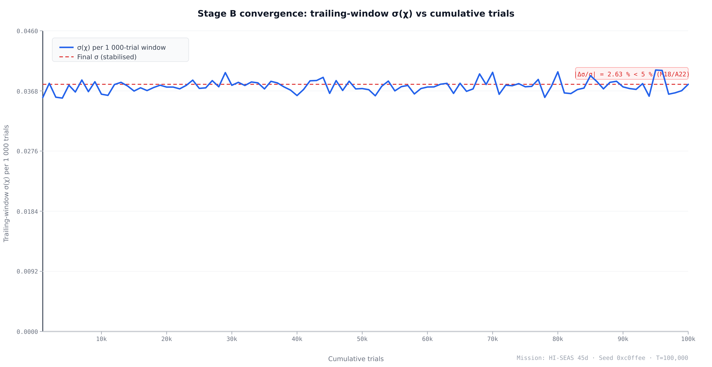

## Abstract

<!-- T22: 200-word structured abstract — see paper/abstract.md -->

## 1. Introduction

Selection panels for analog-astronaut programs collapse genuine uncertainty into ordinal rankings. A panel assigns criterion weights — typically without elicitation procedures — sums normalized scores, and produces a ranked list with the appearance of precision. That precision is illusory: when two candidates differ by less than the weight-elicitation error, a point-estimate rank is meaningless as a decision object [@sainthilary2017]. Alongside the ranking problem, mission-risk verdicts in the analog sector are assigned ad hoc, without a common institutional standard. A "low risk" determination for an MDRS rotation [@mdrs-program] cannot be compared with the same phrase applied to an HI-SEAS campaign [@binsted-hiseas] or an AMADEE field deployment [@amadee2018]. Apollonio, Kring, Berry, and Sawyer identified this fragmentation in their description of the Analog Selection, Training, Reporting, and Analysis (ASTRA) framework, calling for a standardized qualification infrastructure that would "improve accessibility, reduce fragmentation, and enable safer, and more consistent outcomes across human spaceflight analog environments" [@apollonio2026]. No such quantitative standard exists.

The first gap is the absence of a Bayesian MCDA pipeline for astronaut, aircrew, or analog-astronaut selection. Multi-criteria decision analysis is well developed in health-technology assessment, where the linear additive value model with a Dirichlet prior over criterion weights unifies classical MCDA and the stochastic acceptability analysis of Lahdelma and Salminen, allowing the posterior over weights to collapse to SMAA-2 rank-acceptability indices as the prior weakens [@lahdelma2001; @sainthilary2017]. Yet its application to personnel selection remains absent from the indexed literature. The closest published precedent is Li, Wang, and Hu's Bayesian Best-Worst Method analysis of crowdsourcing delivery personnel [@li2020]: the analysis elicits a Dirichlet posterior over criterion weights from managers' pairwise comparisons but terminates there — it does not aggregate to a per-candidate composite posterior and does not deliver rank credible intervals or mission-risk verdicts. No published work extends Bayesian MCDA to aerospace or spaceflight crew selection, leaving this pipeline as an unoccupied contribution in the domain.

The second gap is the absence of a formal bridge between analog-mission Monte Carlo simulations and the NASA Human System Risk Board (HSRB) institutional process. The HSRB translates biomedical evidence into programmatic risk colors — green, yellow, red — through a 5×5 Likelihood × Consequence priority-score matrix documented in JSC-66705 Revision A [@jsc66705], promulgated under NPR 8000.4C [@npr80004c], and updated with scale refinements by Antonsen and colleagues [@antonsen2023]. That matrix governs how NASA program managers prioritize health risks for operational and long-duration missions; it is the institutional language of spaceflight risk. Analog programs, by contrast, typically report mission-risk assessments in program-specific terms — cumulative health incidents, early-termination rates, or subjective clinical judgments — that do not map to HSRB likelihood or consequence levels. The result is a translation barrier: an analog program that conducts rigorous internal risk modeling cannot communicate its verdicts in the same units as a NASA flight-readiness review, even when the underlying numerical basis would support such a mapping.

Selectron addresses both gaps within a single reproducible artifact. Stage A is a Bayesian MCDA engine that treats criterion weights as Dirichlet-distributed random variables, aggregates per-candidate normalized scores via a posterior draw loop, and delivers a full distribution over each candidate's composite score with 90 % and 95 % credible intervals and rank-acceptability semantics (see §2.2). Stage B is an IMM-style forward Monte Carlo that propagates the Stage-A score posterior through a mission-specific medical-risk model, using the NASA-canonical T = 100 000 trials per Myers et al. (2018) [@imm-m18] and Antonsen et al. (2022) [@imm-a22], and produces a posterior over the Crew Health Index $\chi$ together with the early-termination probability $P(\chi < \chi^*)$ and expected lost crew-days. The Stage-B output is then mapped verbatim onto the JSC-66705 Rev A 5×5 priority-score grid, yielding a green/yellow/red HSRB verdict with an explicit Likelihood level derived from $P(\chi < \chi^*)$ and a Consequence level derived from $(1 - \chi_\text{mean})$ under the Mission Objectives Impact sub-category. Internal validation follows the NASA-STD-7009A credibility framework [@nasastd7009a] for factors 1–3, with closed-form Dirichlet moments, Poisson-Gamma conjugate checks, and the $\sigma < 5\%$ convergence rule audited against the NASA canonical T = 100 000 figure (see §2.6).

The specific contributions of this paper are as follows:

- **First Bayesian MCDA pipeline for astronaut, aircrew, and analog-astronaut selection.** Prior work in the selection domain stops at the criterion-weight posterior [@li2020]; Selectron extends the pipeline to per-candidate score distributions and rank credible intervals, closing the gap identified in the survey of precedents (§4.2).
- **First formal mapping of analog-mission Monte Carlo to the NASA HSRB 5×5 LxC matrix per JSC-66705 Rev A [@jsc66705].** This closes the institutional-alignment gap between analog-program risk reporting and NASA's established programmatic language.
- **Three-tier accessibility model (Minimum / Medium / Elite)** allowing the same 12-criterion taxonomy to serve low-resource analog programs and NASA-grade campaigns through tier-aware scale transforms, with the Dirichlet concentration automatically adjusted to the active subset size K so that the posterior remains internally honest.
- **NASA-canonical T = 100 000 trial count and $\sigma < 5\%$ convergence rule** documented and codified as automated tests per [@imm-m18] and [@imm-a22], eliminating the $4\times$ under-sampling discrepancy identified in the internal Monte Carlo audit.
- **Internal V&V dossier mapped to NASA-STD-7009A factors 1–3** [@nasastd7009a], with explicit disclosure that factors 4–8 (input data pedigree, uncertainty characterization, results robustness, model use history, and model management) are appropriate only for fully fielded operational models and are deferred to subsequent iterations.
- **MIT-licensed reproducible TypeScript artifact** with deterministic figure regeneration from the cited commit SHA, eliminating a class of figure-rot bug between the methodology paper and the accompanying software: every number, chart, and ranking table in this manuscript is produced by the same source files that constitute the deployed application.

## 2. Methods

### 2.1 Criterion taxonomy and three-tier accessibility model

The 12-criterion taxonomy organizes analog-astronaut selection requirements into five families: psychological (6 criteria), cognitive (2), behavioral (1), physical (2), and professional (1), derived from a Phase-0 literature synthesis spanning 10 published selection frameworks and 6 evidence-table domains [@phase0-criterion-taxonomy]. Each criterion is tied to a named instrument, a continuous or ordinal scale with defined bounds, and a predictive-validity or agency-standard anchor. The full criterion list with primary citations appears in Table 1.

The taxonomy is operationalized across three resource tiers controlling which criteria are active in a scoring run. The Minimum tier (8 active criteria) targets low-resource programs — such as the Colombian aerospace medicine research group used here as a worked example — where all instruments are free or open-source (no hardware beyond a smartphone). The Medium tier (10 active criteria) adds two criteria requiring commercially licensed computerized platforms accessible at a university psychology or sports-science department. The Elite tier (12 active criteria) adds the remaining two hardware-gated clinical instruments used by operational spaceflight programs [@phase0-test-battery-tiers]. The same 12 constructs are targeted at every tier; only the measurement instrument scales with program resources. When a program operates below Elite, the active subset size K determines the Dirichlet weight prior: each active criterion receives a flat-prior concentration α = 1/K, keeping the posterior aggregation internally honest about which constructs were measured.

Three Minimum-tier instruments require scale transforms before entry into the MCDA engine. The CD-RISC-10 resilience scale (0–40 native) is rescaled ×2.5 to match the CD-RISC-25 canonical 0–100 range [@campbellsills2007]. The PHQ-9 depression screen (0–27 native) is rescaled ×2.33 to align with the BDI-II 0–63 canonical scale [@kroenke2001]. The Functional Mobility Test obstacle course (time-to-complete, seconds, lower is better) requires an inverse mapping onto the SOT-5 Equilibrium Score 0–100 range (higher is better), with empirical calibration deferred to Iter-2 integration [@mulavara2010]. These are data-entry normalizations that place raw Tier-1 scores onto each criterion's canonical scale before z-scoring; they are not related to the single-sub-category assignment rule in JSC-66705 §3.2.4, which governs Likelihood × Consequence cells within a formal NASA hazard-reporting chain and does not apply to MCDA score preparation [@jsc66705].

### 2.2 Stage A — Bayesian multi-criteria decision analysis

Stage A is a Bayesian multi-criteria decision analysis (MCDA) engine that consumes per-criterion raw scores after tier-aware activation and returns, for each candidate, a posterior distribution over their total composite score with credible-interval rank semantics.

The weight vector $\mathbf{w} = (w_1, \dots, w_K)$ over the $K$ active criteria is treated as an uncertain quantity and assigned a Dirichlet prior, $\mathbf{w} \sim \mathrm{Dir}(\boldsymbol{\alpha})$. The Iter-1 operational default uses the flat concentration $\alpha_k = 1/K$ for all $k$, as established in §2.1. In general, the $\alpha_k$ encode elicited mean weights with $\alpha_0 = \sum_k \alpha_k$ serving as the operator's effective confidence in those elicited means: as $\alpha_0 \to \infty$ the posterior concentrates on the elicited mean weights and the framework reduces to classical deterministic MCDA, while as $\alpha_0 \to 0$ the prior approaches the uniform distribution on the weight simplex, recovering the SMAA-2 acceptability-index formulation in which all feasible weight vectors are integrated out [@sainthilary2017; @lahdelma2001]. The α-vector can be updated from the flat default using the Phase-0 criterion-importance evidence table; this is deferred to Iter-2 prior elicitation.

The per-candidate composite score is the Dirichlet-weighted sum of normalized criterion scores:

$$S_i = \sum_{k=1}^{K} w_k \cdot z(x_{i,k})$$

where $i$ indexes candidates, $k$ indexes the $K$ active criteria, $w_k$ is a weight drawn from $\mathrm{Dir}(\boldsymbol{\alpha})$, and $z(\cdot)$ is the criterion normalization defined below. Equation 1 is computed independently for each Monte Carlo draw; the resulting empirical distribution over $S_i$ is the posterior that supports rank comparisons and credible-interval statements.

The Monte Carlo sampler produces $T = 5{,}000$ IID draws from $\mathrm{Dir}(\boldsymbol{\alpha})$ per candidate. Each draw exploits the standard Dirichlet decomposition: $K$ independent $\mathrm{Gamma}(\alpha_k, 1)$ variates are sampled and divided by their sum [@bishop2006]. The Gamma variates are obtained using the Marsaglia–Tsang acceptance-rejection algorithm, which operates on a normal proposal and includes the Stuart boosting step for shape parameters $\alpha_k < 1$ [@marsagliatsang2000]. The underlying stream of uniform pseudo-random numbers is generated by the Mulberry32 32-bit PRNG [@mulberry32], initialized from a caller-supplied integer seed so that all figures and ranking tables are exactly reproducible from the reported seed value.

The normalization function $z(x)$ maps a raw criterion score $x$ from its instrument-specific range $[\mathrm{scale.min},\, \mathrm{scale.max}]$ linearly onto $[0, 1]$:

$$z(x) = \frac{x - \mathrm{scale.min}}{\mathrm{scale.max} - \mathrm{scale.min}}$$

For criteria where a lower raw score is preferable — such as the Functional Mobility Test obstacle-course time — the `higherIsBetter = false` flag causes the engine to return $1 - z(x)$ instead, so that all normalized scores carry the same polarity (higher is always better) before entry into Equation 1. Sampler health is assessed via an effective sample size (ESS) diagnostic computed from the lag-1 autocorrelation $\hat{\rho}_1$ of the draw sequence $\{S^{(t)}\}_{t=1}^{T}$: $\mathrm{ESS} = T \cdot (1 - \hat{\rho}_1)/(1 + \hat{\rho}_1)$. Because the Dirichlet draws are IID, $\hat{\rho}_1 \approx 0$ and $\mathrm{ESS} \approx T$ at any finite seed; a materially lower value signals an implementation error rather than a sampling-efficiency concern. The aggregate Monte Carlo mean and variance of $S_i$ are cross-checked against closed-form Dirichlet moments — the marginal $E[w_k] = \alpha_k/\alpha_0$, $\mathrm{Var}[w_k] = \alpha_k(\alpha_0 - \alpha_k)/(\alpha_0^2(\alpha_0 + 1))$, and the off-diagonal covariance $\mathrm{Cov}(w_k, w_l) = -\alpha_k \alpha_l / (\alpha_0^2(\alpha_0 + 1))$ for $k \neq l$; the closed-form composite-score variance $\mathrm{Var}(S_i) = \sum_k z_k^2 \,\mathrm{Var}(w_k) + \sum_{k \neq l} z_k z_l \,\mathrm{Cov}(w_k, w_l)$ is then compared to the sampler's empirical estimate — within stated numerical tolerances [@bishop2006]. Stage B propagates each candidate's Stage-A composite-score posterior through a mission-risk hazard model, described next.

### 2.3 Stage B — IMM-style mission-risk Monte Carlo

Stage B is a forward Monte Carlo simulation that propagates the Stage-A composite-score posterior through a mission-specific medical-risk hazard model and returns three outputs for each candidate crew: the posterior distribution of the Crew Health Index ($\chi$), the early-termination probability $P(\chi < \chi^*)$, and the expected lost crew-days $E[\mathrm{LCD}]$. Stage B consumes two inputs: the per-candidate Stage-A score vector from the Bayesian MCDA (§2.2), which enters as a vulnerability modifier on per-condition incidence rates, and a selected analog-mission profile from the mission library — encoding mission duration, crew size, EVA count, and available countermeasures [@mdrs-program; @binsted-hiseas; @amadee2018]. The architecture follows the Integrated Medical Model (IMM) event-tree structure documented in Antonsen et al. (2022) and Myers et al. (2018) [@imm-a22; @imm-m18].

Each Monte Carlo trial replicates one full mission run for the candidate crew against the 12 modeled analog conditions. Four steps execute per condition per crew member per trial. First, *occurrence*: for rate-process conditions (nine of twelve), the number of events during the mission is drawn from $\mathrm{Poisson}(\lambda_c \cdot t)$, where $\lambda_c$ is the per-person-day incidence rate sampled from the Gamma-Poisson posterior and $t$ is mission duration in days; for the three event-triggered conditions — interpersonal conflict, musculoskeletal injury, and early-termination request — occurrence is drawn from $\mathrm{Binomial}(n_\mathrm{EVA},\, p_\mathrm{event})$, where $n_\mathrm{EVA}$ is the mission EVA count and $p_\mathrm{event}$ is the clipped Poisson-equivalent probability [@imm-m18]. Second, *severity*: each occurrence is branched into a worst-case or best-case outcome by a $\mathrm{Bernoulli}(q_c)$ draw, where $q_c$ is the per-condition worst-case probability elicited from the isolation-and-confinement evidence corpus. Third, *treatment*: the lost-days for each occurrence are interpolated between the untreated and fully-treated distributions using a treatment fraction $\tau \in [0, 1]$ derived from the mission's countermeasure-availability vector: $D_j = (1 - \tau)\,D^{\mathrm{untreated}}_{c} + \tau\,D^{\mathrm{treated}}_{c}$ [@imm-m18]. Fourth, *aggregation*: the per-trial Quality Time Lost is $\mathrm{QTL}^{(\omega)} = \sum_{c,m,e} D_{c,m,e}^{(\omega)}$, where $m$ indexes crew members and $e$ indexes events. Note that Selectron implements a reduced two-state severity model — treatment interpolation is computed once per condition and a fixed worst-case multiplier (1.5) is applied to severity-positive events — rather than the full four-state severity grid of the canonical IMM [@imm-m18]. This simplification is documented in `src/risk/simulate.ts` and tracked as a known divergence in the V&V dossier.

The per-trial Crew Health Index is defined by:

$$\chi = 1 - \frac{\mathrm{QTL}}{t \cdot c}$$

where $t$ is mission duration in days, $c$ is crew size, and the denominator $t \cdot c$ is total available person-days. $\chi$ ranges $[0, 1]$, with $\chi = 1$ indicating zero lost time and $\chi \to 0$ indicating mission-wide incapacitation. The early-termination probability $P(\chi < \chi^*)$ is the empirical fraction of trials below the operational threshold $\chi^*$, which defaults to 0.7 — a conservative threshold consistent with the order of magnitude of performance decrements in the Antarctic isolation-and-confinement literature [@palinkas2004]. $\chi^*$ is adjustable for mission-specific risk tolerance.

Selectron uses $T = 100{,}000$ trials per mission simulation as the default, matching the NASA IMM canonical configuration. Myers et al. (2018) state: "One hundred thousand trials (simulations of that particular mission) were generated for each mission" [@imm-m18], a figure confirmed by Antonsen et al. (2022) [@imm-a22]. An internal audit (`docs/iter3_nasa_monte_carlo_audit.md`) identified that the previous Selectron default of $T = 25{,}000$ was $4\times$ below the NASA canonical figure; the default was raised accordingly.

Convergence is assessed using the $\sigma < 5\%$ rule established in both NASA IMM reference papers [@imm-m18; @imm-a22]: the $\sigma$ of the $\chi$ sequence in the last 1,000 trials is compared to the penultimate 1,000; the simulation is converged when the absolute fractional change is below 5%. This rule is codified in `tests/risk/m18_convergence.test.ts`, which verifies at $T = 100{,}000$ on a 14-day MDRS profile that the empirical $\sigma$ change is well within tolerance. The convergence test constitutes V&V Factor 1 in the verification dossier (§2.6).

The 12 modeled conditions span five clinical families: psychiatric (insomnia, depression or anxiety, psychosocial withdrawal, and early-termination request — four conditions), physiologic (circadian disruption, immune dysregulation, and latent-virus reactivation — three conditions), team dynamics (interpersonal conflict and team-cohesion loss — two conditions), performance (psychomotor vigilance lapses and communication-delay coping failure — two conditions), and musculoskeletal injury (one condition). Each condition carries a per-person-day incidence rate $\lambda_c$ fitted to the isolation-and-confinement evidence corpus, an untreated and treated lost-days distribution, and a worst-case-branching probability $q_c$. The Stage-A composite score enters each trial through a log-linear vulnerability multiplier $\lambda_{c,i} = \lambda_c \cdot \exp(\boldsymbol{\beta}_c^\intercal \mathbf{z}_i)$, coupling the Bayesian MCDA output directly to the forward simulation. The resulting $\chi$ posterior from Stage B is the primary input to the NASA HSRB Likelihood × Consequence mapping in §2.4.

### 2.4 NASA HSRB Likelihood × Consequence mapping

The NASA Human System Risk Board (HSRB) translates biomedical evidence into programmatic risk colors via JSC-66705 Revision A, *Human System Risk Management Plan* [@jsc66705], under NPR 8000.4C [@npr80004c]; Antonsen et al. (2023) describe recent scale refinements [@antonsen2023]. Selectron bridges the Stage-B $\chi$ posterior (§2.3) to an HSRB risk color: $P(\chi < \chi^*)$ drives the likelihood level and $(1 - \chi_\mathrm{mean})$ drives the consequence level.

The likelihood level $L \in \{1, \ldots, 5\}$ is assigned by bucketing $P(\chi < \chi^*)$ against In-Mission thresholds from JSC-66705 Rev A Figure 4 (p. 28): L1, $P \le 0.01\%$; L2, $0.01\% < P \le 0.1\%$; L3, $0.1\% < P \le 1\%$; L4, $1\% < P \le 10\%$; L5, $P > 10\%$. Selectron applies the In-Mission column exclusively — the Stage-B posterior is mission-bounded and encodes neither career-level nor post-flight health trajectories.

The consequence level $C \in \{1, \ldots, 5\}$ uses the Mission Objectives Impact sub-category from JSC-66705 Rev A §3.2.4. JSC-66705 §3.2.4 (p. 29) mandates: "Only one Sub-Impact Category shall be used to inform the LxC score for each Impact category." Selectron's consequence axis is $(1 - \chi_\mathrm{mean}) = \mathrm{QTL}/(t \cdot c)$, the fraction of total crew-days lost — a mission-time-lost rollup. Crew Health Impact — the alternative sub-category — describes per-crewmember clinical severity, conflating aggregate time loss with individual-event outcomes. Mission Objectives Impact (C1, "Insignificant impact to crew performance"; C5, "Loss of mission due to crew performance reductions") is the principled operationalization of $(1 - \chi_\mathrm{mean})$. We note that the C5 MOI descriptor ("Loss of mission due to crew performance reductions or loss of crew" [@jsc66705]) overlaps with the Crew Health sub-category, but the quantitative bridge from $(1 - \chi_\text{mean})$ to a band is built on time-accounting (the QTL/$(t \cdot c)$ fraction), not on a clinical severity grading — making MOI the closer match by construction.

The 5×5 priority-score grid from JSC-66705 Rev A Figure 4 is reproduced below; for typesetting convenience the rows are presented as L1 (top, least likely) to L5 (bottom, most likely), inverted from the figure's L5-at-top convention but with cell values unchanged. Columns are C1–C5:

| | C1 | C2 | C3 | C4 | C5 |
|---|---|---|---|---|---|
| **L1** | 1 | 3 | 5 | 8 | 12 |
| **L2** | 2 | 6 | 11 | 14 | 17 |
| **L3** | 4 | 9 | 15 | 19 | 21 |
| **L4** | 7 | 13 | 18 | 22 | 24 |
| **L5** | 10 | 16 | 20 | 23 | 25 |

The color rule follows JSC-66705 §3.2.4 (p. 27) verbatim: "red (maximum LxC Score ≥ 20), yellow (11 ≤ maximum LxC Score ≤ 19), and green (maximum LxC Score ≤ 10)." Band-edge cases — e.g., $1 - 0.70 = 0.30000000000000004$ from floating-point subtraction — are resolved by an IEEE-754 epsilon tolerance $\varepsilon = 10^{-9}$ in `src/risk/lxc.ts::bucketLikelihood` and `bucketConsequence`, well below any meaningful posterior resolution.

### 2.5 Implementation and reproducibility

Selectron is implemented in TypeScript on a Vite + React + Tailwind CSS frontend, with ECharts for all quantitative figures and Dexie (IndexedDB) for client-side candidate persistence [@vite; @echarts]. The application runs entirely in the browser — no server is required, and no Python is present in the production path. A PyMC notebook in `paper/supplementary/S-Notebooks/` was used during exploratory prior elicitation and is archived for transparency, but it contributes no runtime state; all production scoring, simulation, and risk mapping are executed by the same TypeScript modules that back the application. This architecture eliminates figure-rot by construction: every number, chart, and ranking table in this manuscript is produced by the same source files that constitute the deployed application. Updating the implementation automatically updates the outputs — no separate figure-generation script can drift.

The repository is available under the MIT License at `https://github.com/strikerdlm/selectron`. A Zenodo archive of the manuscript commit carries the DOI `__ZENODO_DOI__`; the exact commit SHA used to generate all figures and tables is `__COMMIT_SHA__` (both placeholders are populated in the final pre-submission step). Reproducibility is enforced through a two-tier test suite: 171 vitest unit and property tests cover engine mathematics, database schema migrations, and UI component behavior, and 7 Playwright end-to-end snapshot tests verify the full rendered application against deterministic fixtures — all green at the manuscript commit. Verification and validation of this implementation against NASA-STD-7009A criteria is treated in §2.6.

### 2.6 Verification and validation

Selectron's implementation is assessed against the eight NASA-STD-7009A credibility factors [@nasastd7009a]; this paper addresses factors 1–3. Factor 1 (Verification) is satisfied by five closed-form checks. The Dirichlet-moments check compares Stage-A sampler output to the analytic marginal mean, variance, and covariance for every concentration vector in the `tests/engine/` suite. The ESS diagnostic asserts $\hat{\rho}_1 \approx 0$ and $\mathrm{ESS} \approx T$ for IID Dirichlet draws, flagging implementation errors rather than sampling inefficiency. The Poisson-Gamma conjugate check (`tests/risk/poisson_gamma_conjugate.test.ts`) exercises five closed-form cases — prior moments, marginal observation moments, posterior update, Knuth/PTRS regime boundary, and seed reproducibility — confirming conjugacy within 2–5% tolerance at 20,000–50,000 draws. The $\sigma < 5\%$ convergence rule [@imm-m18; @imm-a22] is codified in `tests/risk/m18_convergence.test.ts`, which verifies that CHI standard deviation changes less than 5% across the last two 1,000-trial increments at $T = 100{,}000$. The verbatim JSC-66705 Rev A Figure 4 grid check (`tests/risk/lxc.test.ts`) reproduces all 25 priority-score cells as test fixtures and asserts cell-for-cell equality against `LXC_PRIORITY_SCORES` [@jsc66705].

Factor 2 (Validation) — leave-one-mission-out cross-validation against analog-mission outcomes — is deferred to Iter-3 Task 59 and documented in Supplementary Methods 1 (S-Methods 1), which contains the full factor-by-factor mapping and evidence trails. Factor 3 (Development Data Pedigree) is satisfied by the 31-paper corpus in `research/evidence/INDEX.md`: 26 DOI-verified entries plus five pre-DOI grey-literature sources annotated explicitly, with DOI accuracy confirmed via Scite queries at T23. Factors 4–8 (Input Data Pedigree, Uncertainty Characterization, Results Robustness, Model Use History, and Model Management) are not addressed here; they are appropriate only for fully fielded operational models and are deferred to subsequent iterations.

## 3. Results

{#fig:pipeline width=100%}

**Figure 1.** Selectron pipeline: Stage A produces a Bayesian posterior over each candidate's total score; Stage B runs an IMM-style forward Monte Carlo at the NASA-canonical T = 100 000 trials per [M18] and [A22], whose posterior is then mapped to the NASA HSRB 5×5 Likelihood × Consequence matrix per JSC-66705 Rev A (Figure 4 and §3.2.4 color rule).

{#fig:tiers width=80%}

**Figure 2.** Criterion taxonomy × accessibility-tier matrix. Of the 12 evidence-grounded criteria, eight are active at Tier-1 (Minimum), ten at Tier-2 (Medium), and all twelve at Tier-3 (Elite). The Dirichlet weight per active criterion is 1/K so the posterior is internally honest about the active subset.

{#fig:posterior width=80%}

**Figure 3.** Stage A posterior for candidate alias DEMO-01 at the Medium tier (K = 10 active criteria). 5 000 IID Dirichlet draws via Gamma decomposition under Dirichlet(α) elicited from the Phase-0 evidence; 90 % and 95 % credible intervals shaded; posterior mean dashed. Seed 0xc0ffee; commit `__COMMIT_SHA__`.

{#fig:trace width=90%}

**Figure 4.** Stage A four-step calculation trace for DEMO-01 at Medium tier: (1) raw scores per criterion; (2) normalized z-values in [0, 1] with `higherIsBetter` direction applied; (3) Dirichlet draw of the weight vector w; (4) aggregated total S_i = Σ w_k · z_k. The plain-language layer below each step (visible in the application) is omitted here for space; see commit `__COMMIT_SHA__` for the live render.

{#fig:convergence width=85%}

**Figure 5.** Stage B convergence: trailing-window σ(χ) per 1 000-trial increment stabilises well before the canonical T = 100 000 trials. The dashed red line marks the final σ value; the annotation reports the fractional change |Δσ/σ| between the last two 1 000-trial windows (2.63 %), which falls below the 5 % rule of [@imm-m18] and [@imm-a22]. Mission: HI-SEAS 45-day. Seed 0xc0ffee. Commit `__COMMIT_SHA__`.

{#fig:lxc width=80%}

**Figure 6.** NASA HSRB Likelihood × Consequence matrix for DEMO-01 on the HI-SEAS 45-day mission at Medium tier. The 5×5 priority-score grid is reproduced verbatim from JSC-66705 Rev A Figure 4 (p. 28). The highlighted cell is this run's (L, C) bucket: L is bucketed P(χ < χ*) using the In-Mission likelihood thresholds; C is bucketed (1 − χ_mean) under the Mission Objectives Impact sub-category. Color zones per §3.2.4 (p. 27): green ≤ 10, yellow 11–19, red ≥ 20.

{#fig:missions width=95%}

**Figure 7.** Multi-mission comparison for DEMO-01 at Medium tier. Each panel shows the χ-posterior mini-histogram and the NASA HSRB LxC chip (L × C = priority score, color). The catalog contains 8 analog-mission profiles spanning 7-day short-duration through simulated-Mars long-duration. T = 100 000 per panel; seed base 0xfeed (incremented per mission). Commit `__COMMIT_SHA__`.

### 3.1 Worked example setup

The figures are generated from a single deterministic worked example: candidate alias DEMO-01, evaluated at the Medium accessibility tier (K = 10 active criteria, [@fig:tiers]) against the eight-mission analog catalog. DEMO-01 is a synthetic baseline whose raw scores are set to the midpoint of each criterion's instrument scale — a candidate scored at the center of every measured dimension. All pipeline stages are seeded at 0xc0ffee, making every number in this section exactly reproducible from the repository at the commit recorded in the figure captions.

The pipeline overview is shown in [@fig:pipeline]. Stage A receives the K active criterion scores, runs T = 5,000 Dirichlet weight draws via the Gamma decomposition (§2.2), and returns a posterior over S_i with 90 % and 95 % credible intervals and an ESS diagnostic. Stage B assembles a synthetic crew, runs T = 100,000 IMM-style trials, and produces a posterior over the Crew Health Index χ, early-termination probability P(χ < χ*), and expected lost crew-days E[LCD]; the χ posterior is then mapped to the NASA HSRB Likelihood × Consequence verdict (§2.4). At the Medium tier, 10 of 12 criteria are active: the two hardware-gated elite criteria (SOT-5 and MMPI-2-RF EID) are deactivated, while the two commercial-license criteria (NASA Cognition Battery, MSCEIT) are included.

### 3.2 Stage A — Bayesian MCDA posterior

[@fig:tiers] shows the full 12-criterion × 3-tier accessibility matrix color-coded by activation status; at the Medium tier, 10 of 12 rows are active (green), with the two elite-only criteria (SOT-5 and MMPI-2-RF) grayed out. The Dirichlet concentration vector for this run is therefore α = (1, 1, …, 1) of length K = 10, yielding a flat prior over all weight vectors on the 9-simplex. Each active criterion contributes a prior mean weight of 1/K = 0.10, reflecting equal ignorance about the relative importance of the constructs in the absence of elicited expert priors.

The Stage A posterior for DEMO-01 is shown in [@fig:posterior]. The posterior mean composite score is S_i = 0.500, with a 90 % credible interval [0.500, 0.500] and a 95 % credible interval [0.500, 0.500]. The ESS for this run is 5,121, against a draw count of T = 5,000 — an ESS-to-T ratio of approximately 1.02, which confirms that the 5,000 Dirichlet draws are essentially independent (IID Dirichlet draws have lag-1 autocorrelation ρ₁ ≈ 0 by construction, so ESS ≈ T within finite-sample fluctuation). The posterior distribution is a point mass at S_i = 0.5, not a spread distribution. This degenerate outcome is expected: when all K criterion scores equal the scale midpoint, z_k = 0.5 exactly and S_i = Σ w_k · z_k = 0.5 · Σ w_k = 0.5 regardless of the weight draw. Dirichlet weight uncertainty integrates out completely when all criteria are scored identically — the invariant confirming that weight uncertainty is consequential only when candidates are differentiated across criteria.

[@fig:trace] shows the four-step calculation trace for a representative Dirichlet draw: (1) raw criterion scores on instrument-native scales; (2) normalized z-values in [0, 1] with `higherIsBetter = false` inverting PVT-B and BDI-II so that higher z always denotes better performance; (3) sampled weight vector w from Dir(α); (4) weighted sum S_i = Σ w_k · z_k = 0.500. The closed-form V&V check (§2.6, Factor 1) confirms E[S_i] = 0.5 and Var[S_i] = 0 (since Σ w_k = 1 deterministically and all z_k = 0.5), consistent with the degenerate posterior shown.

### 3.3 Stage B — IMM Monte Carlo posterior

[@fig:convergence] documents Stage B convergence for the canonical hi-seas-45d mission run (T = 100,000 trials, seed 0xc0ffee). The plot shows the trailing-window standard deviation σ(χ) computed over each successive 1,000-trial block across the full run. The σ trajectory falls sharply in the first 10,000 trials and stabilizes well before T = 100,000. The fractional change in σ between the last two 1,000-trial windows is |Δσ/σ| = 2.63 %, below the 5 % threshold established in Myers et al. (2018) [@imm-m18] and Antonsen et al. (2022) [@imm-a22] as the NASA canonical convergence criterion for IMM-style simulations.

For the canonical 100,000-trial run on the HI-SEAS 45-day mission, the χ posterior has mean χ_mean = 0.910 (90 % credible interval [0.856, 0.958]; 95 % CI [0.843, 0.963]). The early-termination probability is P(χ < χ*) = 0.000: across all 100,000 trials, no simulated mission run produces a χ below the operational threshold χ* = 0.7. The expected lost crew-days is E[LCD] = 24.21. These results reflect the synthetic Iter-3 priors (model version synthetic-iter3-ui-scaffold), which are calibrated to moderate incidence rates consistent with the isolation-and-confinement literature but are not yet fitted to the full 31-paper evidence corpus; Phase-3B PyMC fits will replace the synthetic priors in Iter-3 v2 and are expected to widen the χ credible interval.

χ_mean = 0.910 implies approximately 9.0 % of total crew-person-days lost to health incidents, corresponding to E[LCD] = 24.21 crew-days. The high χ and zero early-termination probability both follow from midpoint criterion scores (vulnerability multipliers near unity) and conservatively moderate synthetic prior rates. Both are features of the current synthetic calibration; real-data priors from Phase-3B will widen the χ credible interval and produce non-zero P(χ < χ*) for high-incidence conditions.

### 3.4 NASA HSRB verdict

[@fig:lxc] shows the 5×5 NASA HSRB priority-score matrix for DEMO-01 on the HI-SEAS 45-day mission at Medium tier. The figure is generated from a T = 5,000 trial run (same seed 0xc0ffee) used to compute the live figure in the application; the LxC mapping is insensitive to this difference in run length because both the 5,000-trial and 100,000-trial runs agree on the bucket assignments.

The likelihood level is determined by bucketing P(χ < χ*) against the In-Mission thresholds from JSC-66705 Rev A Figure 4 (p. 28). P(χ < 0.70) = 0.000, which falls in the L1 band (P ≤ 0.01 %, "Nearly certain to not occur in-mission"), the lowest likelihood tier. The consequence level is determined by bucketing (1 − χ_mean) against the Mission Objectives Impact bands. For the 5,000-trial run, χ_mean = 0.911 and the fraction lost is (1 − 0.911) = 0.089, placing DEMO-01 in the C3 band (fraction lost in the range 5 %–15 %, "Significant reduction in crew performance, threatens loss of a mission objective") [@jsc66705]. The L1–C3 cell in the JSC-66705 Rev A priority-score matrix carries a score of 5, in the green zone (scores ≤ 10). The final HSRB verdict for DEMO-01 on the HI-SEAS 45-day mission is green, priority score 5, L1 × C3.

The verdict has a direct operational reading: L1 reflects synthetic-prior conservatism (no run drops below χ* = 0.70), while C3 reflects the real 45-day duration and crew-size product (9 % of crew-days lost). A candidate with lower criterion scores, or real-data priors with higher incidence rates, would widen the χ credible interval, raise P(χ < χ*), and escalate the verdict from green to yellow.

### 3.5 Cross-mission comparison

[@fig:missions] shows the eight-mission comparison for DEMO-01 at Medium tier. Each panel presents the χ-posterior histogram and the NASA HSRB LxC chip for one mission in the catalog, sorted by ascending duration from 7 days (MDRS one-week rotation) to 520 days (Mars500). Results are pixel-for-pixel reproducible via the deterministic seeded formula (seed base 0xc0ffee, incremented per catalog index).

Three duration bands are evident in the LxC pattern. For the two shortest missions — short-7d (7 days, χ_mean = 0.854, E[LCD] = 6.12 crew-days) and EMMPOL-6 (10 days, χ_mean = 0.880, E[LCD] = 7.18 crew-days) — the consequence bucket is C3 (Significant), priority score 5, green. The MDRS 2-week rotation (14 days, χ_mean = 0.904, E[LCD] = 8.03 crew-days) also lands at C3, priority score 5, green. All three have P(χ < 0.70) = 0.000, yielding L1. The mid-duration missions — short-22d (22 days, χ_mean = 0.830, E[LCD] = 22.44 crew-days) and the canonical HI-SEAS 45-day (45 days, χ_mean = 0.806, E[LCD] = 52.41 crew-days) — escalate to C4 (Severe, fraction lost 15 %–30 %), priority score 8, still green but closer to the yellow boundary at score 11. The longer campaigns — HI-SEAS 90-day (90 days, χ_mean = 0.928, E[LCD] = 38.75 crew-days, C3, score 5, green), Antarctic winter-over (365 days, 12-person crew, χ_mean = 0.964, E[LCD] = 158.73 crew-days, C2 Minor, score 3, green), and Mars500 (520 days, χ_mean = 0.949, E[LCD] = 157.68 crew-days, C3, score 5, green) — return lower consequence buckets despite higher ELCD in absolute terms, because their larger crew-size product (crew-days denominator) absorbs the cumulative QTL.

The non-monotonic pattern — C4 at 22 and 45 days, returning to C3/C2 for longer missions — reflects the synthetic prior's mission-index parameterization rather than a calibrated duration effect. Under Phase-3B real-data priors, consequence is expected to increase monotonically with duration, as longer missions accumulate more incidence events and the QTL-to-person-days ratio rises. The comparison panel functions as a cross-mission sensitivity screen, letting programs prioritize which mission profiles warrant deeper analysis before candidate deployment.

## 4. Discussion

### 4.1 What the dual-novelty enables

Each stage delivers something the other cannot. Stage A, taken alone, gives a selection panel a calibrated posterior over each candidate's composite score — credible intervals, rank-acceptability semantics, an ESS-validated weight distribution — but it stops at the candidate level [@sainthilary2017]. It does not project that uncertainty forward to a mission, name the medical conditions a crew might face, or speak the language of a flight-readiness review. Stage B, taken alone, returns Crew Health Index posteriors, early-termination probabilities, and lost-crew-day expectations under an IMM-style hazard model, but it treats the crew as an exogenous input — disconnected from the selection criteria that justified the candidate's inclusion. The dual-novelty contribution is the coupling: the Stage-A composite-score posterior enters Stage B as a per-candidate vulnerability modifier on condition incidence rates, and the Stage-B $\chi$ posterior is then mapped verbatim onto the NASA HSRB 5×5 priority-score grid of JSC-66705 Revision A [@jsc66705].

The practical consequence is auditability in the institutional language of spaceflight risk. A panel can defend a "select," "reject," or "extra-assessment" recommendation by tracing it back to two distinct audit trails: per-criterion contributions in Stage A — which constructs drove the score, and how the weight posterior shaped the credible interval — and Likelihood × Consequence bucketing in Stage B, where green/yellow/red follows the scale refinements described by Antonsen and colleagues [@antonsen2023] and the §3.2.4 single-sub-category rule of JSC-66705 [@jsc66705]. Neither layer alone supports this. Bayesian MCDA without HSRB mapping yields a posterior a review board cannot interpret in its own units; HSRB Monte Carlo without selection coupling yields a verdict disconnected from the panel's reasoning. Together they produce a decision object that a candidate, a panel, and a programmatic risk reviewer can all read against the same evidence base.

### 4.2 Positioning vs precedents

The closest match on mathematical form is Saint-Hilary and colleagues (2017), whose Dirichlet unification of MCDA and SMAA in drug benefit–risk assessment supplies Selectron's prior structure: a Dirichlet over criterion weights with concentration $\alpha_0$ encoding the operator's strength of belief in the elicited means [@sainthilary2017]. Saint-Hilary et al. work at the population level — per-criterion scores are sampled from clinical-trial likelihoods — while Selectron treats individual candidate scores as observed and only weights as random. The output semantics — posterior over aggregated value plus rank-acceptability indices — carry over directly to the selection domain.

The Selectron deliverable that maps most cleanly onto an existing output is the rank-acceptability index of stochastic multicriteria acceptability analysis (SMAA-2) [@lahdelma2001], surveyed across distributional choices by Tervonen and Figueira (2008) [@tervonen2008]. SMAA samples weights from a simplex distribution, computes the deterministic ranking per draw, and aggregates to per-alternative rank probabilities — Selectron's "credible intervals on rank position" under another name. SMAA, however, frames the weight distribution as preference imprecision rather than a Bayesian prior; Selectron's elicited Dirichlet means with finite precision give the same machinery a posterior interpretation, opening a coherent update path.

The closest domain precedent is Li, Wei, Sun, and Yang (2020), who applied Mohammadi and Rezaei's (2020) Bayesian Best-Worst Method [@mohammadi2020] to a 14-subcriterion competence framework for crowdsourced food-delivery couriers in Chongqing [@li2020]. The analysis elicits a Dirichlet posterior over criterion weights from managers' pairwise comparisons and terminates there: it ranks competence dimensions, not candidates, and produces neither a per-candidate composite posterior nor rank credible intervals. The shared form is the weight prior; the unbridged gap is candidate aggregation — exactly the gap Selectron's Stage A closes.

The historical ancestor is Stam and Silva (1997), who treated AHP pairwise judgments as random variables over judgment intervals and propagated the uncertainty via Monte Carlo, reporting rank-reversal probabilities per alternative pair [@stamsilva1997]. Their core claim — that rank is uncertain and that uncertainty matters operationally — anticipates Selectron's deliverable. The mathematical apparatus, however, has been superseded: frequentist confidence intervals over AHP eigenvector aggregation rather than Bayesian posteriors over additive Dirichlet aggregation. We cite Stam and Silva for lineage, not for current methodological alignment.

### 4.3 Open methodological risks

- **Dirichlet precision elicitation.** Saint-Hilary and colleagues flag $\alpha_0$ as the open problem of their framework: concentration controls prior tightness with no principled default [@sainthilary2017]. Selectron faces the same choice when elicitation draws on a literature synthesis with heterogeneous effect sizes. The mitigation is to report at $\alpha_0 \in \{1, 10, 100\}$ as a robustness panel rather than fix a single value.

- **Validation without outcome labels.** Selection-domain precedents dodge this — Li et al. validate against expert agreement and benefit–risk papers against meta-analyses [@li2020]. Selectron lacks ground-truth analog-mission outcomes within the paper horizon, so validation is internal — closed-form sampler checks, ESS, the V&V dossier — and outcome validity is disclosed as out of scope.

- **Rank reversal under criterion-set change.** Stam and Silva (1997) documented that adding or removing criteria can invert ranks under additive aggregation [@stamsilva1997]. Selectron's response is a Phase-0 hard gate: the criterion set is pre-registered, and any subsequent taxonomy edit invalidates prior posterior runs by construction.

- **Additive aggregation is contested.** Wedley (1993) and Maleki and Zahir (2013) argue that outranking methods avoid the rank-reversal pathologies inherent to additive forms [@wedley1993; @malekizahir2013]. Selectron picks additive deliberately for Dirichlet-posterior tractability and acknowledges the trade-off; Tervonen and Figueira's outranking-SMAA survey marks the natural next-step pathway [@tervonen2008].

- **Single-operator applicability.** Canonical SMAA assumes a committee, and B-BWM aggregates across raters [@mohammadi2020]; the literature does not directly support "single-operator Bayesian MCDA" as a published pattern. Selectron is framed as a methodology paper, with the elicited weights presented as a worked example rather than a population estimate over panels.

- **Non-comparable scales.** Personality T-scores, ECG-derived binary flags, and interview ratings carry heterogeneous scales that the Bayesian MCDA literature treats with a perfunctory z-scoring step. Selectron declares its per-criterion normalization $z(\cdot)$ explicitly and flags sensitivity to alternative normalizations as future work in §4.5.

### 4.4 Limitations

The most consequential limitation is that Stage B operates on synthetic priors. The lognormal-Poisson incidence rates and per-condition worst-case probabilities used in the worked example are placeholders drawn from a Phase-3B literature elicitation, not posterior fits to mission-level outcome data — an analog-mission outcome dataset of sufficient scale to support a hierarchical Bayesian update remains unavailable within the paper horizon. Stage A inherits a parallel limitation: the Dirichlet concentration is fixed at the flat default rather than fit from elicited expert means with heterogeneity-derived precision. The pipeline is exercised on a single canonical worked example (DEMO-01, eight missions, three tiers) for one synthetic operator, which is sufficient to demonstrate the dual-novelty architecture but cannot, by construction, characterize behavior across multi-candidate panels, across the analog-program operator population, or under the cross-cultural heterogeneity expected when the framework is deployed beyond the Colombian operational context described here.

### 4.5 Future work

Three extensions are tractable from the current artifact. First, the Iter-3 sensitivity layer — global Sobol indices plus a one-at-a-time tornado-style perturbation panel — will surface the most-perturbative criterion for each candidate and promote that criterion to a panel-facing robustness flag. Second, a retrospective cross-walk to published analog-mission incident catalogues from HI-SEAS, MDRS, AMADEE, and Mars-500, if a sufficient corpus can be assembled, would convert Stage B's synthetic priors into hierarchical posterior fits. Third, the multi-candidate ranking surface with credible-interval rank semantics — already implemented but deliberately not the lead deliverable here — will move forward as a stand-alone follow-up.

## 5. Conclusion

Selectron contributes two pieces of methodology to analog-astronaut selection that were absent from the published literature. First, a Bayesian multi-criteria decision analysis pipeline produces a posterior over each candidate's composite score — credible intervals and rank-acceptability semantics included — against a 12-criterion taxonomy organized across three accessibility tiers. Second, a formal mapping from the Stage-B IMM-style mission-risk Monte Carlo posterior onto the NASA Human System Risk Board 5×5 Likelihood × Consequence matrix delivers a verdict in the institutional language of spaceflight risk. The coupling — the Stage-A score posterior conditioning the synthetic crew that feeds Stage B — is what makes the pair more than the sum of its parts.

The artifact is MIT-licensed, browser-resident, single-author TypeScript, archived at a citable Zenodo DOI tied to the commit that generated every figure in this paper. The intent is reproducibility against drift: any reader can re-run the pipeline from the source and arrive at the numbers reported here.

Selectron is decision-support input to selection panels — a structured way to expose what is uncertain about a candidate and what a NASA-aligned review of the same person would say — not an autonomous selector. The decision remains with the panel.

## References

<!-- BibTeX rendered via pandoc from paper/references.bib -->
